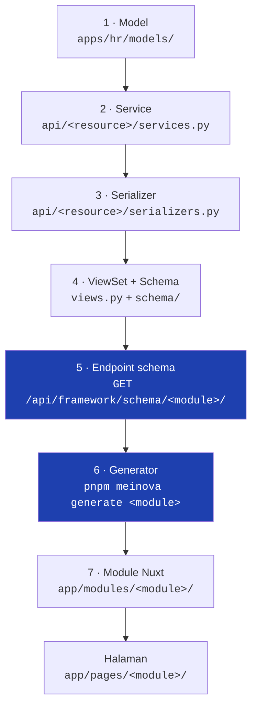

# Pipeline Backend → Frontend

**Halaman terpenting di dokumentasi ini.** Kalau kamu cuma sempat membaca satu halaman sebelum menyentuh kode, baca yang ini.

Frontend Nuxt **tidak menulis form dan tabel dengan tangan**. Backend mendeklarasikan *schema*, frontend menggeneratenya jadi berkas Vue/TypeScript. Konsekuensinya sederhana tapi sering bikin orang kehilangan setengah hari:

> Mengubah model di backend **tidak** mengubah apa pun di layar sampai (a) schema-nya ikut diubah, **dan** (b) module frontend-nya diregenerate.

---

## Tujuh tahap



### 1 · Model — `apps/<domain>/models/`

Satu file per agregat, di-reexport lewat `__init__.py`. Turunan `BaseModel` (audit + soft delete) atau `BaseReference` (+ `code`/`name`/`description`/`sort_order`).

Dua aturan yang gagalnya diam kalau dilanggar:

- **Jangan `unique=True` polos.** Nilainya akan terkunci selamanya oleh record yang sudah di-soft-delete. Pakai `UniqueConstraint(fields=[...], condition=Q(is_deleted=False), name="uniq_active_...")`.
- Turunan `BaseReference` **wajib** menulis `class Meta(BaseReference.Meta)`. `class Meta:` polos membuang constraint dan `ordering` bawaannya.

### 2 · Service — `apps/<domain>/api/<resource>/services.py`

Seluruh logika bisnis. Turunan `BaseMasterService` / `BaseReferenceService` / `BaseTransactionService`. Classmethod-only, setiap mutasi `@transaction.atomic` + `full_clean()`, dengan hook `before_create` / `after_create` / `before_update` / `after_update` / `before_delete`.

### 3 · Serializer

Bentuk data yang keluar-masuk API. **Ini titik paling sering menghasilkan kolom "-" di seluruh baris tabel** — lihat [jebakan #3](#3-kolom-di-semua-baris).

### 4 · ViewSet + Schema

```python
class EmployeeLeaveViewSet(ServiceWriteMixin, BaseMasterViewSet):
    framework_module = "hr/leave"          # WAJIB & unik
    service_class = EmployeeLeaveService
    serializer_class = EmployeeLeaveSerializer
    search_fields = ["employee__full_name", "document_number"]
    data_scope = {"company": "employee__organization__company", "own": "employee__user_id"}
    schema = LEAVE_SCHEMA                  # schema deklaratif
```

Schema ditulis dengan builder DSL di `apps/framework/builders/`:

| Builder | Untuk |
|---|---|
| `field.text()`, `field.lookup()`, `field.select()`, `field.file()`, … | definisi field + metadata tampilan |
| `ui` | flag halaman: `export`, `bulk_delete`, `import`, `workspace` |
| `tabs` | tab workspace, termasuk tabel resource inline |
| `action` | tombol record (Submit/Approve/Generate) |
| `permission`, `workflow`, `importer`, `dashboard` | sisanya |

Tiap field membawa metadata tampilan: `tab=`, `label=`, `table=`, `filter=`, `search=`, `sortable=`, `overview=`, `order=`, `visible_when=`, `readonly_when=`, `modes=`.

### 5 · Endpoint schema

`BaseMasterViewSet` memberi `GET <resource>/ui-schema/` gratis. Yang dipakai generator adalah pencari global:

```
GET /api/framework/schema/<framework_module>/
```

`framework_schema_view` menyapu seluruh subclass dari empat base (`BaseMasterViewSet`, `BaseTreeAPIView`, `BaseSettingAPIView`, `BaseDashboardAPIView`) dan mengembalikan yang `framework_module`-nya cocok. Endpoint ini **`AllowAny`** — disengaja supaya generator bisa jalan tanpa token, tapi artinya struktur field ikut terekspos publik.

Hasilnya adalah gabungan **introspeksi model/serializer** + **schema deklaratif** (deklaratif menang, lewat `deep_merge`).

Empat `schema_type`:

| `schema_type` | Base class | Bentuk layar |
|---|---|---|
| `crud` | `BaseMasterViewSet` | tabel + form (dialog / page / workspace) |
| `tree` | `BaseTreeAPIView` | pohon centang (menu & data permission) |
| `setting` | `BaseSettingAPIView` | satu form, satu record |
| `dashboard` | `BaseDashboardAPIView` | grid widget |

### 6 · Generator

Di repo Nuxt:

```bash
pnpm meinova generate hr/leave                 # dari schema API
pnpm meinova generate:import hr/employees      # hanya berkas import
pnpm meinova make:crud hr/leave                # scaffold kosong, tanpa API
```

URL schema diturunkan dari `MEINOVA_API_BASE_URL` (default `http://demo.localhost:8000`):

```
${MEINOVA_API_BASE_URL}/api/framework/schema/<module>/
```

Override sekali jalan: `--schema-url=http://tenant.localhost:8000/api/framework/schema/hr/leave/`.

Generator memilih template dari `schema.type`, lalu menulis module-nya. Kalau schema memuat key `import`, berkas import ikut digenerate.

### 7 · Module Nuxt

```
app/modules/hr/leave/
├── columns.ts        # kolom tabel      ← dari field ber-table=True
├── filters.ts        # filter toolbar   ← dari field ber-filter
├── form.ts           # definisi form    ← dari field ber-form
├── table.ts          # konfigurasi tabel
├── actions.ts        # tombol record    ← dari schema.actions
├── workspace.ts      # tab workspace    ← dari schema.tabs
├── types.ts
├── index.ts
├── page.vue
├── components/       # LeaveTable.vue, LeaveForm.vue, LeaveTabs.vue, …
└── composables/      # useLeaveList.ts, useLeaveDetail.ts, …
```

Halamannya sendiri di `app/pages/<framework_module>/` — **bukan** di `app/modules/`.

!!! danger "`framework_module` menentukan rute frontend, bukan letak endpoint API"
    Generator mendorong `router.push("/<framework_module>/create")`. Jadi halaman Nuxt **wajib** ada di `app/pages/<framework_module>/`, walaupun endpoint API-nya di path yang sama sekali berbeda.

    Kejadian nyata: Leave Policy pernah ber-`framework_module` `references/hr/leave-policies` sementara halamannya ditaruh di `/hr/masters/...` — tombol Create dan Edit **404** walau semua berkasnya ada. Solusinya `framework_module` diganti `hr/leave-policies`; endpoint API-nya tetap `/api/administration/references/hr/leave-policies/`. Keduanya memang tidak harus sama.

---

## Yang mana yang digenerate, yang mana yang ditulis tangan

| Jenis layar | Cara membuatnya |
|---|---|
| CRUD biasa (tabel + dialog/form) | **Digenerate.** Jangan disunting tangan. |
| Workspace bertab | **Digenerate**, termasuk tab resource inline. |
| Dashboard modul | **Digenerate** dari `schema_type: "dashboard"`. |
| Tree (menu/data permission) | **Digenerate.** |
| Kotak masuk workflow, halaman submissions, detail instance | **Ditulis tangan** — bentuknya bukan CRUD. |
| Tab User Roles & Role Permissions | **Ditulis tangan** di atas keluaran generator. |
| Beranda (`app/pages/index.vue`) | **Ditulis tangan**, isinya dirakit dari registry widget. |

!!! warning "Regenerate menimpa suntingan tangan tanpa peringatan"
    `UsersTable.vue` dan saudaranya di Security membawa tiga hal yang **tidak** dihasilkan generator: role gating, `notify`, dan label hapus yang menyebut nama barisnya. Menjalankan `pnpm meinova generate administration/security/users` menghapus ketiganya — tabelnya tetap jalan, cuma tombolnya muncul untuk peran yang seharusnya read-only. Ada komentar pengingat di kepala tiap berkas; pasang ulang setelah regenerate.

Kalau sebuah perilaku harus bertahan melewati regenerate, tempatnya di `framework/` (repo Nuxt), **bukan** di berkas hasil generate. Itu pelajaran dari perbaikan penanganan error 403: dipasang di `normalizeApiErrors` supaya seratus modul tidak perlu diregenerate satu per satu.

---

## Checklist: setiap kali schema berubah

Simpan ini. Delapan dari sepuluh keluhan "kok nggak muncul?" jawabannya ada di sini.

**Menambah field ke model:**

- [ ] Field ditambahkan di model + migration
- [ ] Field ada di `serializer.fields` — **kalau tidak, PATCH dibalas 200 lalu nilainya dibuang**
- [ ] Field ada di `Service.FIELDS` (untuk service yang punya daftar field eksplisit)
- [ ] Field dideklarasikan di schema dengan `tab=` yang benar
- [ ] `pnpm meinova generate <module>` di repo FE
- [ ] Cek layarnya di browser sungguhan

**Menambah kolom tabel:**

- [ ] Field ber-`table=True` di schema
- [ ] Key-nya **ada di payload API**. Kolom lookup dipetakan ke `<field>_name` kecuali `display_key` disebut
- [ ] Regenerate

**Menambah filter:**

- [ ] Field ber-`filter=True` (atau `filter={"group": "quick", "order": 20}`)
- [ ] Parameternya terdaftar di `filterset_fields` / `filterset_class` — **`filter=True` sendirian hanya menampilkan filter di UI, parameternya diterima lalu diabaikan diam-diam**
- [ ] Untuk filter lookup: `lookup_endpoint` terisi, jika tidak filternya dilewati generator
- [ ] Regenerate

**Menambah dropdown/lookup:**

- [ ] Lookup terdaftar `@register_lookup` dengan `name` **unik lintas domain** (registry-nya global)
- [ ] Modul registry-nya di-import dari `AppConfig.ready()` — kalau lupa, endpoint-nya 404
- [ ] Path endpoint benar: `/<prefix domain>/lookup/<nama>/`, bukan `/<resource>/lookup/`
- [ ] Kalau pakai `autofill`, kunci yang disebut **benar-benar diserialisasi** lookup-nya
- [ ] Kalau pakai `lookup_params`, field induknya juga disebut di `depends_on` — kalau tidak, nilainya tetap menempel setelah induknya diganti dan penolakannya baru muncul saat Simpan
- [ ] Regenerate

**Menambah tombol action:**

- [ ] `@action` di viewset dengan `url_path` eksplisit
- [ ] `action.record(...)` di `schema["actions"]` dengan `endpoint` **URL penuh** memakai placeholder `{id}`
- [ ] `permission` memakai kosakata yang benar: `security.manage` (wewenang) vs `hr.add_employee` (izin model) — pembedanya garis bawah di ruas kedua, dan memakai pemeriksa yang salah gagal **tanpa suara**
- [ ] Regenerate

**Menambah modul baru:** lihat [Membuat Modul Baru](Build-A-Module.md).

---

## Lima jebakan yang gagalnya diam

Semua ini pernah terjadi, dan semuanya **tidak menghasilkan error** — cuma layar yang salah.

### 1. `endpoint` tidak dideklarasikan di schema

Generator **menurunkan endpoint dari `framework_module`** kalau key `endpoint` kosong. Untuk modul yang rutenya tidak sejajar dengan nama module-nya, hasilnya URL yang tidak ada — dan tabelnya menampilkan **"No results."** tanpa error apa pun, yang terbaca seperti "datanya memang kosong".

Kena di `administration/security/{users,roles,permissions}`: module-nya `administration/security/…` tapi API-nya di bawah `/api/accounts/`. **Periksa ini tiap kali `framework_module` berbeda dari path URL-nya.**

### 2. Lupa regenerate

Endpoint jalan, schema benar, layarnya masih pakai definisi lama. Tidak ada indikator versi di UI. Kalau perilakunya "seharusnya sudah bisa tapi kok tidak", regenerate dulu sebelum mencari di tempat lain.

### 3. Kolom "-" di semua baris

Kolom dibuat dari **field model** lewat introspeksi, sementara datanya datang dari **serializer**. Kalau serializer cuma `fields = "__all__"`, kolom `company_name` yang dicari generator tidak pernah ada di payload.

Pola pemeriksaannya: cocokkan `column.*("key")` di `columns.ts` hasil generate dengan kunci payload API sungguhan.

Kejadian nyata: tabel Audit Trail (kolom User kosong — satu-satunya alasan orang membuka layar itu), Work Calendar & Holiday (kolom Company kosong, sehingga dua belas baris libur nasional terbaca seperti duplikat), tabel Permission (708 baris, semuanya "-"), dan tabel User yang punya kolom berjudul **"Password"**.

### 4. Field read-only hilang dari form

Generator membuang semua field ber-`read_only` dari `form.ts`. Benar untuk kolom audit, tapi field turunan yang sengaja ditaruh di sebuah tab **hilang tanpa error**: schema-nya benar, tab-nya menyebutnya, layarnya kosong.

Perbaikannya `display=True`. **Jangan** pakai `form=True` — `form` diisi otomatis introspeksi untuk hampir semua kolom model, jadi memakainya sebagai penanda paksa menyeret masuk kolom read-only modul lain.

### 5. Tab workspace kosong

`ui.workspace` tanpa key `tabs` menghasilkan `workspaceTabs = []` dan halaman create/edit-nya menampilkan **"No workspace tabs available."** — bukan error, cuma kosong, jadi terbaca seperti modul yang belum jadi.

---

## Mengubah `framework/` vs mengubah hasil generate

| Perubahannya berlaku untuk… | Tempatnya |
|---|---|
| satu modul | schema backend → regenerate |
| semua modul | `framework/` di repo Nuxt, atau `scripts/meinova/generators/*.mjs` |
| semua modul **baru** saja | template di `scripts/meinova/templates/` |

Perbaikan di generator/template **tidak menyentuh modul yang sudah ada** sampai diregenerate. Perbaikan di `framework/` langsung berlaku di semua modul tanpa regenerate. Untuk perbaikan bug yang menyentuh puluhan layar, yang kedua hampir selalu pilihan yang benar.

---

## Verifikasi

Build lolos ≠ halamannya jalan.

- `<SelectItem value="">` melempar dan menjatuhkan seluruh halaman — errornya muncul saat **hidrasi di browser**, bukan saat SSR. `curl` membalas 200 dan `nuxi build` lolos walau halamannya rusak.
- Rute baru butuh **restart dev server**. Nuxt tidak selalu menangkap halaman yang dibuat proses lain saat `pnpm dev` sudah berjalan; rutenya 404 sampai server dijalankan ulang.

Satu-satunya verifikasi yang sah adalah membuka halamannya di browser sungguhan.
