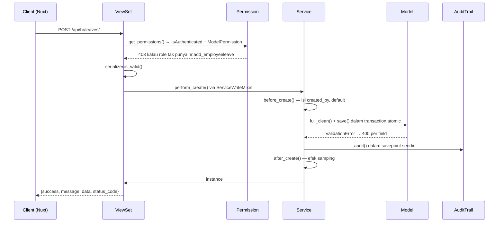

# Siklus Request

Apa yang terjadi dari `POST /api/hr/leaves/` sampai baris tersimpan di database — dan di titik mana request bisa ditolak.

---

## Rute URL berlapis

```
config/urls.py
  └── apps/<domain>/api/urls.py
        └── apps/<domain>/api/<resource>/urls.py
```

Prefix yang sudah terdaftar:

| Prefix | App |
|---|---|
| `/api/accounts/` | `accounts` — auth, users, roles, permissions |
| `/api/framework/` | `framework` — schema module + peta izin |
| `/api/administration/` | `administration` — organisasi, master, kalender, dashboard home |
| `/api/workflow/` | `workflow` — engine approval generik |
| `/api/hr/` | `hr` |
| `/api/payroll/` | `payroll` |
| `/api/imports/`, `/api/uploads/` | import & upload generik |
| `/api/docs/`, `/api/schema/` | Swagger + OpenAPI |

!!! warning "Urutan rute penting"
    Di `apps/hr/api/urls.py`, route spesifik harus **di atas** router viewset umum. Di `apps/imports/api/urls.py`, rute `<path:module>` harus tetap **paling akhir** supaya tidak menelan rute `jobs/` dan `profiles/`.

---

## Alur satu request tulis



---

## Layering: View → Service → Model

**Logika bisnis selalu di service.** Tidak di serializer, tidak di view.

| Lapis | Tanggung jawab | Bukan tanggung jawabnya |
|---|---|---|
| ViewSet | routing, permission, pagination, filter, serialisasi | aturan bisnis |
| Serializer | bentuk data masuk/keluar, validasi format | perhitungan, efek samping |
| Service | aturan bisnis, transaksi, efek samping, audit | tahu soal HTTP |
| Model | invarian satu record (`clean()`), constraint DB | aturan yang menyangkut baris lain |

Aturan pembagi antara `Model.clean()` dan Service: **kalau aturannya perlu melihat baris lain, tempatnya di service.** Kuota `TrainingProgram` ditegakkan di service karena menyangkut jumlah peserta; `OrganizationAssignment.clean()` menolak location yang bukan milik branch terpilih karena itu konsistensi satu record.

### `service_class` sendirian TIDAK cukup

Ini jebakan struktural yang mengenai sebagian besar viewset lama:

> `BaseMasterViewSet` hanya memakai `service_class` untuk `get_queryset()` dan `soft_delete()`. **Jalur tulisnya masih `serializer.save()` bawaan DRF.**

Artinya `Service.create()` / `Service.update()` **tidak pernah jalan lewat API** kecuali `ServiceWriteMixin` dipasang **di depan** base-nya:

```python
class EmployeeLeaveViewSet(ServiceWriteMixin, BaseMasterViewSet):
    service_class = EmployeeLeaveService
```

Konsekuensi memasang mixin — semuanya diinginkan, tapi harus disadari:

- `Model.full_clean()` benar-benar jalan. `meinova_exception_handler` sudah menerjemahkan `django.core.exceptions.ValidationError` jadi 400 berisi error per field; tanpa handler itu DRF membalas 500 karena hanya mengenali `ValidationError` miliknya sendiri.
- `created_by` / `updated_by` terisi otomatis lewat `BaseMasterService.before_create/before_update`.
- **Perubahannya masuk jejak audit.** Viewset tanpa mixin tidak pernah menyentuh `BaseService`, jadi tidak tercatat sama sekali.

Cakupan audit hari ini = daftar viewset ber-mixin, bukan seluruh sistem. Seluruh viewset Leave/Overtime/Training/Recruitment/Roster/Travel sudah memakainya.

---

## Hook `BaseService`

```python
class BaseService:
    @classmethod
    def before_create(cls, data, user=None): ...
    @classmethod
    def after_create(cls, instance, data, user=None): ...
    @classmethod
    def before_update(cls, instance, data, user=None): ...
    @classmethod
    def after_update(cls, instance, data, user=None): ...
    @classmethod
    def before_delete(cls, instance, user=None): ...
```

Turunannya:

| Class | Tambahan |
|---|---|
| `BaseMasterService` | `save_children`, filter soft-delete, `soft_delete()` + `restore()` beserta hooknya |
| `BaseReferenceService` | untuk master referensi ber-`code`/`name` |
| `BaseTransactionService` | untuk dokumen transaksional |

Audit dicatat di `BaseService` (`_audit` / `_snapshot` / `_diff`) — satu tempat, bukan ditaburkan di tiap service. Dimatikan per service lewat `audit_enabled = False`.

Empat keputusan yang membentuk pencatatannya:

1. **Gagal mencatat tidak membatalkan perubahannya.** Penulisannya dibungkus savepoint sendiri; kegagalannya cuma `logger.exception`. Tanpa savepoint, exception di dalam transaksi induk membuat seluruh transaksinya tidak bisa di-commit lagi **meski** exception-nya ditangkap.
2. **Yang tanpa pengguna terautentikasi tidak dicatat.** Seed dan importer mengoper `user=None`; mencatat semuanya membuat satu `seed_demo_workforce` menulis ratusan baris.
3. **Hanya kolom yang berubah** yang disimpan.
4. **Delete dicatat sebelum `instance.delete()`** — sesudahnya `pk` sudah `None`. Soft delete ikut dicatat sebagai `delete`, bukan `update`.

---

## Tiga lapis penjagaan — jangan tertukar

Ini sumber kebingungan paling sering. Ketiganya menjawab pertanyaan yang **berbeda**.

| Lapis | Pertanyaan | Kelas | Dipasang di |
|---|---|---|---|
| Izin model | "boleh **mengubah** tabel ini?" | `ModelPermission` | `get_permissions()` |
| Akses menu | "menu ini disodorkan atau tidak?" | `MenuAccessService` | sidebar FE + katalog |
| Cakupan data | "**baris yang mana** yang boleh dilihat?" | `DataScopeService` | `filter_queryset()` |

**Menu tersembunyi dan izin tulis tidak menyembunyikan satu baris pun.** Hanya lapis ketiga yang mencegah data bocor.

### Izin model — `ModelPermission`

Dipasang lewat `BaseMasterViewSet.get_permissions()`, **bukan** cuma lewat atribut `permission_classes`. Alasannya: puluhan viewset menulis ulang `permission_classes` — kebanyakan sekadar mengulang `[IsAuthenticated]` — dan itu **mengganti** daftarnya, bukan menambah. `CurrencyViewSet` sudah terbukti lolos begitu.

Tiga batasnya disengaja:

- **Hanya aksi CRUD baku** (`create`/`update`/`partial_update`/`destroy`/`bulk_delete`). Endpoint `@action` seperti `submit/`, `approve/`, `sync/` punya aturan jauh lebih spesifik — pegawai berhak mengajukan cutinya sendiri tanpa izin mengubah tabel cuti seisi perusahaan.
- **Membaca dibiarkan terbuka.** Dropdown dipakai lintas modul oleh orang yang tidak berkepentingan mengubahnya.
- Bisa dimatikan lewat `enforce_model_permissions = False` per viewset, atau `ENFORCE_MODEL_PERMISSIONS` di settings.

Sumber izinnya `Role.permissions` (M2M ke `auth.Permission`), dibaca lewat `RolePermissionBackend` di `AUTHENTICATION_BACKENDS`. **Tidak ada konsep "group"** — `User.groups` bawaan Django diwarisi tapi tidak dibaca satu baris kode pun.

### Cakupan data — `DataScopeService`

Dipasang di `filter_queryset()`, **bukan** `get_queryset()`. Dua alasan, dan yang kedua yang menentukan:

1. `get_object()` DRF memanggil `filter_queryset(get_queryset())`. Satu tempat ini menutup daftar, detail by id, export, bulk-delete, **dan** update sekaligus — tanpa itu `/api/hr/employees/154/` tetap terbaca dan tetap bisa di-PATCH.
2. **41 viewset menimpa `get_queryset()` sendiri** dan semuanya akan lolos diam-diam.

Peta per viewset:

```python
data_scope = {
    "company": "organization__company",
    "location": "organization__location",
    "own": "user_id",
}
```

`None` = tidak disaring, dan itu benar untuk master data. Jenis yang **tidak ada di peta dilewati**, bukan menolak semua.

Semantik `RoleDataPermission`: antar-jenis di-**AND**, sesama jenis di-**OR**, antar role di-**OR**. **Role tanpa satu pun baris = tanpa batasan.**

!!! danger "Dropdown adalah jalur bocor yang paling gampang terlewat"
    `EmployeeViewSet.lookup` merakit querysetnya sendiri dari `Employee.objects`, jadi tidak melewati `filter_queryset()`. Tanpa `DataScopeService.filter` eksplisit di sana, admin site yang hanya boleh melihat 6 pegawai tetap mendapat daftar nama seluruh tenant.

!!! danger "Dashboard tidak ikut jalur ini"
    `BaseDashboardAPIView` adalah `APIView` biasa yang merakit querysetnya sendiri. Tiap service dashboard **wajib** memanggil `DataScopeService.filter(...)` di setiap queryset yang dibangunnya.

Cakupan menyaring **baca**, bukan **create**. Untuk create, service-nya sendiri yang harus mengisi default dari cakupan pembuatnya lalu menolak yang di luar cakupan — lihat `RosterSetupService.apply_scope_defaults` / `assert_within_scope`.

---

## Response

Semua response memakai envelope yang sama:

```json
{
  "success": true,
  "message": "Success.",
  "data": { },
  "status_code": 200,
  "meta": { "count": 128, "page": 1 }
}
```

Helper di `apps/core/responses/api.py`: `success_response`, `created_response`, `error_response`, `no_content_response`.

Error lewat `meinova_exception_handler` (`apps/core/exceptions/handler.py`).

!!! warning "Kunci pesannya `message`, bukan `detail`"
    Envelope menaruh kalimatnya di **`message`**. Frontend yang membaca `detail` lebih dulu lalu jatuh ke `error.message` milik `$fetch` akan menampilkan `[POST] "http://…": 403 Forbidden` — teks teknis, bukan pesan yang bisa ditindaklanjuti. Di FE gunakan helper `apiErrorMessage()`, yang urutannya `message` → `detail` → pesan mentah → terjemahan per status.

Pagination: `apps.core.pagination.StandardPagination`, `?page=&page_size=`, page size default 20, dibatasi `MAX_PAGE_SIZE = 100`. Nilai di atas itu **dipotong diam-diam**, jadi FE tidak boleh menawarkan pilihan yang lebih besar.

---

## Yang gratis dari `BaseMasterViewSet`

| Endpoint | Catatan |
|---|---|
| `GET .../ui-schema/` | `AllowAny`; schema untuk generator |
| `GET .../export/` | CSV, kolomnya = kolom tabel, **ikut filter aktif** |
| `POST .../bulk-delete/` | `{"ids": [...]}`, lewat jalur soft delete yang sama |

Tampil-tidaknya di UI diatur flag `ui.export` / `ui.bulk_delete` / `ui.import`.

!!! warning "`search_fields` wajib diperiksa terhadap model"
    Base memberi default `["code", "name"]`. Model tanpa kolom itu yang lupa menimpanya dulu membalas **HTTP 500** setiap kali user mengetik di kotak pencarian (12 viewset kena). Pencarian sekarang lewat `SafeSearchFilter` yang melewati field tak dikenal dan mencatatnya di log — tetap perbaiki konfigurasinya, jangan bersandar pada jaring itu. Untuk kolom FK pakai `relasi__field` (`city__name`).

---

## Delete = soft delete

`destroy()` dan `bulk-delete` sama-sama lewat `perform_soft_delete()`. Urutannya:

1. `service_class.soft_delete()` kalau ada (lengkap dengan hook `before/after_soft_delete` dan `restore()`)
2. kalau tidak, tandai `is_deleted` / `deleted_at` / `deleted_by` langsung
3. hard delete **hanya** untuk model yang memang tidak punya kolom `is_deleted`

**Tidak ada endpoint hapus permanen. Itu disengaja.**
