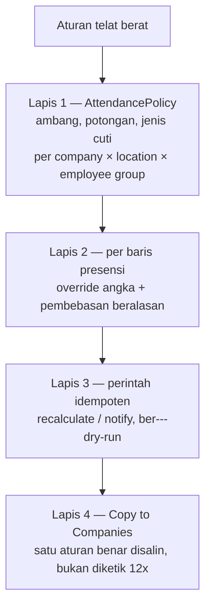
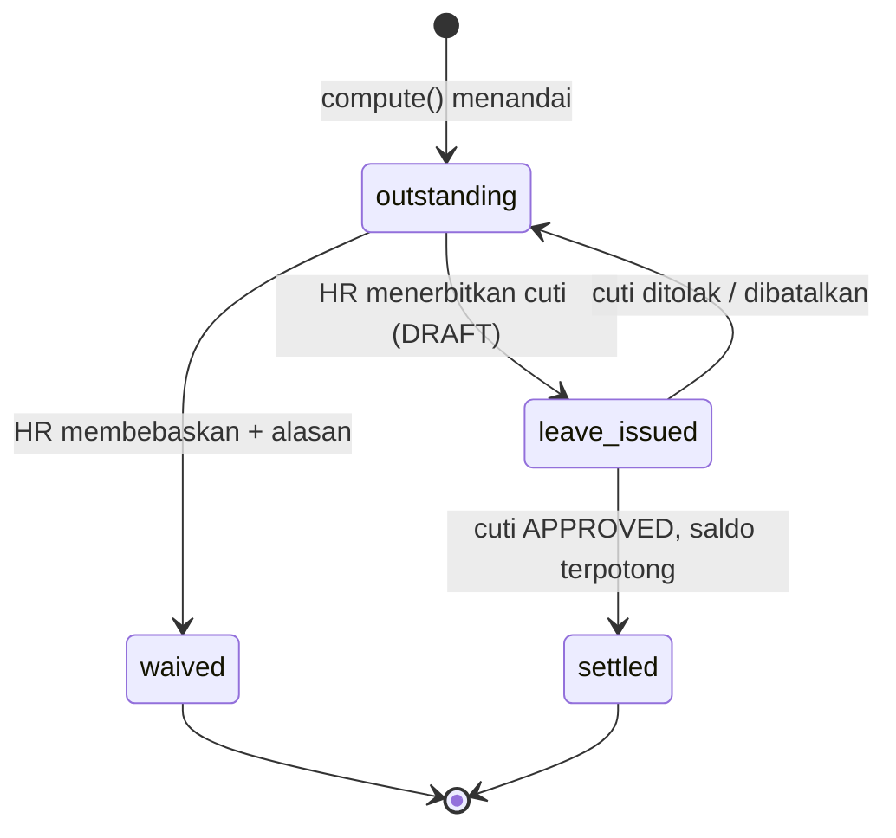

# Proposal — Kewajiban Cuti dari Presensi

Status: **sudah dikerjakan** per 2026-08-16. Dokumen ini hasil audit codebase per
2026-08-15; nilainya sekarang sebagai catatan alasan, bukan rencana.

!!! success "Hasil implementasinya di halaman lain"
    Kolom keputusan atasan, notifikasi ke `reports_to`, dan tiga tombol
    Waive / Require Leave / Issue Leave sudah terpasang — beserta alasan kenapa
    review-nya **tidak** lewat engine workflow. Lihat
    **[Saldo Awal Cuti & Pengecualian Presensi](Leave-Opening-Attendance-Exception.md)**
    §6. Yang tersisa cuma digest per atasan dan penjadwalan otomatis perintahnya.

Aturannya: **telat lebih dari 2 jam, atau pulang lebih awal dari 2 jam, wajib
mengambil cuti satu hari penuh** — dengan peringatan ke HR, dan bisa dikoreksi
manual per baris.

Menyambung ke **[Proposal: Saldo Cuti](Leave-Balance-Proposal.md)**: cuti yang
terbit dari sini memotong saldo yang sama, dan kalau saldonya habis ia menjadi
cuti dibayar di muka.

---

## 0. Yang sudah ada — dan ternyata hampir seluruh mesinnya

| Yang sudah jalan | Berkas |
|---|---|
| `late_leave_threshold_minutes` / `early_leave_leave_threshold_minutes` | `apps/administration/models/references/attendance_policy.py` |
| `leave_deduction_days` | idem |
| `EmployeeAttendance.leave_required_days` + `leave_required_reason` | `apps/hr/models/attendance/attendance.py` |
| `AttendancePolicyResolver.compute()` — **fungsi murni, tanpa satu pun query** | `apps/hr/api/attendance/policy.py` |
| Berjenjang `specificity` (company 4 / location 2 / employee group 1) | idem |
| `recalculate_attendance` idempoten | `apps/hr/management/commands/` |
| `CompanyCopyMixin` — `AttendancePolicy` pemakai pertamanya | `apps/framework/services/company_copy.py` |

Empat keputusan yang sudah benar dan **tidak boleh diubah**:

1. **Ambangnya dinilai terhadap jam jadwal**, bukan terhadap menit telat yang
   sudah dipotong toleransi. Kalau tidak, mengubah toleransi dari 1 menit jadi
   15 diam-diam menggeser ambang dua jamnya juga.
2. **Sekali sehari, bukan dua kali.** Yang datang telat **dan** pulang cepat
   tetap kehilangan satu potongan. Menjumlahkannya membuat satu hari kerja bisa
   memotong cuti lebih dari satu hari, dan angka itu tidak bisa dijelaskan.
3. **Penanda, bukan eksekusi.** Yang dihasilkan cuma angka dan sebabnya; yang
   memotong saldo tetap dokumen cuti yang diajukan dan disetujui.
4. **Tidak ditulis untuk baris yang belum bisa dinilai** (tanpa jadwal, atau
   tap pulangnya belum masuk). Menulis nol untuk hal yang belum diketahui akan
   menghapus penanda yang mungkin sudah benar.

### Yang kurang

1. **Bawaannya setengah hari, bukan sehari.** `leave_deduction_days` default
   `0.5`, dan seed peragaan `ATT-MMR-HO` juga `0.5`.
2. **Tidak disebut cuti jenis apa.** "Wajib ambil cuti" tanpa menyebut saldo
   yang mana tidak bisa dieksekusi.
3. **Tidak ada yang diberi tahu.** Penandanya tersimpan di kolom yang tidak
   dibuka siapa pun sampai ada yang kebetulan membuka layar Attendance.
4. **Tidak bisa dikoreksi manual.** `compute()` menimpa `leave_required_days`
   tiap kali dijalankan — dan itu terjadi lagi begitu tap pulang menyusul, atau
   begitu `recalculate_attendance` jalan. Apa pun yang diketik HR **hilang
   tanpa pesan**.
5. **Tidak ada jalan menindaklanjutinya.** Tidak ada tombol yang mengubah
   penanda jadi dokumen cuti, dan tidak ada cara membebaskannya.

---

## 1. Angka: satu hari penuh

| Tempat | Sekarang | Jadi |
|---|---|---|
| `AttendancePolicy.leave_deduction_days` (default model) | `0.5` | **`1.0`** |
| `seed_demo_attendance_policy` → `ATT-MMR-HO` | `0.5` | **`1.0`** |

!!! danger "Mengubah default model TIDAK mengubah baris yang sudah ada"
    Default hanya berlaku untuk baris **baru**. Tenant yang sudah punya
    `AttendancePolicy` tetap memotong 0,5 hari sampai ada yang mengubahnya dari
    layar setting.

    Itu memang yang benar — memotong sehari penuh untuk keterlambatan yang
    kemarin memotong setengah hari adalah perubahan kebijakan, bukan perbaikan
    bug, dan tidak boleh datang lewat rilis. Sebutkan di catatan rilisnya, lalu
    tenant yang mau ikut mengubahnya sendiri **satu kali** — dan sesudah itu
    menyalinnya ke company lain lewat tombol **Copy to Companies** yang sudah
    terpasang.

!!! note "Tetap bukan angka bulat wajib"
    Kolomnya `DecimalField(max_digits=4, decimal_places=2)` dan tetap begitu.
    Perusahaan yang memang mau setengah hari, atau 0,25, tetap bisa. Yang
    berubah cuma **bawaannya**, karena bawaan yang salah adalah bawaan yang
    dipakai orang tanpa memikirkannya.

### Satu hal yang jangan "diperbaiki" nanti

Orang yang telat dua jam tetap bekerja enam jam hari itu, lalu dipotong cuti
satu hari penuh. Itu **bukan** perhitungan waktu, melainkan penindakan — dan
memang begitu maksudnya.

Baris presensinya tetap menyimpan fakta: jam tap, menit telat, jam kerja
bersih. Yang memotong saldo adalah dokumen cuti terpisah. Jangan pernah
memprorata potongannya "supaya adil terhadap jam kerja" — begitu diprorata,
aturannya berhenti jadi penindakan dan tidak ada lagi alasan orang datang tepat
waktu.

---

## 2. Jenis cutinya wajib disebut

Kolom baru di `AttendancePolicy`:

```python
leave_deduction_leave_type = FK("administration.LeaveType", null=True)
```

Wajib terisi begitu salah satu ambang menyala — ditegakkan `clean()`. Pola
yang sama persis dengan `RotationPurpose.deducts_leave` yang mewajibkan
`leave_type`: "memotong saldo" tanpa menyebut saldo yang mana tidak bisa
dieksekusi, dan kegagalannya baru ketahuan saat menghitung.

Lazimnya `ANNUAL`. Tenant yang ingin memisahkannya bisa membuat `LeaveType`
tersendiri (mis. `DISC` — Potongan Disiplin) supaya rekapnya bisa dibedakan
dari cuti tahunan biasa.

---

## 3. Fleksibilitasnya — empat lapis



### Lapis 1 — angka & saklar di policy *(sudah ada)*

| Kenop | Arti |
|---|---|
| `late_leave_threshold_minutes` | 120 = telat di atas 2 jam. **0 = mati** |
| `early_leave_leave_threshold_minutes` | idem untuk pulang cepat |
| `leave_deduction_days` | 1.0 |
| `leave_deduction_leave_type` | saldo mana yang dipotong *(baru)* |

Cakupannya sudah company × location × employee group, jadi HO 120 menit dan
site mati sama sekali **sudah bisa hari ini** — dan itu memang yang diseed di
tenant peragaan (`ATT-MMR-HO` 120, `ATT-MMR-SITE` 0). Tidak ada satu baris kode
pun yang menyebut "HO".

### Lapis 2 — koreksi manual per baris *(baru, dan ini yang diminta)*

Tiga kolom di `EmployeeAttendance`:

```python
leave_required_override      = Decimal(null=True)   # angka yang diketik HR
leave_required_waived        = Boolean(default=False)
leave_required_waiver_reason = Text(blank=True)
```

Yang berlaku adalah properti turunannya:

```python
@property
def leave_required_effective(self) -> Decimal:
    if self.leave_required_waived:
        return Decimal("0")

    if self.leave_required_override is not None:
        return self.leave_required_override

    return self.leave_required_days
```

!!! danger "`compute()` tidak boleh menyentuh ketiga kolom itu"
    `leave_required_days` tetap menyimpan **angka menurut aturan** dan tetap
    ditimpa tiap perhitungan ulang — itu faktanya, dan faktanya tidak boleh
    hilang.

    Kalau nilai manual ditulis ke kolom yang sama, "menurut aturan seharusnya
    berapa" hilang, dan **pembebasan tidak bisa dibedakan dari aturan yang
    memang tidak menyala**. Pembebasan harus terlihat sebagai pembebasan —
    itu satu-satunya yang bisa diaudit saat ada yang bertanya kenapa orang ini
    tidak dipotong.

    Konsekuensi yang diinginkan: `recalculate_attendance` aman dijalankan kapan
    saja tanpa menghapus keputusan orang. Pelajaran yang sama dengan
    `LeaveBalance.adjustment` dan `RotationTravel.is_manual_override`.

`leave_required_waiver_reason` **wajib** begitu `leave_required_waived`
menyala. Pembebasan tanpa alasan tertulis adalah persis hal yang membuat aturan
ini kehilangan wibawanya dalam tiga bulan.

### Lapis 3 — kapan dieksekusi

```bash
tenant_command recalculate_attendance --start= --until= [--dry-run]   # sudah ada
tenant_command notify_attendance_violations [--date=] [--dry-run]     # baru
```

### Lapis 4 — penyalinan antar company

`AttendancePolicy` **sudah** terpasang `CompanyCopyMixin`. Satu aturan yang
sudah benar disalin ke sebelas company lewat tombol, bukan diketik dua belas
kali dengan satu di antaranya salah ketik.

!!! warning "Batas yang sudah diketahui: 'semua HO lintas company' belum bisa dinyatakan"
    `location` menunjuk satu baris lokasi, bukan *jenis* tempat, dan `clean()`
    mewajibkan company begitu lokasi diisi. Di tenant berisi dua belas
    perusahaan, "semua kantor pusat" hari ini berarti dua belas baris — dan
    Copy to Companies adalah penambal untuk itu, bukan jawabannya.

    Jawaban sebenarnya menambahkan cakupan `location_type` (masternya **sudah
    ada dan sudah terpakai**: `HO`, `OFFICE`, `MINE`, `PROJECT`, `PORT`). Yang
    belum diputuskan bobot `specificity`-nya: mengikuti konvensi policy lain
    (company tertinggi) membuat aturan "semua HO" kalah oleh aturan se-company,
    dan itu kebalikan dari cara orang memikirkannya.

---

## 4. Peringatan ke HR — digest, bukan per baris

Kolom baru di `AttendancePolicy`:

```python
alert_role    = FK("accounts.Role", null=True)    # kosong = tidak ada yang diberi tahu
alert_scope   = CharField(choices=ApproverScope)  # bawaan: location
alert_manager = Boolean(default=True)             # atasan langsung ikut
```

!!! danger "`alert_scope` bukan kerapian — kebocorannya sudah pernah terjadi"
    Tanpa cakupan, "HR Admin" menarik pemegang role se-company dan
    keterlambatan pegawai Gebe mendarat di kotak masuk orang Halmahera.
    Kebocorannya **diam** — notifikasinya memang muncul, cuma di meja yang
    salah. Persis bug yang sudah ditutup `WorkflowStep.approver_scope`, dan
    kosakatanya sengaja dipinjam dari sana.

    Bawaan `location`, bukan `company`: aturan ini soal orang datang ke tempat
    kerjanya, dan yang perlu tahu adalah yang mengurus tempat itu.

### Kenapa digest harian, bukan saat itu juga

Penandanya ditulis di tiga jalur: `EmployeeAttendanceService.create/update`,
`AttendanceImportWriter.apply_policy()` (import file), dan sync agen
fingerprint. Satu import berisi seribu baris akan menembakkan ratusan
notifikasi ke orang yang sama, dan yang kesepuluh sudah tidak dibaca.

```bash
tenant_command notify_attendance_violations --date=2026-08-14
```

| Ke siapa | Isi |
|---|---|
| Pegawainya | satu notifikasi, hari itu juga — "Anda terlambat 2j 15m pada 14 Agu. Menurut kebijakan, hari itu terhitung 1 hari cuti." |
| `alert_role` di cakupannya | **satu** notifikasi berisi rekap hari itu, per unit |
| Atasan langsung *(kalau `alert_manager`)* | rekap anggota timnya |

Idempotensinya `EmployeeAttendance.leave_required_notified_at`. Perintahnya
aman diulang, dan tap susulan yang mengubah angkanya menghapus penanda itu
supaya rekap berikutnya membawa angka yang benar.

!!! note "Pegawainya harus tahu di hari itu juga"
    Kalau baru tahu saat gajian, satu-satunya hal yang bisa dilakukannya adalah
    protes. Notifikasi hari itu masih memberinya ruang menjelaskan sebabnya
    sebelum HR memutuskan — dan itu justru yang membuat jalur pembebasan di
    lapis 2 ada gunanya.

---

## 5. Menindaklanjutinya: dua tombol, bukan otomatis



```
POST /api/hr/attendance/<id>/issue-leave/    → EmployeeLeave DRAFT, terisi
POST /api/hr/attendance/<id>/waive/          → alasan WAJIB
```

`issue-leave/` membuat dokumen cuti lewat `EmployeeLeaveService` — bukan
`objects.create` — dengan pegawai, tanggal, jenis cuti dari policy, dan
`total_days = leave_required_effective`. `EmployeeAttendance.leave` (FK
nullable) menautkannya balik, jadi tidak bisa diterbitkan dua kali dan barisnya
menunjukkan sudah diselesaikan.

`leave_obligation_status` **diturunkan**, tidak disimpan — dari
(`leave_required_effective`, `leave_required_waived`, `leave_id`,
`leave.status`). Menyimpannya berarti satu lagi kolom yang bisa hanyut dari
kenyataan.

!!! danger "Jangan pernah menerbitkan cutinya otomatis"
    Tiga alasan, dan ketiganya sudah jadi prinsip di modul lain:

    1. **Saldo tidak pernah berkurang tanpa persetujuan.** Berlaku di seluruh
       codebase ini, termasuk di jalur Travel Request yang baru menerbitkan
       catatan cuti setelah alurnya selesai.
    2. **Kasus yang punya alasan harus bisa dibebaskan tanpa menghapus catatan
       presensinya.** Ban bocor, kapal digeser, izin atasan yang tidak sempat
       ditulis. Menghapus baris presensi untuk membatalkan potongan berarti
       membuang fakta jam tapnya.
    3. **Satu import fingerprint bisa menerbitkan ratusan dokumen sekaligus**,
       dan yang salah tidak bisa ditarik satu per satu.

### Kalau saldonya sudah habis

Cuti terbitan ini menempuh jalur yang sama dengan cuti lain, jadi ia langsung
mewarisi seluruh aturan di **[Proposal: Saldo Cuti](Leave-Balance-Proposal.md)**:
menggerus sisa bawaan tahun lalu lebih dulu, dan kalau saldonya habis ia
menjadi **cuti dibayar di muka** — masuk hitungan hutang, dan diperhitungkan
saat pegawainya berhenti.

Itu jawaban yang utuh untuk "kalau saldonya sudah nol bagaimana": bukan kasus
khusus, cuma cabang yang sudah ada.

---

## 6. Layar

| Layar | Yang ditambahkan |
|---|---|
| **Attendance** (`hr/attendance`) | Kolom **Leave Required** (angka efektif) + **Obligation** (badge status). Filter `leave_obligation_status`, karena inilah daftar kerja HR |
| Dialog baris presensi | Tab **Obligation**: angka menurut aturan (read-only), override, pembebasan + alasan, tautan ke dokumen cutinya |
| Record action | **Issue Leave** (`visible_when` status `outstanding`) dan **Waive** |
| **Attendance Policy** (`hr/attendance-policies`) | Tab Rules: jenis cuti; tab **Alert**: role, cakupan, atasan langsung |
| Dashboard HR | Kartu **Kewajiban Cuti Belum Diselesaikan** — angka yang tidak pernah dibuka tidak akan pernah ditindaklanjuti |

Kolom **Leave Required** wajib menampilkan angka **efektif**, bukan
`leave_required_days`. Menampilkan angka menurut aturan pada baris yang sudah
dibebaskan membuat daftarnya terbaca seperti pekerjaan yang belum selesai.

---

## 7. Urutan pengerjaan

| # | Pekerjaan | Berkas |
|---|---|---|
| 1 | Default `leave_deduction_days` → `1.0` + `leave_deduction_leave_type` + `clean()` | `attendance_policy.py` |
| 2 | Tiga kolom override/waiver + properti efektif & status di `EmployeeAttendance` | `apps/hr/models/attendance/attendance.py` |
| 3 | Pastikan `compute()` **tidak** menyentuh ketiganya; pemanggil memakai angka efektif | `apps/hr/api/attendance/policy.py` |
| 4 | Kolom `alert_role` / `alert_scope` / `alert_manager` | `attendance_policy.py` |
| 5 | `AttendanceAlertService` + `notify_attendance_violations` | `apps/hr/api/attendance/alerts.py` *(baru)* |
| 6 | Action `issue-leave/` + `waive/` | `apps/hr/api/attendance/views.py` |
| 7 | Schema + `pnpm meinova generate hr/attendance hr/attendance-policies` | `apps/hr/api/attendance/schema/` |
| 8 | Test `SimpleTestCase` untuk `compute()` di ambang 120 menit | `apps/hr/tests/attendance/` *(baru)* |
| 9 | `seed_demo_attendance_policy` → `1.0` + `ANNUAL` + `alert_role` | `apps/hr/seeds/demo_attendance_policy.py` |

Langkah 3 yang paling mudah luput dan paling mahal: kalau pemanggil masih
membaca `leave_required_days`, seluruh pembebasan yang diketik HR tidak
berpengaruh apa-apa — dan **gagalnya diam**, karena angkanya memang tetap
keluar.

---

## 8. Yang sengaja TIDAK dikerjakan

- **Menerbitkan cuti otomatis.** Lihat bagian 5.
- **Memprorata potongan terhadap jam kerja.** Lihat bagian 1.
- **Akumulasi ("telat 3 kali dalam sebulan = 1 hari").** Aturan berbasis
  hitungan dalam periode berjalan bentuknya berbeda — ia tidak bisa dinilai
  dari satu baris presensi, jadi tidak muat di `compute()` yang murni. Layak
  jadi lanjutan tersendiri, bukan ditempelkan ke sini.
- **Penjadwalan otomatis** digest-nya. Menunggu `django_celery_beat` di
  `SHARED_APPS`.
- **Kanal email.** `config/settings/email.py` masih kosong; notifikasi baru
  menulis `Notification`.
