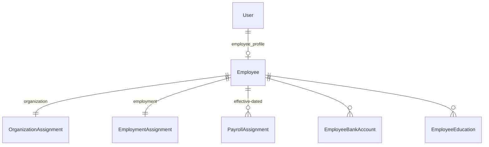

# HR — Database

37 tabel berprefiks `hr_`. Konvensi umum di [Naming Convention](../../06-database/Naming-Convention.md), diagram relasinya di [ERD](../../06-database/ERD.md).

---

## Berkas model

`apps/hr/models/`, satu file per agregat, di-reexport lewat `__init__.py`:

| Berkas | Isi |
|---|---|
| `employee.py` | `Employee` |
| `organization.py` | `OrganizationAssignment` |
| `employment.py` | `EmploymentAssignment` |
| `payroll.py` | `PayrollAssignment` |
| `employee_bank.py`, `_education.py`, `_family.py`, `_emergency.py`, `_experience.py`, `_certificate.py`, `_document.py`, `_medical_event.py`, `_training.py` | sub-data |
| `attendance/` | `EmployeeAttendance`, `AttendanceLog`, `AttendanceDevice`, profil import |
| `leave.py` | `EmployeeLeave`, `LeaveBalance` + konstanta status |
| `overtime.py` | `EmployeeOvertime` |
| `employee_action.py` | `EmployeeAction` |
| `rotation.py` | `SiteRotation`, `RotationPeriod` |
| `roster_setup.py` | `RosterSetupRequest`, `RosterSetupLine`, `RosterPlanVersion` |
| `roster_adjustment.py` | `RosterAdjustment` |
| `rotation_credit.py` | `RotationCreditTransaction`, `RotationCreditBalance` |
| `travel_request.py` | `TravelRequest`, `TravelRequestPurpose`, `TravelArrangement` |
| `training.py` | `TrainingProgram`, `TrainingParticipant` |
| `recruitment.py` | `JobVacancy`, `Candidate`, `CandidateInterview` |
| `reminder.py` | kebijakan pengingat |

### Tiga berkas yang perlu diketahui

| Berkas | Keadaan |
|---|---|
| `performance.py` | **0 baris** — kosong |
| `separation.py` | **0 baris** — kosong |
| `employee_history.py` | 72 baris, **tidak pernah punya migration maupun export** |

!!! danger "`EmployeeMovement` adalah kode mati"
    Ada di `employee_history.py` tapi tidak pernah dimigrasikan. **Jangan dihidupkan sebagai riwayat paralel** — riwayat dibaca dari `EmployeeAction` yang `APPLIED`. Satu tabel, satu kebenaran.

---

## Employee dan empat penempatannya

!!! warning "Accessor akun → pegawai adalah `user.employee_profile`"
    Bukan `user.employee`. `getattr` mengembalikan `None` tanpa error — kesalahan ini **gagal diam** dan pernah membuat orang tidak bisa melihat riwayat gajinya sendiri.

### `EmploymentAssignment` — kolom yang menentukan perilaku

| Kolom | Menentukan |
|---|---|
| `join_date` | jatah cuti, masa kerja |
| `employment_type` (+ `requires_contract`) | perlu kontrak atau tidak |
| `contract_start` / `contract_end` | |
| `roster_policy` + `roster_cycle_start` + `roster_start_basis` | jadwal site (jalur baru) |
| `roster_crew` + `roster_start_override` | jadwal site (jalur lama) |
| `working_calendar` | **lapisan pertama** perhitungan hari cuti, selalu menang |
| `point_of_hire` (FK `City`) | ke mana tiket pulang ditanggung, **dan** berapa hari perjalanan |
| `travel_days_override` | |
| `job_location` | **teks bebas**, bukan FK |

!!! note "`job_location` sengaja teks bebas"
    Nilai klien seperti "Gebe/Bacan/Ternate" tidak bisa dipetakan ke satu lokasi. Penempatan terstrukturnya tetap `OrganizationAssignment.location`.

!!! warning "`employment_status`/`employment_type` dibuat nullable"
    Supaya import bisa menyimpan tanggal walau file klien tidak memuat klasifikasi kepegawaian. **Form tetap mewajibkannya lewat schema.**

---

## Cuti

| Konstanta | Isi | Untuk |
|---|---|---|
| `LEAVE_DEDUCTING_STATUSES` | `RECORDED` + `APPROVED` | menghitung `used` |
| `LEAVE_BLOCKING_STATUSES` | + **`SUBMITTED`** | mendeteksi tumpang tindih |

`SUBMITTED` ikut di daftar kedua tapi tidak di yang pertama: cuti yang belum disetujui tidak boleh sudah mengurangi jatah, **tapi** dua pengajuan di tanggal yang sama tetap salah.

`LeaveBalance.used` **disimpan** (supaya bisa disortir) dan **dijumlahkan ulang penuh** dari record `EmployeeLeave` — bukan inkremental.

---

## Roster: berversi, bukan disunting di tempat

`RotationPeriod` punya `version_from` / `version_to`. Baris yang berubah **ditutup**, lalu diganti baris baru.

Baris yang berakhir **sebelum** tanggal berlaku tidak disentuh — dimiliki bersama semua versi. Itu yang membuat `TravelRequest.rotation_period` yang menunjuknya tetap sah.

!!! note "Nomor urut tidak pernah dipakai ulang"
    `uniq_active_hr_rotation_period_sequence` berlaku untuk **seluruh** baris termasuk yang ditutup. Konsekuensinya nomor urut **berlubang** — dan itu benar: urutan tampilan ditentukan tanggal.

`RosterSegmentType` = `WORK` / `TRAVEL_OUT` / `FIELD_BREAK` / `TRAVEL_IN`. `period_type` jadi kolom **turunan** untuk pemanggil lama.

!!! danger "Jangan tambahkan kolom booking ke `RotationPeriod`"
    Tidak boleh ada `ticket_number` / `transport_*` / `accommodation_*` / `origin` / `destination`. Tanggal penerbangan **hanya** di `TravelArrangement` — kalau disimpan di dua tempat, ada dua tanggal keberangkatan untuk penerbangan yang sama.

---

## Travel Request

`TravelArrangement`: **satu baris = satu etape**, bukan satu arah. Constraint `(request, direction, sequence)`.

Constraint lama `uniq_active_hr_travel_arrangement_direction` memaksa satu baris per arah, sehingga rute transit jatuh ke satu kolom teks yang tidak bisa dilaporkan.

`origin`/`destination` sengaja **teks bebas** — Sorong dan Ternate belum tentu ada di master.

---

## Ledger kredit rotasi

`RotationCreditTransaction` **append-only**:

- `update()` dan `soft_delete()` **melempar**
- Koreksi lewat `ADJUSTMENT_PLUS`/`MINUS`, pembatalan lewat `REVERSAL` yang menunjuk barisnya (satu kali, dijaga constraint)
- **`days` selalu positif** — arahnya dari `entry_type`, karena dua cara menulis pengurangan yang sama membuat penjumlahannya bergantung mana yang kebetulan dipakai
- Tidak punya tahun. Bukan `LeaveType`, bukan `LeaveBalance`

---

## Absensi

| Model | Isi |
|---|---|
| `EmployeeAttendance` | hasil olahan per (pegawai, tanggal) |
| `AttendanceLog` | tap mentah |
| `AttendanceDevice` | mesin fingerprint |
| `AttendanceImportProfile` | mapping per klien (jalur lama, tidak dihapus) |

`external_id` menyimpan `source_key` dari agent — **jangan ubah semantiknya**, agent mengandalkannya untuk idempotensi.

`EmployeeAttendance` mendenormalisasi `company`/`branch`/`location` untuk penyaringan `RoleDataPermission` tanpa join berlapis. Diisi `EmployeeAttendanceService` saat create — **dan itu hanya jalan kalau viewsetnya memasang `ServiceWriteMixin`**.

---

## Constraint

Semua field unik dikondisikan `Q(is_deleted=False)`, kecuali yang sengaja:

| Constraint | Kenapa tanpa kondisi |
|---|---|
| `uniq_active_hr_rotation_period_sequence` | nomor urut tidak pernah dipakai ulang |
| OneToOne (`OrganizationAssignment.employee`, dst.) | mengubahnya berarti mengganti accessor |

Nomor pegawai: `uniq_active_employee_number`. Formatnya `<KODE COMPANY><YY><4 digit>` (`KW260001`) lewat `NumberingSequence` — **bukan** `count() + 1` dan bukan pk, karena keduanya mengulang nomor begitu ada baris yang dihapus.

---

## Migrasi

37 migrasi.

!!! danger "Empat migrasi pernah menggagalkan penyediaan tenant baru"
    `hr/0002`, `hr/0009`, `hr/0010`, dan `imports/0004` menambah FK ke `administration.Site` — model yang direname jadi `Location` — tanpa menyatakan `run_before`.

    Keempatnya sudah ditambal. **Migrasi baru yang menyentuh model hasil rename wajib menyatakannya.**

Lihat [Migration](../../06-database/Migration.md).
