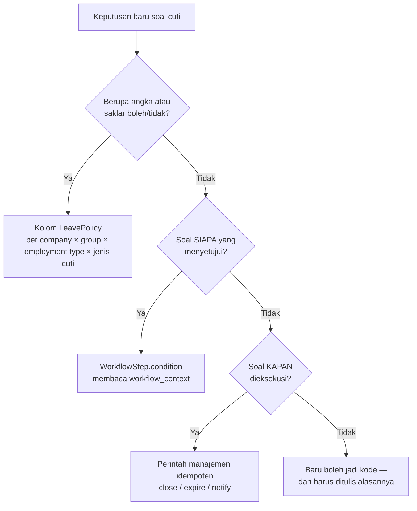
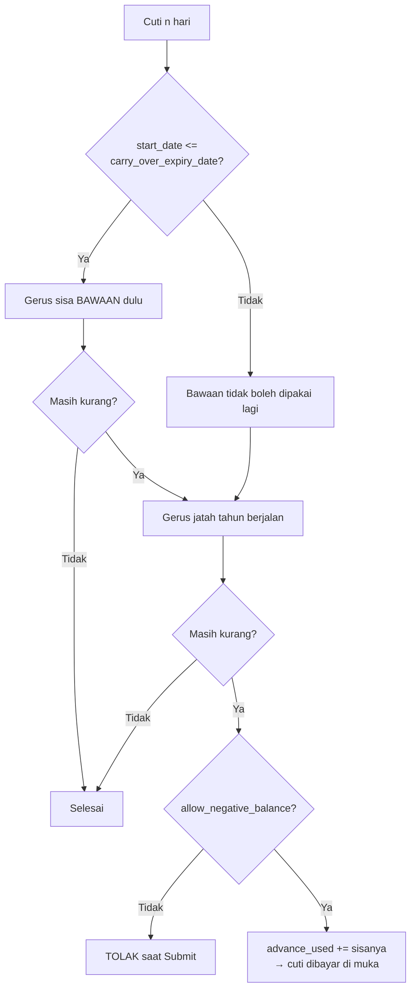
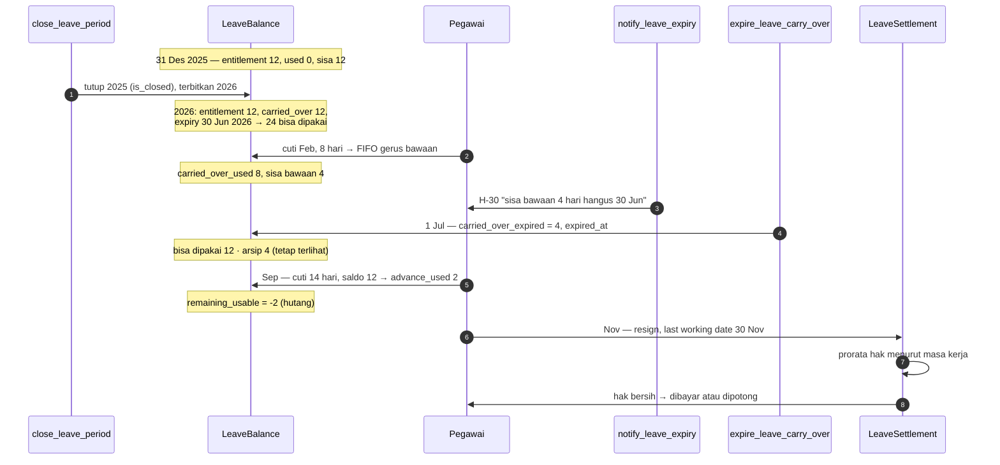

# Proposal — Siklus Hidup Saldo Cuti

Status: **sebagian sudah dikerjakan** per 2026-08-16. Dokumen ini hasil audit
codebase per 2026-08-15 plus rancangan yang diminta.

!!! success "Yang sudah terpasang — pindah ke halaman hasilnya"
    Carry over, penghangusan, dan **alokasi FIFO** sudah jalan; saldo awal migrasi
    (`LeaveOpeningBalance`) menyusul sebagai kantong ketiga. Uraian lengkap beserta
    flow dan perintahnya ada di
    **[Saldo Awal Cuti & Pengecualian Presensi](Leave-Opening-Attendance-Exception.md)**.

    Yang **belum** dan masih berlaku dari proposal ini: penyelesaian saldo saat
    resign/PHK (`LeaveSettlement`, §10), penutupan periode & arsip
    (`close_leave_period`, §7), dan penjagaan over-draw (§8). Bagian §0.7 yang menyebut
    FIFO sebagai penghalang utama **sudah tidak berlaku** — penghalangnya sudah dibuka.

Cakupan: sisa cuti tahun lalu → masa berlaku → hangus → arsip → cuti dibayar
di muka (hutang) → penyelesaian saat resign/PHK.

Di luar cakupan dan **dianggap final**: perhitungan hari cuti
(`LeaveDayCalculator`), dua jalur status di `EmployeeLeave`, engine approval,
penomoran dokumen, dan cakupan data.

Menyambung ke **[Proposal: Kewajiban Cuti dari Presensi](Attendance-Leave-Obligation-Proposal.md)** —
cuti yang terbit dari keterlambatan berat memotong saldo yang sama, dan kalau
saldonya habis ia menjadi cuti dibayar di muka lewat jalur di bagian 5.

---

## 0. Ringkasan audit — apa yang sudah ada

Modul cuti **bukan lahan kosong**:

| Yang sudah ada | Berkas | Perannya sekarang |
|---|---|---|
| `EmployeeLeave` dua jalur | `apps/hr/models/leave.py` | Pencatatan (`RECORDED`) + pengajuan (`DRAFT`→`APPROVED`) |
| `LeaveBalance` | idem | Kartu per pegawai × jenis × tahun: `entitlement`, `carried_over`, `adjustment`, `used`, properti `remaining` |
| `LeavePolicy` | `apps/administration/models/references/leave_policy.py` | Aturan berjenjang `specificity` (company 4 / group 2 / employment type 1) |
| `LeaveDayCalculator` | `apps/hr/api/leave/calculator.py` | Hari kerja: cabang roster vs `WorkCalendar` |
| `LeaveEntitlementCalculator` + `LeaveBalanceGenerator` | `apps/hr/api/leave/entitlement.py` | Menerbitkan `entitlement`, aman diulang, `adjustment` tidak pernah disentuh |
| `LeaveBalanceService.recalculate_used` | `apps/hr/api/leave/services.py` | Jumlah ulang penuh dari record, bukan inkremental |
| `assert_no_overlap` | idem | Menolak dua cuti di tanggal yang bersinggungan, lintas jenis |
| Engine approval + `workflow_context` | `apps/workflow/` | `WorkflowStep.condition` sudah bisa menilai konteks dokumen |
| `CompanyCopyMixin` | `apps/framework/services/company_copy.py` | `LeavePolicy` sudah terpasang — aturannya bisa disalin antar company |

### Yang tidak ada, dan itulah pekerjaannya

1. **`carried_over` tidak pernah ditulis siapa pun.** Kolomnya ada di model,
   ada di schema UI, dan **nol baris kode** mengisinya. Sisa 12 hari tahun lalu
   bukan hangus pada 1 Januari — ia tidak pernah ada.
2. **Tiga kenop policy tidak pernah dibaca**: `allow_carry_over`,
   `carry_over_max_days`, `carry_over_expiry_months`. Yang mengisinya di layar
   setting mengira sudah mengatur sesuatu.
3. **Tidak ada penjagaan saldo minus.** `remaining` tidak pernah diperiksa saat
   Submit. Ambil 20 dari jatah 12 → saldo −8, tanpa satu pun pesan.
4. **Tidak ada notifikasi apa pun.** `Notification` punya model, endpoint, dan
   layar — belum ada satu baris kode yang menulis barisnya.
5. **Resign/PHK tidak menyentuh cuti sama sekali.** `_apply_separation` menulis
   `termination_date` + `is_active=False`, lalu selesai.
6. **`used` dijumlah per tahun kalender `start_date`**, sementara policy boleh
   `period_basis = JOIN_DATE`. Untuk policy anniversary, kolom `year` di kartu
   saldo tidak menunjuk periode yang sama dengan jatahnya. Cuti yang melintasi
   31 Desember juga dihitung penuh di tahun mulainya.
7. **`used` satu angka skalar** — dan ini penghalang utamanya. Begitu ada dua
   kantong (bawaan tahun lalu vs jatah tahun berjalan), satu angka tidak bisa
   menjawab "yang terpakai itu kantong yang mana", sehingga "sisa bawaan hangus
   30 Juni" tidak bisa dihitung sama sekali.

---

## 1. Di mana fleksibilitasnya duduk

Fleksibel di sini **bukan** berarti banyak `if` di service. Artinya: setiap
angka dan setiap boleh/tidak-boleh punya satu tempat yang bisa diubah tanpa
rilis kode. Empat lapis, dan tiap keputusan harus jatuh ke salah satunya.



### Lapis 1 — angka & saklar jadi kolom `LeavePolicy`

`LeavePolicy` **sudah** berjenjang per Company × Employee Group × Employment
Type, **dan sudah per `leave_type`**. Konsekuensinya, setiap kenop yang
ditambahkan ke sana otomatis dapat empat sumbu pembeda tanpa satu baris kode:

- HO boleh minus 6 hari, site tidak → beda `employee_group`, bukan beda kode
- PKWT tidak boleh bawa sisa, tetap boleh → beda `employment_type`
- Cuti tahunan boleh dibayar di muka, cuti melahirkan tidak → beda `leave_type`
- Anak perusahaan pelayaran punya aturannya sendiri → beda `company`

!!! danger "Jangan pernah menulis `if` yang menyebut 'HO' atau 'site'"
    Pelajaran yang sudah mahal di repo ini: `icontains="ho"` pada pencarian
    lokasi Head Office ikut mencocokkan **Sorong** dan **Ternate**. Pembeda
    pola kerja adalah data (`employee_group`, `roster_policy`), bukan nama.

Dan karena `LeavePolicy` sudah terpasang `CompanyCopyMixin`, satu aturan yang
sudah benar bisa disalin ke sebelas company lain lewat tombol — bukan diketik
dua belas kali dengan satu di antaranya salah ketik.

### Lapis 2 — siapa yang menyetujui jadi syarat step

Ini lapis yang paling penting, dan yang paling mudah salah tempat. Aturan
"cuti yang melebihi saldo harus naik ke HR Manager" **tidak boleh** hidup di
`EmployeeLeaveService`. Tempatnya `WorkflowStep.condition`, yang sudah ada dan
sudah dipakai alur HO (`total_days >= 5`).

Yang perlu ditambahkan cuma **isi konteksnya**. `workflow_context()` diperkaya:

```python
"balance_before":     "12.0",   # sisa sebelum cuti ini
"balance_after":      "-4.0",   # sisa sesudahnya
"is_advance":         True,     # melebihi saldo
"advance_days":       "4.0",    # berapa hari yang dibayar di muka
"uses_carry_over":    True,     # menggerus bawaan tahun lalu
"notice_days":        1,        # jarak pengajuan ke tanggal mulai
"is_short_notice":    True,     # di bawah min_notice_days policy
"leave_type_code":    "ANNUAL", # sudah ada
"total_days":         "8.0",    # sudah ada
```

Sesudah itu, seluruh kebijakan eskalasi jadi konfigurasi:

| Kebutuhan tenant | Konfigurasi, tanpa kode |
|---|---|
| Cuti minus butuh HR Manager | step baru, `{"field": "is_advance", "op": "is_true"}` |
| Cuti mendadak butuh Kepala Departemen | `{"field": "is_short_notice", "op": "is_true"}` |
| Minus **dan** mendadak butuh Direktur | `{"all": [{...is_advance}, {...is_short_notice}]}` |
| Cuti yang memakai sisa tahun lalu cukup atasan langsung | `{"not": {"field": "uses_carry_over", "op": "is_true"}}` |

!!! note "Konteks dibekukan saat submit, dan itu memang yang diinginkan"
    `WorkflowInstance.context` adalah cuplikan nilai **saat pengajuan**. Jadi
    dokumen yang sudah berjalan tidak berpindah jalur hanya karena saldo
    pegawainya berubah kemarin — rantai tanda tangannya tetap yang disepakati
    saat ia mengajukan.

### Lapis 3 — kapan dieksekusi jadi perintah, bukan signal

Tiga perintah manajemen, semuanya **idempoten** dan ber-`--dry-run`:

```bash
tenant_command close_leave_period --year=2025      # tutup buku, terbitkan bawaan
tenant_command expire_leave_carry_over             # hanguskan yang lewat masa berlaku
tenant_command notify_leave_expiry                 # peringatan H-60/30/14/7
```

Bukan `post_save` signal. Alasannya sama dengan `close_attendance` dan
`extend_roster_horizon`: penutupan buku yang jalan diam-diam di tengah request
orang lain tidak bisa di-`--dry-run`, tidak bisa dijelaskan hasilnya sebelum
dijalankan, dan kalau salah tidak ada satu titik pun untuk mengulangnya.

Penjadwalannya menunggu `django_celery_beat` yang masih dikomentari di
`SHARED_APPS`. Sampai itu menyala, ketiganya manual atau cron OS.

### Lapis 4 — sisanya baru boleh jadi kode

Yang tersisa jadi kode cuma **mekanikanya**: FIFO, prorata, dan penjumlahan
ulang. Ketiganya tidak punya varian per tenant — yang berbeda cuma angkanya,
dan angkanya sudah di lapis 1.

---

## 2. Model data — dua kantong, tetap dihitung ulang

Saya **tidak** menyarankan ledger append-only seperti `RotationCreditTransaction`.
Seluruh modul cuti ini dibangun di atas "jumlahkan ulang, jangan inkremental",
dan itu prinsip yang benar di sini karena sumber kebenarannya (`EmployeeLeave`)
sudah lengkap. Ledger berarti dua sumber angka untuk hal yang sama.

Yang ditambahkan ke `LeaveBalance` — semuanya hasil hitung ulang:

| Kolom | Arti |
|---|---|
| `carried_over` | *(sudah ada)* sisa tahun lalu setelah dipotong cap |
| `carry_over_expiry_date` | **tanggal**, dibekukan saat tutup buku |
| `carried_over_used` | bagian bawaan yang terpakai dalam masa berlaku |
| `carried_over_expired` | **hangus — tetap tersimpan.** Ini "arsip" itu |
| `forfeited_over_cap` | kelebihan di atas `carry_over_max_days`, arsip juga |
| `debt_carried_in` | hutang tahun lalu yang dibawa masuk (angka positif) |
| `advance_used` | bagian `used` yang tidak punya jatah — cuti dibayar di muka |
| `expired_at` | kapan penghangusan dieksekusi |
| `is_closed` | tahun sudah ditutup; angkanya tidak berubah lagi |

!!! danger "`carry_over_expiry_date` wajib tanggal, bukan diturunkan saat dibaca"
    Kalau diturunkan tiap kali dari `carry_over_expiry_months`, mengubah policy
    dari 6 bulan jadi 3 bulan akan **memundurkan hak yang sudah terbit** untuk
    orang yang sudah telanjur diberi tahu tanggalnya lewat notifikasi.

    Dibekukan sekali saat tutup buku. Policy yang berubah berlaku untuk
    penutupan berikutnya. Pola yang sama dengan approver yang dibekukan saat
    submit di engine workflow.

Properti turunannya:

```
entitlement_used   = used − carried_over_used − advance_used

remaining_usable   = (entitlement + adjustment − debt_carried_in − entitlement_used)
                   + max(0, carried_over − carried_over_used − carried_over_expired)

remaining_archived = carried_over_expired + forfeited_over_cap

remaining_total    = remaining_usable + remaining_archived
```

`remaining` yang sekarang tetap ada dan artinya menjadi `remaining_usable`,
supaya serializer, kolom tabel, dan kartu Travel Request tidak berubah arti.

!!! note "Kenapa `is_closed` perlu"
    Tanpa penanda itu, `LeaveBalanceGenerator` yang dijalankan ulang tahun
    depan akan menghitung ulang `entitlement` tahun lalu memakai policy hari
    ini — dan angka yang sudah jadi dasar penutupan buku berubah di belakang.
    Tahun yang tertutup dilewati generator, dan itu satu-satunya cara membuat
    penutupan bisa dipercaya.

---

## 3. Alokasi FIFO

Dihitung ulang dari nol tiap kali ada cuti berubah, sama seperti
`recalculate_used` hari ini. Ambil semua cuti periode itu ber-status
`LEAVE_DEDUCTING_STATUSES`, urutkan `(start_date, pk)`, lalu untuk tiap baris:



!!! danger "Urutannya wajib `(start_date, pk)`, bukan `pk` saja"
    Kalau diurutkan `pk`, mengoreksi tanggal satu cuti lama akan memindahkan
    kantong seluruh cuti sesudahnya — dan jumlah hari hangus seseorang berubah
    tanpa ada yang menyentuh datanya.

Tempatnya `apps/hr/api/leave/allocation.py`, **fungsi murni tanpa satu pun
query** — pola yang sama dengan `RosterCalculationService` dan
`RotationPeriodGenerator`. Itu yang membuat preview di form, penyimpanan, dan
perhitungan ulang memakai jalan yang sama, dan bisa diuji tanpa menyiapkan
tenant.

---

## 4. Siklus hidup



---

## 5. Cuti dibayar di muka — dan kenapa bukan sekadar angka minus

Kebutuhannya nyata: pegawai HO yang saldonya habis, lalu ada yang mendadak.
Menolaknya mentah-mentah membuat orang mengarang cuti sakit, dan itu justru
merusak data yang mau dijaga.

Tapi **hutang yang lahir dari angka minus yang muncul diam-diam adalah hutang
yang tidak bisa ditagih.** Di Indonesia, potongan upah untuk membayar hutang
pekerja hanya bisa dilakukan atas dasar kesepakatan tertulis (PP 78/2015 psl.
24), dan potongannya dibatasi. Angka `−4` di kartu saldo yang tidak pernah
dilihat pegawainya tidak memenuhi apa pun dari itu.

Karena itu rancangannya: **hutang cuti hanya boleh lahir dari dokumen yang
disadari pegawainya.**

| Bagian | Bentuknya |
|---|---|
| Penanda di dokumen | `EmployeeLeave.is_advance` + `advance_days`, diisi service saat Submit |
| Peringatan di form | Banner eksplisit sebelum tombol Submit, menyebut angkanya |
| Persetujuan tambahan | Lewat `workflow_context.is_advance` → step konfigurasi tenant |
| Pengakuan pegawai | `advance_acknowledged_at` — kotak centang wajib saat Submit kalau `advance_requires_acknowledgement` menyala |
| Pagar keras | `max_negative_days` — di atas itu **ditolak**, apa pun persetujuannya |

Teks pengakuannya ikut dibekukan ke `workflow_context`, bukan cuma penanda
boolean. Yang perlu dibuktikan setahun kemudian adalah **apa** yang disetujui
orangnya, bukan bahwa ia pernah mencentang sesuatu.

### Pelunasan selagi masih bekerja

Pada `close_leave_period`, sisa negatif dibawa sebagai `debt_carried_in` dan
dipotong dari jatah baru lebih dulu. Jadi hutangnya melunasi dirinya sendiri
pada 1 Januari, tanpa transaksi apa pun.

| `debt_carry_forward` | Akibatnya |
|---|---|
| `True` *(bawaan)* | 2 hari hutang → jatah 2027 efektif 10 hari |
| `False` | hutang dihapuskan di akhir tahun, dicatat sebagai `debt_waived` |

---

## 6. Penyelesaian saat resign/PHK — di sinilah rasio masa kerja masuk

Ini bagian yang paling mudah salah, dan salahnya selalu ke arah yang sama:
menganggap hutangnya sebesar saldo minus di kartu. **Bukan.**

Dengan akrual `UPFRONT`, jatah setahun penuh terbit pada 1 Januari — padahal
yang *diperoleh* baru sebagian saat orangnya berhenti di bulan Maret. Jadi
penyelesaiannya harus **menghitung ulang jatahnya secara prorata sampai hari
kerja terakhir**, bukan membaca `remaining`.

```
hak_terakru  = entitlement_days × (bulan_dilayani ÷ 12)
sisa_bawaan  = bawaan yang belum terpakai DAN belum gugur
hak_bersih   = hak_terakru + sisa_bawaan + adjustment − used

hak_bersih > 0  → uang penggantian hak   (dibayar)
hak_bersih < 0  → hutang cuti            (dipotong)
```

### Contoh yang menunjukkan kenapa ini penting

Budi, HO, `ANNUAL-STD` 12 hari, `UPFRONT`, tahun kalender, carry 6 bulan.

| Waktu | Kejadian | Keadaan |
|---|---|---|
| 31 Des 2025 | tidak pernah cuti | sisa 12 |
| 1 Jan 2026 | tutup buku | entitlement 12 + bawaan 12 (exp. 30 Jun) = **24** |
| Feb 2026 | cuti 20 hari | bawaan terpakai 12, jatah terpakai 8 → sisa **4** |
| Apr 2026 | ibu sakit, cuti 8 hari mendadak | `advance_days = 4` → sisa **−4** |
| 31 Jul 2026 | resign, hari kerja terakhir | — |

Perhitungannya:

```
bulan dilayani 2026   = Jan–Jul = 7 bulan
hak_terakru           = 12 × 7/12       =  7 hari
sisa_bawaan terpakai  = 12 (sah, dipakai sebelum 30 Jun)
used                  = 28 hari
hak_bersih            = 7 + 12 + 0 − 28 = −9 hari   → HUTANG 9 hari
```

Tanpa prorata, hak-nya terbaca 12 + 12 = 24 dan hutangnya cuma 4 hari.
**Selisih 5 hari itu persis bagian jatah 2026 yang belum pernah Budi peroleh.**

### Kenop yang menentukan angkanya

| Kolom | Pilihan | Bawaan | Kenapa |
|---|---|---|---|
| `prorate_on_separation` | on/off | **on** | Mematikannya berarti orang yang berhenti Februari membawa jatah setahun penuh |
| `separation_accrual_rounding` | `exact` / `month_up` / `month_down` / `half_month` | **`month_up`** | Bulan berjalan dihitung penuh — memihak pegawai, dan itu yang lazim |
| `compensate_unused` | on/off | **on** | Sisa yang belum gugur memang wajib diganti |
| `compensate_expired_on_separation` | on/off | **off** | Lihat catatan di bawah |
| `debt_settlement_on_separation` | `deduct` / `waive` / `manual` | **`manual`** | Potongan upah butuh dasar tertulis; sistem menghitung, manusia memutuskan |

!!! warning "Arsip yang hangus: tetap terlihat, tapi ikut-tidaknya adalah kebijakan"
    Permintaannya jelas — saldo tidak pernah kosong, yang hangus jadi arsip dan
    ikut dihitung saat resign. Arsipnya **tetap dibuat persis begitu**:
    `carried_over_expired` tidak pernah hilang, terlihat di kartu cuti
    selamanya, dan ikut di laporan.

    Yang jadi saklar cuma ikut-tidaknya ke **uang**: uang penggantian hak
    (PP 35/2021 psl. 40 ayat 4) adalah untuk cuti yang belum diambil **dan
    belum gugur**. Membayar hari yang sudah gugur adalah kebijakan perusahaan
    di atas ketentuan minimum — sah, tapi harus jadi keputusan yang tercatat
    per company, bukan asumsi yang tertanam di kode.

### Modelnya

`LeaveSettlement` — satu baris per pegawai per penyelesaian, dibuat saat
`EmployeeAction` bertipe `RESIGNATION`/`TERMINATION` **diterapkan**:

```python
employee, action, last_working_date
lines[]:  leave_type, year, entitled_prorated, carried_over_usable,
          adjustment, used, net_days, archived_days, reason
total_payable_days      # net_days positif dijumlah
total_debt_days         # net_days negatif dijumlah
total_archived_days     # arsip, informasi
settlement_status       # draft / final
```

**Snapshot, bukan turunan.** Angkanya dibekukan pada saat penerapan; policy
yang berubah tahun depan tidak boleh mengubah surat penyelesaian yang sudah
diserahkan ke orangnya.

Nominal rupiahnya **tidak** dihitung di sini — modul payroll baru sebagian
(model + seed lengkap, API sebagian) dan belum punya payroll run. Yang
disimpan **jumlah harinya**; upah harian dan perkaliannya urusan payroll.
Menaruh angka rupiah di sini berarti dua sumber angka untuk uang yang sama.

!!! danger "Gagal menghitung tidak boleh membatalkan penerapan separation"
    Pola yang sama dengan `EmployeeActionService.apply()` hari ini: alurnya
    sudah selesai dan keputusan approver-nya sah. Kegagalan perhitungan
    ditempel ke `settlement_error` pada dokumennya dan diulang lewat
    `POST .../recalculate-settlement/` — bukan melempar di layar orang yang
    tidak bisa memperbaikinya.

---

## 7. Notifikasi

| Kapan | Ke siapa | Isi |
|---|---|---|
| Tutup buku | pegawai | "12 hari cuti 2025 dibawa, berlaku sampai 30 Jun 2026" |
| H-60 / H-30 / H-14 / H-7 | pegawai + atasan langsung | "Sisa bawaan 4 hari hangus 30 Jun" |
| H-30 | HR (rekap per unit) | daftar semua yang akan hangus |
| Hari eksekusi | pegawai + HR | "4 hari hangus, tercatat sebagai arsip" |
| Saat cuti di muka disetujui | pegawai | "Cuti ini 4 hari di muka; akan diperhitungkan bila Anda berhenti" |

Ambangnya `LeavePolicy.notify_lead_days` (JSON list), sebentuk dengan
`RosterPolicy.notify_lead_days` yang sudah ada — bukan konstanta di kode.

!!! note "Peringatan yang terlalu sering melatih orang berhenti membacanya"
    Empat titik itu batas atasnya, bukan targetnya. Pelajaran yang sama dengan
    sorotan beranda yang sengaja hilang di hari biasa: baris yang 360 hari
    setahun berbunyi sama hanya melatih orang mengabaikannya, dan pada hari
    yang benar-benar penting mereka sudah tidak melihat ke sana.

---

## 8. Seluruh kenop `LeavePolicy` sesudah proposal ini

Dikelompokkan jadi tab di layar setting — 20+ kolom dalam satu tumpukan adalah
master yang tidak bisa dipakai siapa pun.

| Tab | Kolom | Bawaan |
|---|---|---|
| **Scope** | `company`, `leave_type`, `employee_group`, `employment_type` | kosong = semua |
| **Entitlement** | `entitlement_days`, `accrual`, `period_basis`, `eligible_after_months`, `prorate_first_period` | 12 / upfront / kalender / 12 / on |
| **Carry Over** | `allow_carry_over`, `carry_over_max_days`, `carry_over_expiry_months`, `carry_over_expiry_basis`, `keep_expired_as_archive` | off / — / — / period_start / **on** |
| **Advance** | `allow_negative_balance`, `max_negative_days`, `advance_requires_acknowledgement`, `debt_carry_forward` | off / 0 / on / on |
| **Notice** | `min_notice_days`, `notice_exempt_reasons`, `notice_violation` | 0 / — / `warn` |
| **Separation** | `prorate_on_separation`, `separation_accrual_rounding`, `compensate_unused`, `compensate_expired_on_separation`, `debt_settlement_on_separation` | on / `month_up` / on / **off** / `manual` |
| **Notification** | `notify_lead_days` | `[30, 7]` |

!!! danger "Bawaan seluruh kenop baru = perilaku hari ini"
    `allow_carry_over` **off**, `allow_negative_balance` **off**,
    `min_notice_days` **0**. Tenant yang tidak menyentuh apa pun tidak berubah
    perilakunya sedikit pun setelah rilis ini.

    Yang berubah cuma `seed_leave_policy` untuk tenant **baru**: `ANNUAL-STD`
    diseed dengan `allow_carry_over=True` dan `carry_over_expiry_months=6`.
    Tenant lama menyalakannya sendiri dari layar — kalau diseed menimpa, jatah
    orang berubah gara-gara sebuah rilis, dan itu tidak boleh.

---

## 9. Keputusan yang harus diambil sebelum kode ditulis

| # | Pertanyaan | Usulan |
|---|---|---|
| 1 | Arsip yang hangus ikut dibayar saat resign? | Tidak (`compensate_expired_on_separation=off`), tapi tetap terlihat selamanya |
| 2 | Hutang cuti dipotong otomatis dari pembayaran terakhir? | Tidak — `manual`. Sistem menghitung, HR/payroll memutuskan |
| 3 | Berapa hari maksimal boleh di muka untuk HO? | Usulan 6 (setengah jatah). Angkanya di policy, bukan kode |
| 4 | Cuti mendadak: `warn`, step tambahan, atau blokir? | `warn` + step tambahan. Memblokir mendorong orang mengarang cuti sakit |
| 5 | `period_basis = JOIN_DATE` dipakai ada tenant? | Kalau belum, kolom `year` cukup tahun kalender dan temuan #6 turun prioritas |

---

## 10. Urutan pengerjaan

| # | Pekerjaan | Berkas |
|---|---|---|
| 1 | Kolom bucket + hutang + migrasi | `apps/hr/models/leave.py` |
| 2 | Kolom baru `LeavePolicy` + `clean()` antar-kenop | `apps/administration/models/references/leave_policy.py` |
| 3 | `LeaveAllocator` — FIFO, **fungsi murni tanpa query** | `apps/hr/api/leave/allocation.py` *(baru)* |
| 4 | `recalculate_used` → `recalculate_balance`, menulis kedua kantong; sekalian betulkan temuan #6 | `apps/hr/api/leave/services.py` |
| 5 | Migrasi data: `carried_over` yang diketik tangan → `adjustment` | `apps/hr/migrations/` |
| 6 | `LeaveCarryOverService.close_period()` + `expire()` | `apps/hr/api/leave/carry_over.py` *(baru)* |
| 7 | `close_leave_period` + `expire_leave_carry_over` | `apps/hr/management/commands/` |
| 8 | Penjagaan saldo + `is_advance` + `workflow_context` diperkaya | `apps/hr/api/leave/services.py` |
| 9 | Notifikasi (`NotificationService` sudah ada) | `apps/hr/api/leave/notifications.py` *(baru)* |
| 10 | `LeaveSettlement` + hook di `_apply_separation` | `apps/hr/api/employee_action/services.py` |
| 11 | Schema: tab Carry Over + Advance, lalu `pnpm meinova generate hr/leave-balances hr/leave-policies` | `apps/hr/api/leave/schema/` |
| 12 | Test `SimpleTestCase` untuk `LeaveAllocator` + prorata separation | `apps/hr/tests/leave/` *(baru)* |
| 13 | `seed_leave_policy` + `seed_security_roles` **wajib diulang** | seed |

!!! danger "Langkah 5 tidak boleh dilewati"
    `carried_over` hari ini **bisa diketik tangan** lewat form saldo, dan
    sesudah ini akan ditimpa penutupan tahun. Koreksi manual yang sudah telanjur
    ada harus dipindah ke `adjustment` — kolom yang memang tidak pernah
    disentuh perhitungan ulang. Kalau tidak, pekerjaan HR hilang senyap pada
    penutupan pertama, dan gejalanya muncul sebagai "saldo saya berkurang" tanpa
    ada satu pun jejak yang menjelaskannya.

!!! danger "Model baru = `tenant_command seed_security_roles` wajib diulang"
    Permission `add_leavesettlement` dkk. baru lahir bersama modelnya, dan role
    yang diseed sebelumnya tidak memilikinya. Gejalanya 403 di layar yang
    seharusnya boleh.

---

## 11. Yang sengaja TIDAK dikerjakan

- **Ledger transaksi cuti.** Dua sumber angka untuk hal yang sama; `EmployeeLeave` sudah lengkap sebagai sumber kebenaran.
- **Nominal rupiah penyelesaian.** Milik payroll, yang belum punya payroll run.
- **Reset password mandiri / kirim email.** Notifikasi baru menulis `Notification`; kanal email menunggu `config/settings/email.py` yang masih kosong.
- **Penjadwalan otomatis.** Menunggu `django_celery_beat` di `SHARED_APPS`.
- **Pembatasan pemakaian per bulan berjalan** untuk akrual `MONTHLY`. Butuh keputusan "boleh minus atau tidak" yang baru diselesaikan proposal ini — layak jadi lanjutan, bukan bagian dari ini.
