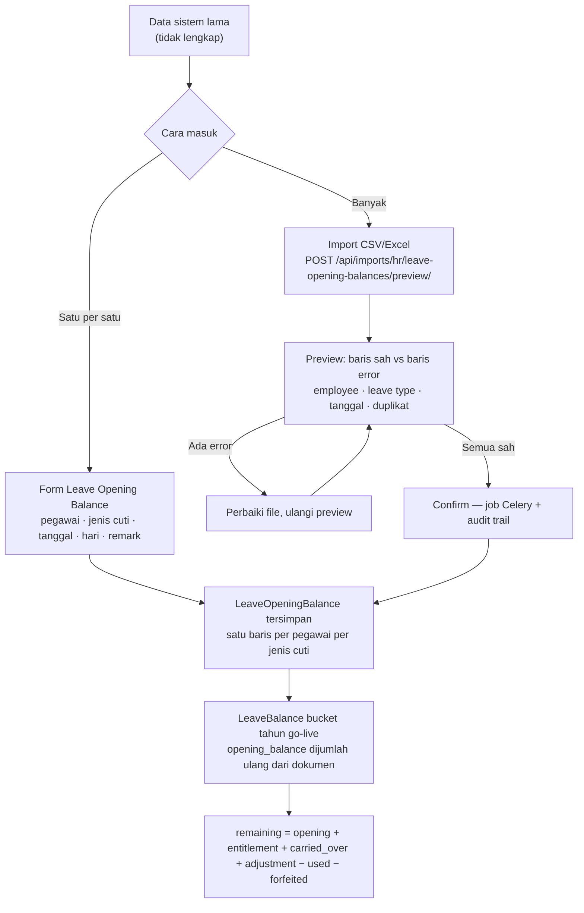
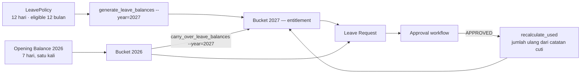
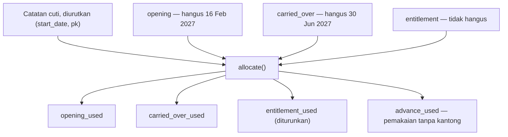
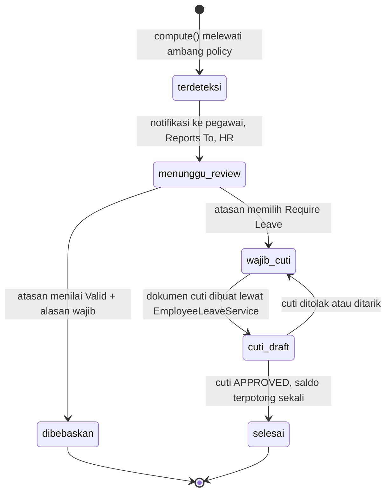

# Saldo Awal Cuti & Pengecualian Presensi

Status: **selesai dan terpasang** per 2026-08-16 — tahap 1 sampai 5. Halaman ini
menggantikan bagian yang sudah dikerjakan dari dua proposal yang mendahuluinya:
**[Proposal: Saldo Cuti](Leave-Balance-Proposal.md)** dan
**[Proposal: Kewajiban Cuti dari Presensi](Attendance-Leave-Obligation-Proposal.md)**.
Keduanya tetap berlaku untuk bagian yang belum dikerjakan (penyelesaian saat resign,
arsip periode cuti).

Cakupan: saldo awal migrasi go-live → import massalnya → alokasi FIFO yang membuat
penghangusan bisa dipercaya → peninjauan pengecualian presensi oleh atasan.

---

## 1. Kesimpulan lebih dulu

Modul cuti di repo ini **bukan lahan kosong**, dan justru itu yang membuat penambahan
Opening Balance harus hati-hati. Bucket sudah ada, policy berjenjang sudah ada,
perhitungan hari kerja site-vs-HO sudah ada, dan aturan "jangan bikin histori tahun
lampau" sudah dipatuhi sebelumnya — bukan kebetulan, tapi karena
`generate_leave_balances` memang per tahun dan dijalankan manual.

Yang benar-benar hilang cuma dua hal, dan keduanya berakibat jauh lebih besar daripada
ukurannya: **tidak ada kantong untuk saldo awal migrasi**, dan **penanda kewajiban cuti
di presensi tidak pernah sampai ke siapa pun**.

!!! danger "Temuan paling mendesak — sudah ditutup"
    Sebelum perubahan ini, satu-satunya cara HR mengisi saldo awal adalah mengetik kolom
    `entitlement` atau `adjustment` di layar Leave Balance. Yang pertama **ditimpa
    diam-diam**: `LeaveBalanceGenerator` menulis ulang kolom itu, dan ia dipanggil
    otomatis dari `EmploymentService.save()` setiap kali Join Date, Employee Group, atau
    Employment Type disunting. Jadi saldo migrasi 7 hari milik Andi hilang begitu ada
    yang membetulkan satu huruf di kartu pegawainya — tanpa satu pun pesan. Sekarang
    saldo awal punya kantongnya sendiri, dan generator tidak mengenalnya.

| Yang dikerjakan | Berkas |
|---|---|
| Model dokumen saldo awal | `apps/hr/models/leave_opening.py` — satu baris per pegawai per jenis cuti, unik dan dikondisikan ke `is_deleted` |
| Kantong ketiga di kartu saldo | `LeaveBalance.opening_balance` + `opening_expires_at`, dijumlah ulang dari dokumen; `remaining` ikut menghitungnya |
| Service + hook | `apps/hr/api/leave_opening/services.py` — turunkan tahun, bekukan tanggal hangus, sinkronkan kartu saat create / update / hapus / restore |
| Layar & endpoint | `/api/hr/leave-opening-balances/`, schema dua tab, `ServiceWriteMixin`, cakupan data sama dengan Leave Balance |
| Import massal | `apps/hr/imports/leave_opening/` + dua `ImportProfile`; preview, template, laporan error, dan audit job datang dari pipeline generik |
| Alokasi FIFO + penghangusan | `apps/hr/api/leave/allocation.py` (fungsi murni, tanpa query) + kolom `opening_used` / `carried_over_used` / `advance_used`; `expire()` kini menghanguskan dua kantong |
| Peninjauan presensi | `apps/hr/api/attendance/obligation.py` — tombol Waive / Require Leave / Issue Leave, penerima dari `reports_to`, dua event notifikasi baru |
| Layar & menu FE | Module `hr/leave-opening-balances` + rute + menu; ditambahkan ke `scripts/10_hr_apps.sh`, dan `generate_all.sh` ikut memanggil script 12–14 yang selama ini terlewat |
| Uji | 34 test baru (11 opening balance, 12 alokasi, 11 keadaan kewajiban). Seluruh suite HR: 151 lulus |

---

## 2. Lima temuan yang menentukan bentuk kodenya

### T-1 — Saldo migrasi yang diketik ke `entitlement` akan hilang sendiri

`LeaveBalanceGenerator.run()` menulis ulang `entitlement` dan `carried_over`, dan ia
dipanggil otomatis dari `EmploymentService.save()` untuk tahun berjalan + tahun depan.
Artinya angka migrasi bertahan sampai ada yang menyunting Join Date, Employee Group,
atau Employment Type pegawai itu — lalu diam-diam kembali ke angka policy.

Ini bukan alasan menghentikan generator; ini alasan opening balance wajib jadi **kantong
ketiga** yang generator tidak kenal, sama seperti `adjustment`.

`apps/hr/api/leave/entitlement.py` · `apps/hr/api/employee/services/employment_service.py`

### T-2 — `adjustment` tidak cukup, dan memakainya justru merusak artinya

Kolom itu bertahan dari perhitungan ulang, jadi menggoda dipakai untuk migrasi. Tapi
bentuknya satu angka skalar: tidak menyimpan tanggal go-live, tidak menyimpan keterangan
per koreksi, dan tidak bisa mencegah duplikat. Begitu saldo migrasi dan koreksi
manajemen menempati kolom yang sama, pertanyaan "7 hari ini dari mana" tidak punya
jawaban di layar mana pun.

### T-3 — Expiry opening balance tidak bisa dihitung tepat selama `used` masih skalar

Bucket 2026 dengan opening balance 7, terpakai 2, sisa 5 hangus 30 Juni 2027. Untuk tahu
**5 hari itu dari kantong mana**, konsumsinya harus FIFO. Selama `used` satu angka untuk
seluruh bucket, "bawaan dulu, baru jatah tahun berjalan" tidak bisa dinyatakan.

Ini yang menentukan urutan kerja: alokasi FIFO harus ada kalau opening balance mau punya
tanggal hangus yang bisa dipercaya.

### T-4 — Penanda kewajiban cuti ditimpa tiap perhitungan ulang

`AttendancePolicyResolver.compute()` menimpa `leave_required_days` setiap kali dipanggil
— dan itu terjadi lagi begitu tap pulang menyusul, atau begitu `recalculate_attendance`
dijalankan. Jadi keputusan atasan ("valid, tidak perlu cuti") tidak boleh ditulis ke
kolom itu. Ia harus punya kolom sendiri, dan angka menurut aturan tetap tersimpan sebagai
fakta — kalau tidak, pembebasan tidak bisa dibedakan dari aturan yang memang tidak
menyala.

### T-5 — Review presensi jangan lewat engine workflow

Engine `apps/workflow` membangun seluruh baris keputusan di depan saat submit, dan
dirancang untuk **dokumen** — satu Travel Request, satu Employee Action. Satu import
fingerprint bisa melahirkan ratusan pengecualian dalam satu tarikan; membuat satu
`WorkflowInstance` per baris presensi akan membanjiri kotak masuk yang sama yang dipakai
menyetujui cuti dan perjalanan dinas.

Yang tepat: review ringan di baris presensi itu sendiri, penerimanya diambil dari
`manager_of()` yang sama.

---

## 3. Flow A — Go-live: dari sistem lama ke bucket

Opening balance masuk sebagai **dokumen**, bukan angka yang diketik ke kartu saldo. Kartu
saldonya tetap dihitung ulang dari dokumen itu — pola yang sama dengan `used` yang
dijumlah ulang dari catatan cuti.



!!! info "Kenapa dokumen, bukan kolom bebas ketik"
    Yang diminta ada empat sekaligus: cegah duplikat, simpan remark dan tanggal, sediakan
    preview sebelum final submit, dan audit siapa yang memasukkannya. Keempatnya alami
    sebagai baris dokumen dengan constraint unik, dan canggung sebagai kolom di kartu
    saldo. Kartunya tetap satu-satunya tempat orang membaca angka — yang berubah cuma
    dari mana angka itu datang.

### Aturannya

- **Satu baris per pegawai per jenis cuti**, ditegakkan `uniq_active_hr_leave_opening_balance`.
  Batas itu yang membuatnya tetap alat migrasi; tanpanya ia jadi cara menambah saldo
  sehari-hari dalam tiga bulan, dan koreksi harian tempatnya `adjustment` yang memang
  dibuat untuk itu.
- **Tanggal hangus dibekukan saat dokumen dibuat**, diturunkan dari
  `LeavePolicy.carry_over_expiry_months`. Anchor-nya `opening_date`, **bukan** 1 Januari
  seperti sisa bawaan tahun lalu: titik lahirnya berbeda, dan kalau ikut 1 Januari,
  tenant yang go-live bulan Agustus dengan masa berlaku 6 bulan mendapat tanggal hangus
  yang **sudah lewat** pada hari pertama sistemnya dipakai. Tidak pernah dihitung ulang
  saat update — policy yang berubah besok tidak boleh memundurkan hak yang sudah
  dikabarkan ke pegawai.
- **`LeaveBalance.opening_balance` jangan pernah diketik langsung.** Ia diisi
  `LeaveOpeningBalanceService.sync_balance` dari baris dokumen yang aktif.
- `Meta.validators = []` di serializer mematikan `UniqueTogetherValidator` bawaan DRF —
  bukan melonggarkan (constraint DB tetap, `validate()` memeriksa hal yang sama) tapi
  supaya pesannya menyebut dokumen bentroknya, **dan** supaya PATCH satu kolom tidak
  dibalas "This field is required" untuk kolom yang tidak disentuh siapa pun.

### Import massal

Module `hr/leave-opening-balances` di pipeline import generik. Seluruh penolakan ditulis
di `resolve()`, bukan dibiarkan jatuh di `write()`: yang di `resolve()` muncul di layar
preview lengkap dengan nomor barisnya, yang jatuh di `write()` baru terbaca setelah job
selesai.

Yang diperiksa: pegawai ada, jenis cuti ada (kode dulu, nama ikut diterima), tanggal
terbaca, saldo bukan negatif, tanggal berlaku tidak lebih awal dari Join Date, dan
**duplikat** — baik terhadap dokumen yang sudah ada (di `resolve()`) maupun terhadap
baris lain di file yang sama (di `write()`, karena saat preview belum satu pun tertulis).

Profil: `LEAVE-OPENING-CSV-DEFAULT` dan `LEAVE-OPENING-CSV-US-DATE` lewat
`seed_import_profiles`.

!!! warning "Header file di-`strip().lower()`, spasinya TIDAK diubah jadi garis bawah"
    Jadi "Employee Code" mendarat sebagai `employee code` dan tidak cocok dengan alias
    `employee_code` — dua bentuk itu harus dua-duanya ditulis di `mapping`. Gagalnya
    diam: kolomnya terbaca kosong, lalu barisnya ditolak sebagai "employee_code is
    required" padahal isinya ada.

!!! bug "Bug lama yang ikut ketahuan"
    `ImportNormalizer.to_date` meneruskan `ValueError` dari `parse_date` untuk tanggal
    yang **bentuknya** benar tapi mustahil (`2026-13-45`, `31/04/2026`) — satu sel salah
    ketik di tengah file menjatuhkan **seluruh** preview jadi 500, dengan pesan ("month
    must be in 1..12") yang tidak menyebut baris maupun kolomnya. Kena semua importer,
    bukan cuma yang ini. Sudah ditangkap; nilainya jadi tidak terbaca dan importer
    melaporkannya sebagai error baris.

---

## 4. Flow B — Setelah go-live: kembali normal



Perhatikan arah panah terakhir: HR tidak pernah mengubah angka sisa. Cuti Andi 2 hari
disetujui, `LeaveBalanceService.recalculate_used` menjumlah ulang seluruh catatan
cutinya, dan sisa 7 menjadi 5 dengan sendirinya. Mekanisme itu **sudah berjalan
sebelumnya** — opening balance cuma menambah satu suku di penjumlahannya.

---

## 5. Alokasi FIFO — cuti mana menggerus kantong mana

Kartu saldo punya **tiga kantong** yang lahir dari tempat berbeda: `entitlement` (jatah
tahun berjalan), `carried_over` (sisa tahun lalu), dan `opening_balance` (saldo awal
migrasi). Selama `used` cuma satu angka untuk seluruh kartu, "yang terpakai itu kantong
yang mana" tidak bisa dijawab — dan tanpa jawaban itu **penghangusan tidak bisa
dieksekusi sama sekali**: bawaan yang belum terpakai (memang hangus) tidak bisa dibedakan
dari bawaan yang sudah dipakai bulan Maret (tidak ada yang perlu dihanguskan).

**Aturannya: yang paling cepat hangus dipakai lebih dulu.** Kalau dibalik, setiap orang
kehilangan bawaannya walau cutinya banyak, dan tidak ada yang bisa menjelaskan kenapa.

Urutan kantong: tanggal hangus menaik (yang tidak pernah hangus paling belakang), lalu
asal-usul tertua (`opening` → `carried_over` → `entitlement`) sebagai pemecah seri.



- **Fungsi murni, tanpa satu pun query** (`apps/hr/api/leave/allocation.py`) — dipakai
  perhitungan ulang, pratinjau, dan perintah penghangusan, jadi ketiganya memakai jalan
  yang sama dan bisa diuji tanpa menyiapkan tenant. Pola yang sama dengan
  `RosterCalculationService`. Dijaga `apps/hr/tests/leave/test_allocation.py`
  (`SimpleTestCase`, 12 test).
- **Urutan cuti wajib `(start_date, pk)`.** Kalau diurutkan `pk` saja, mengoreksi tanggal
  satu cuti lama akan memindahkan kantong seluruh cuti sesudahnya — dan jumlah hari
  hangus seseorang berubah tanpa ada yang menyentuh datanya.
- **Batas hangus eksklusif**: cuti yang mulai tepat di tanggal hangus sudah tidak boleh
  memakainya, sejajar dengan syarat penghangusan (`expires_at <= today` berarti sudah
  hangus).
- **`entitlement_used` diturunkan, bukan disimpan** — kolom keempat yang harus dijaga
  tetap sejumlah dengan ketiganya cepat atau lambat berbeda.
- **`advance_used`** = pemakaian yang tidak punya kantong sama sekali (cuti dibayar di
  muka). Inilah yang membuat kartu bersaldo minus bisa dijelaskan — tanpanya, −3 tidak
  bisa dibedakan dari jatah yang salah hitung.

!!! danger "Yang hangus TIDAK mengurangi kolom pemberiannya"
    `expire()` dulu mengurangi `carried_over`; sekarang cuma menulis `*_forfeited`, dan
    `remaining` yang mengurangkannya. Alasannya keras: `carried_over` ditimpa ulang tiap
    carry over dijalankan dan `opening_balance` dijumlah ulang dari dokumen migrasi —
    mengurangi di sana berarti hari yang sudah dihanguskan **hidup lagi** pada
    sinkronisasi berikutnya, tanpa satu pun pesan. Ini sekalian menutup bug lama:
    menjalankan carry over setelah expire mengembalikan hari yang sudah hangus.

```
remaining = entitlement + carried_over + opening_balance + adjustment
          − used − carried_over_forfeited − opening_forfeited
```

Pengingat kedaluwarsa (`apps/hr/reminders/leave_expiry.py`) ikut dua kantong, dan
angkanya dari hasil alokasi — bukan `carried_over − used` yang kasar. Yang kasar
**menghukum orang dua kali**: cuti yang sebenarnya menggerus saldo awal tetap terhitung
mengurangi bawaan, sehingga bawaannya terlihat habis padahal utuh. `dedup_key` memuat
kantong **dan** tonggaknya.

---

## 6. Flow C — Presensi: pengecualian, atasan, lalu cuti



### Kolom keputusan terpisah dari kolom aturan

`compute()` **tidak boleh menyentuh kolom keputusan**. `leave_required_days` tetap
menyimpan angka **menurut aturan** dan tetap ditimpa tiap perhitungan ulang — itu
faktanya. Keputusan orang duduk di kolom sendiri (`leave_required_override`,
`leave_required_waived`, `leave_required_waiver_reason`, `review_decision`,
`reviewed_by`, `reviewed_at`).

Kalau ditulis ke kolom yang sama, "menurut aturan seharusnya berapa" lenyap dan
**pembebasan tidak bisa dibedakan dari aturan yang memang tidak menyala**. Konsekuensi
yang diinginkan: `recalculate_attendance` aman dijalankan kapan saja tanpa menghapus
keputusan orang. Pelajaran yang sama dengan `LeaveBalance.adjustment` dan
`RotationTravel.is_manual_override`.

| Properti turunan | Artinya |
|---|---|
| `leave_required_effective` | Pembebasan menang atas apa pun, lalu angka yang ditetapkan orang, lalu hitungan aturan |
| `leave_obligation_status` | `none` / `waived` / `outstanding` / `leave_issued` / `settled` |
| `leave_obligation_label` | Versi siap-tampil untuk kolom tabel |

`leave_obligation_status` **diturunkan, tidak disimpan**: ia bergantung pada status
dokumen cutinya, dan dokumen itu bisa berubah tanpa menyentuh baris presensi. Cuti yang
**ditolak** mengembalikan barisnya jadi `outstanding`, dan itu benar — kewajibannya belum
diselesaikan siapa pun.

Kolom tabelnya memakai angka **efektif**; `leave_required_days` sendiri `table=False`.
Dua kolom berlabel nyaris sama yang salah satunya diam-diam mengabaikan pembebasan adalah
cara tercepat membuat daftar ini tidak dipercaya.

### Siapa yang boleh memutuskan

**Atasan = `reports_to`, bukan field baru.** `AttendanceObligationService.supervisor_of()`
memanggil `manager_of()` milik resolver engine approval — dua salinan aturan "siapa
atasan siapa" akan membuat orang yang meninjau presensi berbeda dari orang yang
menyetujui cutinya, dan selisih seperti itu tidak berbunyi.

Yang boleh memutuskan: atasan langsung, HR yang punya `change_employeeattendance`, dan
superuser — **diperiksa paling akhir**, supaya yang kebetulan juga atasan tercatat sebagai
atasan.

### Tiga tombol

| Endpoint | Perilaku |
|---|---|
| `POST /api/hr/attendance/<id>/waive/` | Alasan **wajib**. Menyalakan `leave_required_waived`, `review_decision="valid"`. Angka menurut aturan tetap utuh di belakangnya |
| `POST /api/hr/attendance/<id>/require-leave/` | Membatalkan pembebasan, boleh menetapkan `days` sendiri, memberi tahu pegawainya |
| `POST /api/hr/attendance/<id>/issue-leave/` | Menerbitkan `EmployeeLeave` **DRAFT** lewat `EmployeeLeaveService`, tertaut balik lewat FK |

- **DRAFT, bukan APPROVED** — yang menerbitkan bukan yang berhak menyetujui. Di seluruh
  codebase ini saldo tidak pernah berkurang tanpa persetujuan.
- **Jenis cutinya dari `AttendancePolicy.leave_type`, dan ditolak kalau kosong** — bukan
  ditebak. Cuti dengan jenis yang ditebak memotong saldo yang salah, dan itu baru
  ketahuan saat orangnya mengajukan cuti tahunan lalu ditolak karena saldonya habis.
  `clean()` mewajibkannya begitu salah satu ambang menyala.
- `leave_deduction_days` menyimpan **dua** desimal, `total_days` cuma **satu**. Dibulatkan
  `ROUND_HALF_UP` di sini; tanpa itu potongan 0,25 hari menjatuhkan penyimpanan dengan
  pesan tentang tempat desimal, jauh dari layar tempat angkanya diketik.
- FK `EmployeeAttendance.leave` menautkannya balik, jadi tidak bisa diterbitkan dua kali.

### Notifikasi

Dua event baru di `apps/notifications/events.py`:

| Event | Penerima bawaan |
|---|---|
| `hr.attendance_exception` | pegawai + **atasan langsung** |
| `hr.attendance_leave_required` | pegawai |

Saklarnya di policy (`notify_employee` / `notify_supervisor` / `notify_hr`) lewat
`only_recipient_types` — **mempersempit, tidak pernah memperluas**, kalau tidak layar
Notification Rules berhenti menjawab "siapa saja yang menerima ini".

```bash
python manage.py tenant_command notify_attendance_exceptions --schema=demo [--start=] [--until=] [--dry-run]
```

Perintah berkala, bukan signal saat barisnya ditulis: satu import fingerprint menulis
ratusan baris sekaligus, dan mengirim surat di dalam jalur tulis berarti satu berkas
absensi menahan importnya sambil menembak ratusan email. Bawaannya 7 hari ke belakang
sampai **kemarin**; hari ini tidak ikut karena tap pulang lazim baru masuk sore.
`dedup_key` memuat id barisnya, jadi aman diulang.

---

## 7. Endpoint & perintah

### Endpoint

```
GET|POST      /api/hr/leave-opening-balances/
GET|PATCH|DEL /api/hr/leave-opening-balances/<id>/

POST /api/imports/hr/leave-opening-balances/preview/
GET  /api/imports/hr/leave-opening-balances/template/
POST /api/imports/hr/leave-opening-balances/confirm/

POST /api/hr/attendance/<id>/waive/
POST /api/hr/attendance/<id>/require-leave/
POST /api/hr/attendance/<id>/issue-leave/
```

### Perintah

```bash
# saldo cuti — urutannya generate dulu, baru carry over
python manage.py tenant_command generate_leave_balances --year=2027 --schema=demo
python manage.py tenant_command carry_over_leave_balances --year=2027 --schema=demo [--expire] [--dry-run]

# presensi
python manage.py tenant_command notify_attendance_exceptions --schema=demo [--dry-run]
python manage.py tenant_command recalculate_attendance --start= --until= --schema=demo [--dry-run]
python manage.py tenant_command close_attendance --schema=demo
```

### Wajib dijalankan setelah deploy

```bash
python manage.py migrate_schemas                                     # hr.0041–0043, administration.0033
python manage.py tenant_command seed_import_profiles     --schema=<t>  # 2 profil import baru
python manage.py tenant_command seed_security_roles      --schema=<t>  # permission add_leaveopeningbalance dkk.
python manage.py tenant_command seed_menus               --schema=<t>  # menu Leave Opening Balance
python manage.py tenant_command seed_notification_templates --schema=<t>  # 2 template baru
python manage.py tenant_command seed_attendance_policy   --schema=<t>  # leave_type kini wajib saat ambang menyala
```

!!! danger "Model baru = `seed_security_roles` wajib diulang"
    Permission `add_leaveopeningbalance` dkk. lahir bersama modelnya, jadi role yang
    diseed sebelumnya tidak memilikinya. Gejalanya 403 di layar yang seharusnya boleh.

### Sisi frontend

```bash
pnpm meinova generate hr/leave-opening-balances
# atau seluruh HR sekaligus
sh scripts/10_hr_apps.sh
```

Rute `app/pages/hr/leave-opening-balances/{index,import}.vue`, menu di grup **Attendance
& Leave** tepat di bawah Leave Balance — keduanya dibaca bergantian saat menelusuri satu
angka. Sengaja **tidak** masuk daftar menu role `EMPLOYEE`: ini alat HR saat go-live, dan
angkanya sudah terbaca di kartu saldo pegawainya sendiri.

!!! bug "Tombol Import di editor berdialog sempat mati total"
    Template `crud-dialog` merender `:show-import` / `:show-export` /
    `:show-bulk-delete` dari `crud.ui` tapi **tidak memasang satu pun handler**-nya —
    hanya `crud-workspace` yang punya. Jadi ketiga tombol tampil persis seperti di layar
    yang berfungsi, ditekan, dan tidak terjadi apa-apa: tanpa error, tanpa permintaan ke
    server, tanpa perubahan di layar. Ketahuan lewat modul ini, modul berdialog pertama
    yang punya importer. Sudah ditambal di template (`crud-dialog` dan `crud-page`), jadi
    modul berdialog lain mendapatkannya begitu diregenerate — yang tertinggal di sana
    bukan Import (belum ada yang punya) melainkan **Export dan Bulk Delete**.

    Rute `/<module>/import` sendiri tidak pernah digenerate — seluruh berkas di
    `app/pages/` ditulis tangan. Tombolnya sekarang selalu terpasang, jadi modul
    ber-`ui.import` yang lupa membuat rutenya mendarat di 404; itu kegagalan yang
    terlihat, dan jauh lebih baik daripada tombol yang diam.

!!! note "Perbaikan generator yang berlaku untuk semua modul"
    Field bertipe pilihan yang membawa `options` kini jadi dropdown di toolbar filter.
    Sebelumnya hanya `lookup` dan `boolean` punya cabang; sisanya jatuh ke `filter.text`,
    jadi filter **Status**, **Source**, dan **Approval Status** di seluruh modul berupa
    kotak ketik dan pemakainya harus menebak **nilai tersimpannya** — mengetik "Manual"
    tidak mencocokkan apa pun karena yang tersimpan `manual`. Hasilnya nol baris, dan itu
    tidak bisa dibedakan dari data yang memang tidak ada.

---

## 8. Acceptance test

| # | Skenario | Status | Catatan |
|---|---|---|---|
| 1 | Opening balance 7 → saldo 7 | Lulus | Terverifikasi di tenant demo dan dikunci test |
| 2 | Cuti 2 disetujui → sisa 5 | Lulus | Otomatis lewat `recalculate_used`; HR tidak mengetik apa pun |
| 3 | Tidak ada bucket palsu 2022–2025 | Lulus | Sudah benar sebelumnya, kini dikunci test |
| 4 | Bulk import 3 pegawai | Lulus | 3 dibuat, baris salah ditolak beserta sebabnya dan nomor barisnya |
| 5 | Exception diarahkan ke Reports To | Lulus | Tanpa field supervisor baru — `manager_of()` yang dipakai |
| 6 | Telat 2j15m → exception, tanpa potong saldo | Lulus | Telat 134 menit → 0,5 hari, notifikasi terkirim, saldo tidak bergerak |
| 7 | Atasan menilai valid → tidak ada potongan | Lulus | Waive tanpa alasan ditolak; angka menurut aturan tetap utuh |
| 8 | Atasan meminta cuti → alur cuti normal | Lulus | Dokumen DRAFT terbit lewat service; terbit dua kali ditolak |

Uji otomatis:

```bash
python manage.py test apps.hr.tests.leave apps.hr.tests.attendance --keepdb
```

| Berkas | Jenis | Isi |
|---|---|---|
| `apps/hr/tests/leave/test_opening_balance.py` | `TenantTestCase` | 11 test — dokumen, sinkronisasi kartu, duplikat, hapus/restore |
| `apps/hr/tests/leave/test_allocation.py` | `SimpleTestCase` | 12 test — urutan kantong, batas hangus eksklusif, advance |
| `apps/hr/tests/attendance/test_obligation_state.py` | `SimpleTestCase` | 11 test — keadaan kewajiban, pembebasan vs override nol |

Dua berkas terakhir **tidak menyentuh database sama sekali** — keduanya memang fungsi dan
properti murni, dan itu properti yang harus tetap dijaga: begitu ada yang menambahkan
query, berkas ini yang pertama gagal.

---

## 9. Yang tersisa, dan kenapa

- **Digest per atasan.** Atasan yang kebagian dua puluh pengecualian pagi itu tetap
  mendapat dua puluh surat. Ini batas seluruh mesin notifikasi hari ini, bukan kekurangan
  modul presensi — memperbaikinya berarti menambah lapisan penggabungan di
  `apps/notifications`, dan itu keputusan tersendiri.
- **Penjadwalan otomatis.** Tiga perintah berkala — `notify_attendance_exceptions`,
  `close_attendance`, dan `carry_over_leave_balances --expire` — masih dijalankan tangan.
  Celery Beat sudah aktif; yang kurang satu entri jadwal plus task pembagi per tenant.
- **Rincian kantong di kartu cuti.** Kolomnya terisi dan sudah ikut di schema, tapi
  `table=False`: enam kolom angka berjejer membuat daftarnya harus digulir ke samping,
  sementara yang dicari orang cuma Remaining.
- **Layar penghangusan.** `opening_forfeited` dan `carried_over_forfeited` sudah terisi
  dan sudah dikurangkan dari `remaining`, tapi belum ditampilkan sebagai baris tersendiri
  di kartu — jadi "empat hari saya ke mana" masih dijawab dengan membuka detailnya.
- **Penyelesaian saldo saat resign/PHK.** Masih di
  [Proposal: Saldo Cuti](Leave-Balance-Proposal.md) §10, belum dikerjakan.

---

## 10. Yang sengaja tidak dikerjakan

- **Ledger append-only untuk cuti.** Modul ini dibangun di atas "jumlahkan ulang, jangan
  inkremental", dan sumber kebenarannya (`EmployeeLeave`) sudah lengkap. Ledger berarti
  dua sumber angka untuk hal yang sama.
- **Model supervisor baru.** `reports_to` sudah ada dan sudah dipakai engine approval.
- **Penerbitan cuti otomatis dari presensi.** Di seluruh codebase ini saldo tidak pernah
  berkurang tanpa persetujuan, termasuk di jalur Travel Request. Penanda, bukan eksekusi.
- **Bucket per tahun untuk masa sebelum go-live.** Histori yang tidak pernah lengkap dan
  tidak akan pernah lengkap; yang benar satu titik awal bertanggal, lalu seluruh transaksi
  sesudahnya kembali lewat jalur normal.
- **Review presensi lewat engine workflow.** Lihat T-5 di atas.

---

## Lihat juga

- [Business Flows → Cuti](../../09-business-flows/Leave-Request.md) — alur pengajuan cuti dan perhitungan harinya
- [HR → Leave](Leave.md) — ringkasan modul cuti dan masternya
- [HR → Attendance](Attendance.md) — master jadwal, Shift, Work Calendar
- [Proposal: Saldo Cuti](Leave-Balance-Proposal.md) — bagian yang belum dikerjakan
- [Proposal: Kewajiban Cuti dari Presensi](Attendance-Leave-Obligation-Proposal.md) — rancangan awal
