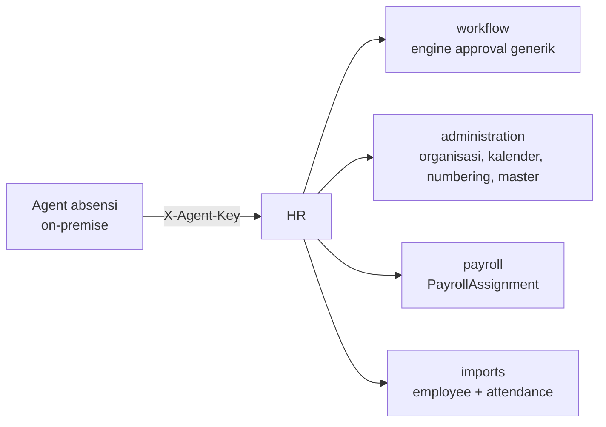

# Modul HR

Modul paling matang di sistem ini. 24 `framework_module`, 37 migrasi, satu-satunya app yang punya test.

---

## Status per bagian

| Bagian | Status | Halaman |
|---|---|---|
| Employee master + sub-data | ✅ | [Employees](Employees.md) |
| Attendance (import file + sync agent) | ✅ | [Attendance](Attendance.md) |
| Leave (pencatatan + pengajuan) | ✅ | [Leave](Leave.md) |
| Overtime | ✅ | pencatatan; **belum** disambungkan ke engine approval |
| Travel Request | ✅ | [Travel & Rotation](Travel-Rotation.md) |
| Roster (setup, adjustment, credit) | ✅ | [Roster](../../09-business-flows/Roster-Management.md) |
| Employee Action | ✅ | [Employee Action](../../09-business-flows/Employee-Action.md) |
| Training | ✅ | [Training](Training.md) |
| Recruitment | ✅ | [Recruitment](Recruitment.md) |
| Reminder kepegawaian | ✅ | task terjadwal jam 6 pagi |
| Dashboard HR | ✅ | [Dashboard](Dashboard.md) |
| Medical | 🟡 | [Medical](Medical.md) — hanya `EmployeeMedicalEvent`, tanpa modul |
| Performance | ❌ | [Performance](Performance.md) — `models/performance.py` **file kosong** |
| Separation | ❌ | `models/separation.py` **file kosong**; turnover dihitung dari `EmploymentAssignment.termination_date` |

---

## Menu

| Menu | `framework_module` | Model utama |
|---|---|---|
| Dashboard | `hr/dashboard` | — (agregasi) |
| Employees | `hr/employees` | `Employee` + sub-data |
| Attendance | `hr/attendance` | `EmployeeAttendance` |
| Leave | `hr/leave`, `hr/leave-balances` | `EmployeeLeave`, `LeaveBalance` |
| Overtime | `hr/overtime` | `EmployeeOvertime` |
| Travel Request | `hr/travel-requests` | `TravelRequest` |
| Roster Schedule | `hr/site-rotations` | `SiteRotation`, `RotationPeriod` |
| Roster Setup | `hr/roster-setups`, `hr/roster-setup-lines` | `RosterSetupRequest` |
| Roster Adjustment | `hr/roster-adjustments` | `RosterAdjustment` |
| Rotation Credit | `hr/rotation-credits` | `RotationCreditTransaction` |
| Employee Actions | `hr/employee-actions` | `EmployeeAction` |
| Training | `hr/training`, `hr/training-participants` | `TrainingProgram` |
| Recruitment | `hr/recruitment`, `hr/candidates`, `hr/candidate-interviews` | `JobVacancy`, `Candidate` |
| Masters | 5 policy + referensi | lewat Master Hub |

Registry lengkap: [Module Registry](../Module-Registry.md).

---

## Pembelahan yang membentuk seluruh modul: HO vs site

Hampir semua perhitungan HR bercabang di satu titik — **pola kerja pegawai**, yang tersimpan di `EmploymentAssignment`.

| | Pegawai kantor (HO) | Pegawai site |
|---|---|---|
| Penanda | tanpa `roster_crew` / `roster_policy` | punya salah satunya |
| Kalender | `WorkCalendar` (Senin–Jumat, libur nasional keluar) | blok roster (`RotationPeriod`) |
| Hitungan hari cuti | hari kerja kalender | hari blok kerja |
| Travel Request | tidak punya kepulangan untuk diajukan | jalur utamanya |
| Absensi | 10:00–18:00 | 07:00–17:00, mengikuti blok kerja |

Cuti 14–18 Agustus 2026 (5 hari kalender): pegawai HO memotong **2 hari**, pegawai site memotong **5 hari**.

!!! danger "Form-nya sengaja TIDAK dipisah"
    Yang berbeda bukan jenis cutinya, melainkan **cara menghitung harinya** — dan itu properti pola kerja pegawai, bukan properti record cuti.

    Memisah form berarti dua tabel, dua saldo, dua laporan, dan **pegawai yang pindah site↔HO jadi kasus khusus permanen**.

!!! danger "Kalender ditentukan location, bukan jenis pegawai"
    `resolve_calendar` memenangkan kalender yang cocok company **+** location sebelum kalender company saja. Pegawai kantor yang `location`-nya diisi site mewarisi kalender **operasional** site — tujuh hari kerja seminggu — sehingga cuti seminggunya memotong 7 hari, bukan 5.

    Perbaikannya: isi `EmploymentAssignment.working_calendar` eksplisit.

---

## Employee: identitas terpisah dari penempatan

`Employee` hanya identitas. Empat model penempatan yang menentukan perilakunya:

| Model | Kardinalitas | Isi |
|---|---|---|
| `OrganizationAssignment` | OneToOne | company … section, position |
| `EmploymentAssignment` | OneToOne | join date, kontrak, roster policy, POH, kalender |
| `PayrollAssignment` | banyak, **effective-dated** | payroll group, gaji, PTKP, BPJS |
| Bank / pendidikan / keluarga / dokumen / medis | banyak | |

Memisahkannya begini yang membuat perubahan bisa punya tanggal berlaku, dan membuat `EmployeeDataPolicy` bisa menutup **sebagian** data pegawai tanpa menutup seluruh barisnya.

---

## Lima master aturan

Semuanya berjenjang lewat skor `specificity`, dan **kosong berarti "berlaku untuk semua"**:

| Master | Menjawab |
|---|---|
| `LeavePolicy` | berapa jatah cuti, sejak kapan berhak |
| `RosterPolicy` | pola siklus, hari travel per POH, rasio konversi |
| `EmployeeActionPolicy` | siapa boleh **mengusulkan** perubahan kepegawaian |
| `EmployeeDataPolicy` | siapa boleh **melihat** bagian mana dari data pegawai |
| `WorkflowDefinition` | siapa menyetujui dokumen siapa |

Dua yang di tengah ada karena Django Permission tidak bisa menyatakannya: ia cuma tahu `add_employeeaction`, tidak mengenal `action_type`.

---

## Integrasi keluar modul



HR **tidak** punya engine approval sendiri — `apps/workflow` generik, dan HR menyambung lewat `@register_completion`.

---

## Test

Satu-satunya app yang punya test: `apps/hr/tests/roster/` dan `apps/hr/tests/policy/`.

```bash
python manage.py test apps.hr.tests.roster --keepdb
```

Dua berkas di antaranya `SimpleTestCase` yang **tidak menyentuh database sama sekali** — kalkulator roster memang fungsi murni, dan itu properti yang dijaga test.

Detail: [Testing](../../08-development/Testing.md).

---

## Data uji

```bash
tenant_command seed_demo_workforce    # 11 pegawai: HO Jakarta + site Gebe
tenant_command seed_roster_demo
tenant_command seed_demo_attendance
```

Urutan lengkap: [Onboarding](../../08-development/Onboarding.md#5-data-uji).

---

## Rujukan

| Topik | Halaman |
|---|---|
| Alur bisnis lengkap | [Business Flows](../../09-business-flows/Overview.md) |
| Endpoint | [API](API.md) |
| Model | [Database](Database.md) |
| Yang belum ada | [Future](Future.md) |
