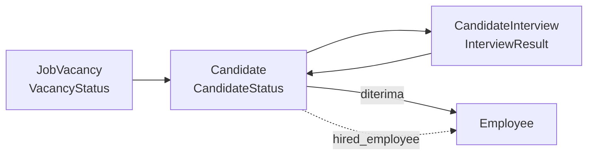

# Recruitment

Tiga model, tiga `framework_module`.

| Model | `framework_module` |
|---|---|
| `JobVacancy` | `hr/recruitment` |
| `Candidate` | `hr/candidates` |
| `CandidateInterview` | `hr/candidate-interviews` |

---

## Alur



Belum disambungkan ke engine approval — perpindahan status dilakukan langsung, bukan lewat meja persetujuan.

---

## `Candidate.hired_employee`

```python
hired_employee = models.OneToOneField(...)
```

Diisi setelah kandidat diterima, **supaya jejak asal-usul pegawai tidak hilang**.

Tanpa itu, pertanyaan "pegawai ini dulu melamar lewat jalur apa, siapa yang mewawancarai, kenapa kandidat lain ditolak" tidak bisa dijawab lagi begitu ia jadi pegawai.

`OneToOneField` karena satu kandidat menghasilkan paling banyak satu pegawai.

---

## Master

| Master | Isi |
|---|---|
| `recruitment-sources` | dari mana kandidat datang |
| `candidate-statuses` | tahap seleksi |
| `interview-types` | jenis wawancara |
| `rejection-reasons` | alasan penolakan |

Keempatnya baru ditambahkan ke seeder bersama `leave-types` dan `overtime-types` — sebelumnya modulnya jalan tapi dropdown-nya kosong.

```bash
tenant_command seed_administration --only=hr-reference
```

!!! note "`rejection-reasons` sebagai master, bukan teks bebas"
    Supaya bisa dilaporkan. "Kenapa 40 kandidat ditolak bulan ini" tidak bisa dijawab dari kolom catatan.

---

## Cakupan data

`VACANCY_SCOPE` **tidak punya kunci `own`**:

> Lowongan bukan "data milik seseorang".

Ini berbeda dari `EMPLOYEE_SCOPE` dan `TRANSACTION_SCOPE` yang punya `own` (`employee__user_id`).

!!! warning "Kunci yang tidak ada di peta dilewati, bukan menolak semua"
    Jadi role yang dicakup `own` tetap melihat **semua** lowongan. Itu perilaku yang benar di sini — tapi periksa sadar saat menambah peta untuk model lain.

---

## Widget dashboard

"Lowongan Terbuka" adalah salah satu widget yang **menggantikan** kartu mockup yang datanya belum ada.

Kartu **"Kinerja Tercapai"** dan **"Total Payroll"** dari mockup sengaja tidak dibuat: `models/performance.py` masih file kosong, dan payroll belum punya model payroll run. Tempatnya diisi **Jam Lembur** dan **Lowongan Terbuka** yang datanya nyata.

Prinsip yang berlaku di seluruh dashboard: **yang datanya belum ada modelnya tidak dibuat, bukan diisi angka contoh.**

---

## Yang belum ada

- **Approval** — belum lewat engine workflow
- **Portal kandidat** — tidak ada jalur masuk dari luar; kandidat dimasukkan HR
- **Upload CV terkait** — `apps/uploads` sudah ada, belum disambungkan ke `Candidate`
- **Penjadwalan wawancara** dengan notifikasi
- **Pipeline board** (kanban) — statusnya ada, layarnya masih tabel
- Onboarding checklist setelah kandidat jadi pegawai
