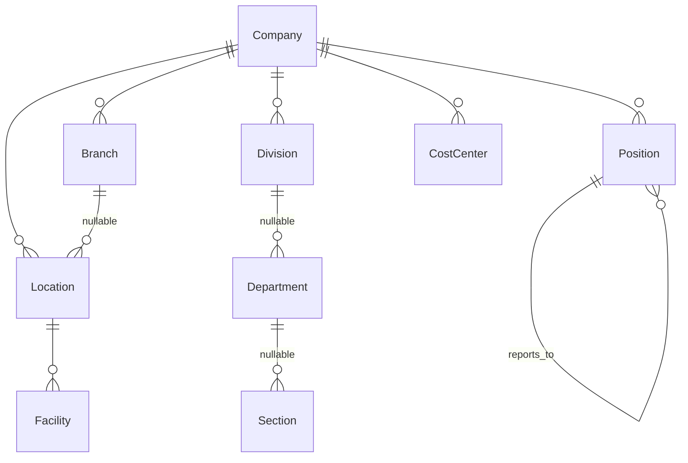

# Organization — Database

Tabel berprefiks `master_`, app `administration`. Konvensi umum di [Naming Convention](../../06-database/Naming-Convention.md).

---

## Hierarki



!!! danger "Hanya Company yang wajib"
    Seluruh level di bawahnya **nullable dan boleh dilompati** — `Location.branch` boleh kosong, `Department.division` boleh kosong.

    Itu disengaja: satu struktur melayani UMKM satu kantor sampai tambang multi-lokasi. Dan konsekuensinya membentuk hampir semua aturan di halaman ini.

---

## Location, dulu bernama Site

`master_site` → `master_location`, `SiteType` → `LocationType`, kolom FK `site` → `location` di seluruh model.

Namanya diganti karena **"site" ambigu di luar industri tambang**: satu master yang sama dipakai untuk Jakarta HO / Gebe Mine / Gebe Port / Gebe Camp maupun Factory A / Warehouse.

| | Branch | Location |
|---|---|---|
| Apa | unit **administratif** | **tempat orang bekerja** |
| Yang menempel padanya | — | absensi, shift, kalender libur |

Importer employee **tetap menerima header `site`/`site_code` sebagai alias** supaya file klien lama jalan.

!!! danger "Rename ini punya utang migrasi"
    Empat migrasi (`hr/0002`, `hr/0009`, `hr/0010`, `imports/0004`) menambah FK ke `administration.Site` tanpa menyatakan `run_before` terhadap migrasi rename-nya. `imports/0004` memang kena: **penyediaan tenant baru gagal**.

    Keempatnya sudah ditambal. Migrasi baru yang menyentuh model hasil rename **wajib** menyatakannya.

---

## Kode unik per company, bukan global

```python
name="uniq_core_location_company_code"    # (company, code)
```

Kena: Branch, Location, Division, Department, Section, Position, CostCenter.

Konsekuensinya dua, dan keduanya penting:

!!! danger "1 · Jangan pernah mencari entitas organisasi hanya dari `code`"
    Wajib disaring lewat induknya. Lihat `ORGANIZATION_CHAIN` di `apps/hr/imports/employee/resolver.py` — **kode ambigu ditolak, bukan ditebak**.

!!! danger "2 · Penyaringan memakai pola 'cocok dengan induk ATAU induknya null'"
    Karena induk di master boleh kosong. Menyaring dengan `parent_id = X` saja akan membuang baris yang induknya sengaja dikosongkan.

    Diimplementasikan di `OrganizationScopedLookup`.

---

## Constraint

Semua field unik dikondisikan `Q(is_deleted=False)` — tanpa itu kode `LOC-01` yang dihapus tidak bisa dipakai lagi selamanya, dan tidak ada pesan yang menjelaskan kenapa.

`OrganizationAssignment.employee` adalah `OneToOneField` yang **sengaja tidak** dikonversi jadi FK + constraint: mengubahnya berarti mengganti accessor `employee.organization`.

---

## Validasi konsistensi

`OrganizationAssignment.clean()` menolak `location` yang bukan milik `branch` terpilih, dst.

Ini **lapis ketiga** dan satu-satunya yang tidak bisa dilewati:

| Lapis | Mekanisme | Bisa dilewati? |
|---|---|---|
| 1. Form | `lookup_params` menyaring dropdown | ya — pemanggil API langsung |
| 2. Import | resolver berantai | ya — bukan jalur API |
| 3. Model | `clean()` | **tidak** |

---

## Seed

```bash
tenant_command seed_administration --only=organization-reference
tenant_command seed_administration --only=organization
```

!!! note "Branch bawaan bernama `Main Branch`, bukan 'Default Location'"
    Seed dulu memberi nama yang sama persis ke Branch bawaan **dan** Location bawaan, jadi di layar Locations kolom Branch dan kolom Location Name berbunyi identik — dropdown filter Branch yang isinya "Default Location" terbaca seperti filter yang belum menyaring apa pun.

    Seed mencocokkan lewat `code`, jadi mengganti `name` **memperbarui baris yang sudah ada**, bukan membuat baris baru.

!!! warning "Master tenant lazim memuat sebelas 'Default Location' kosong"
    Hasil seed awal per company. Itu sebabnya `seed_roster_demo` memilih site dari **jumlah pegawai**, bukan dari kode yang ditebak — dan sebabnya Company ditanyakan lebih dulu di form Roster Setup.

---

## Cakupan data — belum lengkap

!!! danger "Delapan dari sembilan viewset organisasi tidak punya `data_scope`"
    Tabel Company/Branch/Location/Department masih terbaca **utuh** oleh admin bercakupan sempit.

    Dashboard Administration justru **lebih ketat** daripada tabelnya. Selisihnya disengaja (layar baru sebaiknya menutup lebih dulu), tapi itu berarti invarian "angka dashboard cocok dengan isi tabel" **belum berlaku di sini**.

Untuk dashboard, Division/Department/Section/Position disaring `allow_null=True` — department tanpa `location` berarti **berlaku lintas site**. Tanpa itu, admin yang dicakup ke satu lokasi membaca "Department 0" padahal departmentnya sendiri ada.
