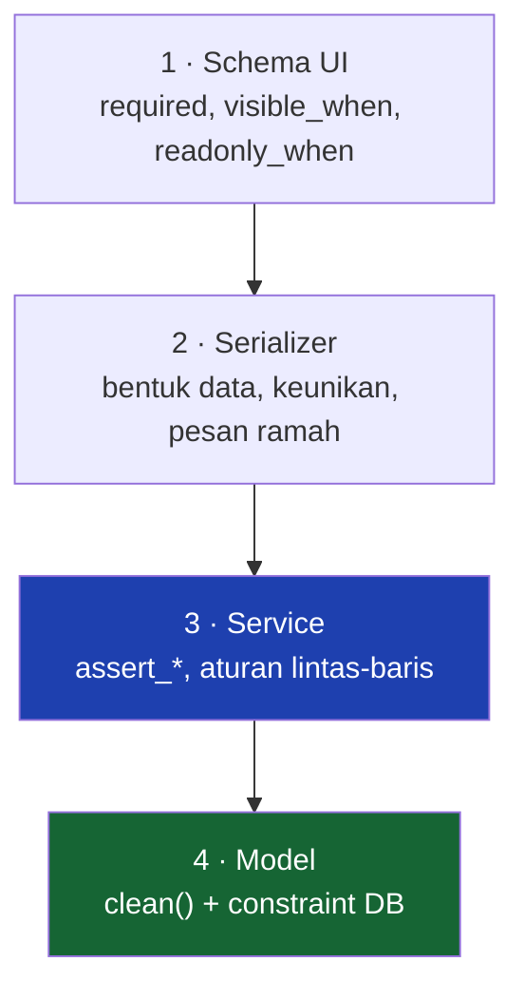

# Validation

Empat lapis, dan menaruh aturan di lapis yang salah adalah salah satu kesalahan yang paling sering terjadi di repo ini.

---

## Empat lapis



| Lapis | Menjaga? | Isinya |
|---|---|---|
| Schema UI | **tidak** | kenyamanan — bisa dilewati pemanggil API langsung |
| Serializer | ya | bentuk data, dan **pesan yang bisa ditindaklanjuti** |
| Service | ya | aturan bisnis, terutama yang melihat baris lain |
| Model | ya, terakhir | invarian satu record + constraint DB |

**Aturan pembagi Service vs Model:**

> Kalau aturannya perlu **melihat baris lain**, tempatnya di service.

| Aturan | Tempatnya |
|---|---|
| `location` harus milik `branch` terpilih | `Model.clean()` |
| Contract End tidak boleh menempel di pegawai Permanent | `Model.clean()` |
| Kuota `TrainingProgram` | service |
| Cuti tidak boleh tumpang tindih | service |
| Dua dokumen terbuka sejenis ditolak | service |

---

## `full_clean()` jalan di setiap tulis lewat service

`BaseService` memanggil `full_clean()` di dalam `transaction.atomic` untuk setiap create/update.

!!! danger "Tapi hanya kalau `ServiceWriteMixin` terpasang"
    `BaseMasterViewSet` menulis lewat `serializer.save()` bawaan DRF kecuali mixin itu dipasang di depan base-nya. Viewset tanpa mixin **tidak pernah menjalankan `full_clean()`** — jadi seluruh `Model.clean()`-nya tidak berlaku lewat API.

    Lihat [Siklus Request](../02-Framework/Request-Lifecycle.md#service_class-sendirian-tidak-cukup).

Dan `full_clean()` yang gagal hanya jadi 400 berkat `meinova_exception_handler` — tanpa itu DRF membalas **500**. Lihat [Error Response](Error-Response.md#yang-paling-penting-penerjemahan-validationerror-django).

---

## Validasi saat Submit, bukan saat penerbitan

Pola yang berlaku di semua dokumen berapproval:

```python
def submit(cls, *, instance, user=None):
    cls.assert_submittable(instance)      # ← di sini
    cls.assert_no_open_duplicate(instance)
    WorkflowService.submit(...)
```

**Bukan** di `on_complete`. Kalau menunggu sampai approver terakhir menekan tombol:

- kegagalannya **membatalkan persetujuan yang sah**
- muncul di layar orang yang **tidak bisa memperbaikinya** — pengajunya yang harus mengubah tanggal, dan dia sudah tidak memegang dokumen itu

Contohnya `TravelRequestService.assert_no_leave_conflict` dan `EmployeeActionService.assert_submittable`.

Sebaliknya, di `on_complete` yang sudah lewat semua meja, kegagalan **tidak boleh melempar**: ia ditempel ke `apply_error` pada dokumennya dan diulang lewat `POST .../apply/`.

---

## Keunikan diperiksa dua kali, sengaja

| Lapis | Pesannya |
|---|---|
| Serializer | *"Nomor pegawai KW260007 sudah dipakai Budi Santoso"* |
| Constraint DB | `Constraint uniq_active_employee_number is violated` |

Kalimat kedua **tidak menempel di kolom mana pun**, jadi form tidak bisa menandai field yang salah. Karena itu pemeriksaan ramahnya di serializer, dan constraint DB tetap jadi jaring terakhir untuk pemanggil non-API (importer, seed, shell).

### Constraint unik wajib dikondisikan ke `is_deleted`

```python
UniqueConstraint(fields=[...], condition=Q(is_deleted=False), name="uniq_active_...")
```

Tanpa ini nilainya **terkunci selamanya** oleh record yang sudah dihapus. Lihat [Base Classes](../02-Framework/Base-Classes.md#field-unik-wajib-dikondisikan-ke-is_deleted).

---

## `UniqueTogetherValidator` menuntut semua anggota constraint hadir

Jebakan yang sudah kena dua kali, di `RotationPeriod.sequence` dan `TravelArrangement.sequence`.

DRF membangkitkan `UniqueTogetherValidator` dari constraint `(rotation, sequence)`, dan validator itu **memaksa setiap field anggotanya hadir di payload** — membalas *"This field is required"* **sebelum service jalan**, sehingga `apply_sequence()` yang seharusnya mengisinya tidak pernah kepakai.

`required=False` saja **tidak cukup**. Yang melewatinya:

```python
sequence = serializers.IntegerField(required=False, default=None)
```

Jebakan sebentuk: field yang diisi otomatis service (`location` di Roster Setup, `start_date` di `SiteRotation`) wajib dibuat `required=False` lewat `extra_kwargs`, kalau tidak DRF menolak request lebih dulu.

---

## Validasi yang sengaja jadi peringatan, bukan penolakan

| Kasus | Kenapa |
|---|---|
| Nama tidak cocok saat sync absensi | Absensi tidak boleh hilang gara-gara ejaan nama |
| Celah/tumpang tindih antar periode roster | Menggeser satu blok selalu melewati keadaan tumpang tindih sebelum blok berikutnya digeser — menolak membuat jadwal bersambung mustahil disunting |
| Pasangan back-to-back belum ada | Pegawai yang belum punya pasangan tetap harus bisa dibuatkan jadwal |
| Kondisi step workflow yang tidak bisa dinilai | Step approval yang **hilang** gara-gara salah ketik konfigurasi jauh lebih berbahaya daripada step tambahan |

Kebalikannya juga berlaku: approver yang tidak ketemu **menggagalkan seluruh pengajuan**, karena dokumen yang berjalan dengan satu kotak kosong akan mengendap tanpa ada yang merasa ditagih.

---

## Nilai nol yang sah

`total_days = 0` pada cuti pegawai roster **bukan error** — ia mengambil cuti saat blok off-nya, jadi tidak kehilangan hari kerja apa pun. Validasi hanya menolak nilai **negatif**.

Jangan kembalikan jadi `> 0`. Pola ini muncul juga di `travel_days = 0` untuk pegawai lokal (nol hari travel = nol baris segmen, bukan cabang `if`).

---

## Validasi di sisi UI

`visible_when` / `readonly_when` di schema **bukan penjagaan** — nilainya tetap bisa dikirim pemanggil API langsung.

Dan **syarat yang tidak bisa dinilai dianggap terpenuhi**: field yang hilang gara-gara salah ketik nama kolom membuat orang mencari kesalahan di backend; field yang telanjur tampil kelihatan sendiri.

Detail: [Schema DSL](../02-Framework/Schema.md#visible_when--readonly_when).

---

## Checklist

- [ ] Aturan lintas-baris di service, bukan di `Model.clean()`
- [ ] `assert_*` dipanggil saat **Submit**, bukan saat penerbitan
- [ ] Pesan error menyebut **nomor dokumen / nama pemakai**, bukan "sudah ada yang lain"
- [ ] Constraint unik dikondisikan ke `is_deleted`
- [ ] Field yang diisi otomatis service diberi `required=False` (+ `default=None` kalau ia anggota constraint)
- [ ] Error lintas field memakai kunci `detail`/`non_field_errors` supaya dirender sebagai banner
