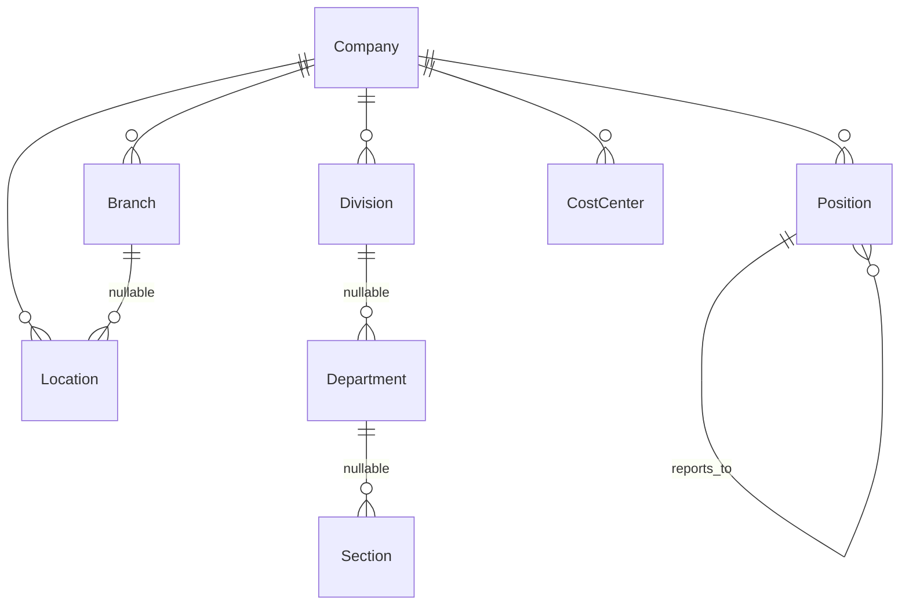
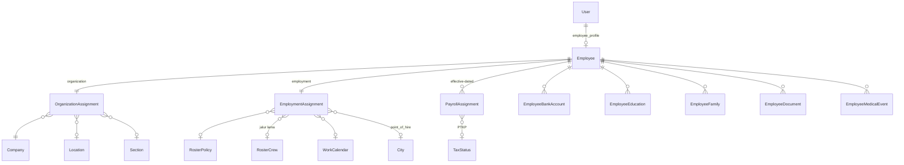
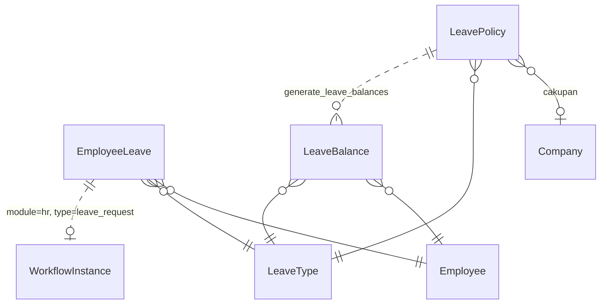
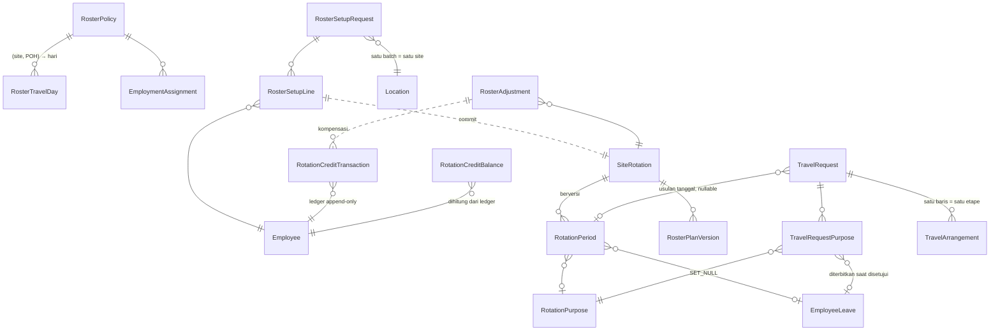
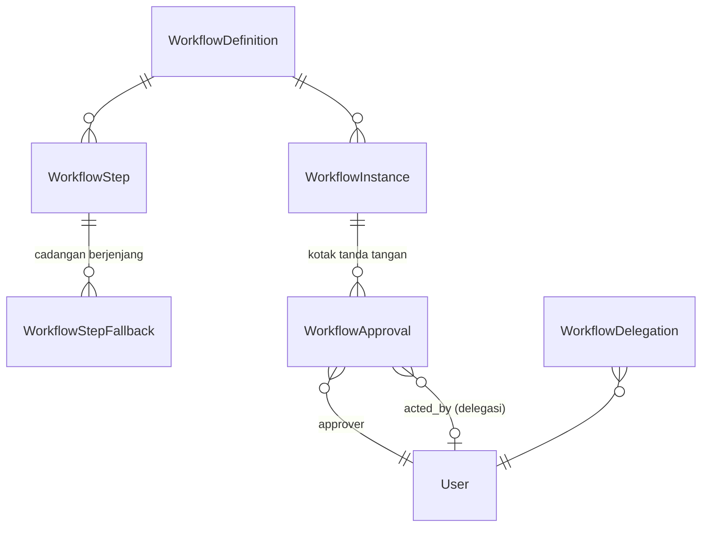
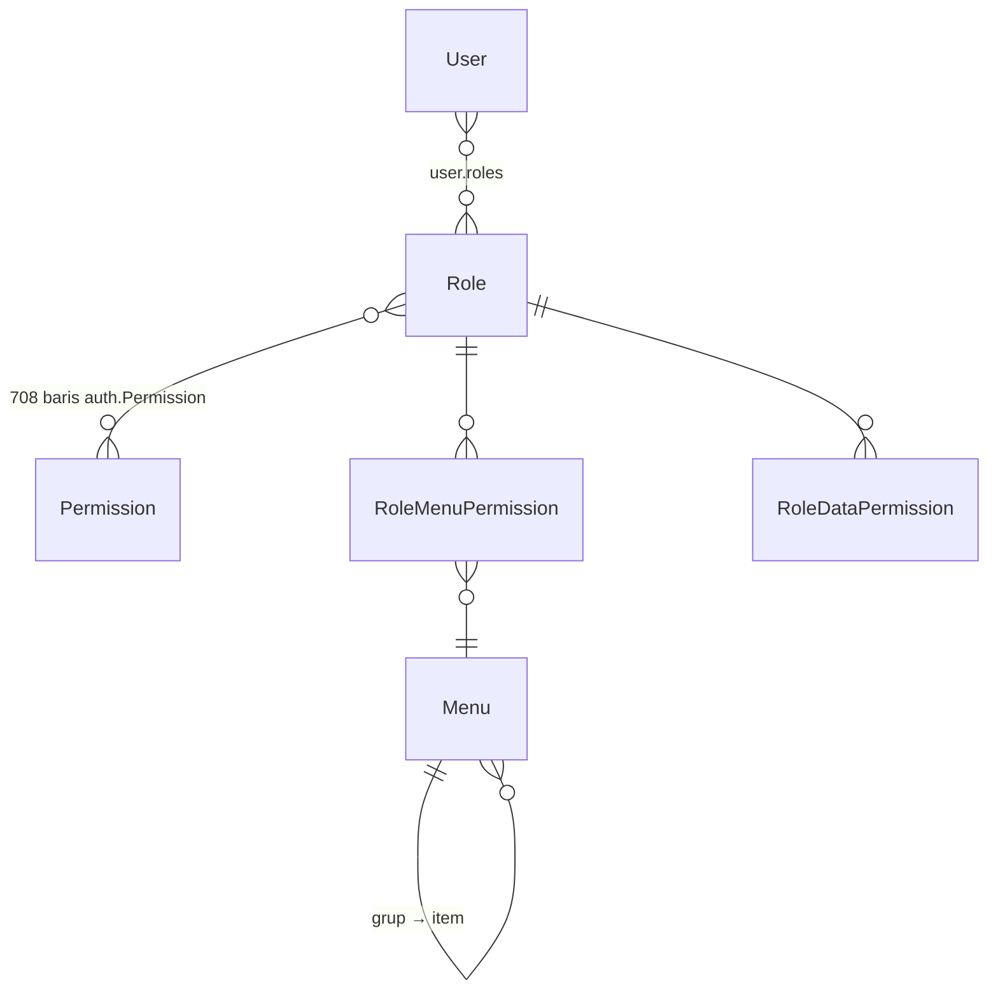
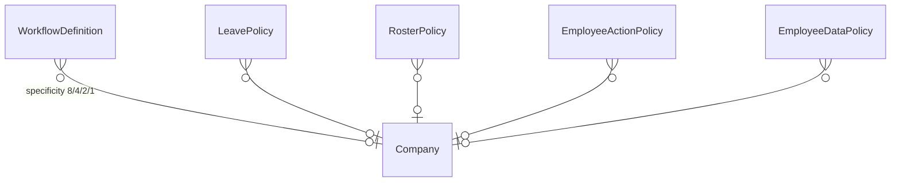

# ERD

Diagram relasi antar model inti. 168 model total — yang digambar di sini hanya yang perlu dipahami untuk membaca modul HR.

Konvensi penamaannya di [Naming Convention](Naming-Convention.md), pola desainnya di [Database Design](Database-Design.md).

---

## Struktur organisasi



**Hanya Company yang wajib.** Seluruh level di bawahnya nullable dan boleh dilompati — `Location.branch` boleh kosong.

Konsekuensinya: kode unik **per company**, dan penyaringan memakai pola "cocok dengan induk **ATAU** induknya null".

---

## Employee dan empat penempatannya



!!! danger "Accessor akun → pegawai adalah `user.employee_profile`"
    Bukan `user.employee`. `getattr` mengembalikan `None` tanpa error — kesalahan ini pernah membuat "pegawainya sendiri" tidak pernah cocok di `EmployeeDataPolicy`.

`Employee` sendiri hanya identitas. Yang menentukan perilakunya ada di `EmploymentAssignment` — terutama `roster_policy`/`roster_crew`, yang membelah hampir semua perhitungan HR jadi cabang HO vs site.

---

## Cuti



`LeaveBalance.used` **disimpan** (supaya bisa disortir), tapi selalu **dijumlahkan ulang penuh** dari record `EmployeeLeave`.

`LeavePolicy` menyimpan **aturannya**, bukan angkanya — angkanya diterbitkan `generate_leave_balances`, dan kolom `adjustment` tidak pernah disentuh generator.

---

## Roster & Travel Request



Tiga hal yang paling sering salah dibaca dari diagram ini:

1. **`TravelRequest.rotation_period` nullable** — roster bukan syarat TR.
2. **Tanggal penerbangan hanya di `TravelArrangement`.** `RotationPeriod` cuma menghitung perkiraan jendela travel. Jangan kembalikan baris travel ke roster.
3. **`RotationPurpose` bukan `LeaveType`.** Master tersendiri, karena Field Break tidak memotong saldo sementara Cuti Tahunan memotong. `deducts_leave` yang jadi penentu.

---

## Engine workflow



!!! warning "Tidak ada FK dari `WorkflowInstance` ke dokumen"
    Dokumen ditunjuk `module` + `document_type` + `object_id` (**string**), bukan `GenericForeignKey`. Engine jadi tidak perlu mengenal model modul mana pun.

    Konsekuensinya **tidak ada integritas referensial** di level database — yang menjaganya constraint `uq_workflow_open_instance` dan kenyataan bahwa penghapusan dokumen selalu soft.

---

## RBAC



!!! danger "`User.groups` bawaan Django diwarisi tapi TIDAK dibaca satu baris kode pun"
    Dua sistem paralel. Yang berlaku hanya `roles`, dibaca lewat `RolePermissionBackend`.

`RoleDataPermission` **tidak punya kolom `can_view`** — itu milik `RoleMenuPermission`. Dua model bersaudara dengan bentuk berbeda, dan sudah dua kali menjatuhkan kode yang menyalinnya.

---

## Master aturan berjenjang

Lima master mengikuti pola yang sama: kolom cakupan + skor `specificity`.



Semuanya punya `company` / `location` / `employee_group` (sebagian juga `branch`). **Kosong berarti "berlaku untuk semua", bukan "tidak berlaku".**

---

## Menggambar ERD lengkap

Belum ada ERD 168 model yang di-generate otomatis. Kalau perlu:

```bash
pip install django-extensions pygraphviz
python manage.py graph_models hr administration -o erd-hr.png
```

Untuk multi-tenant, jalankan pada satu app agar hasilnya terbaca — diagram seluruh model tidak berguna sebagai gambar.
