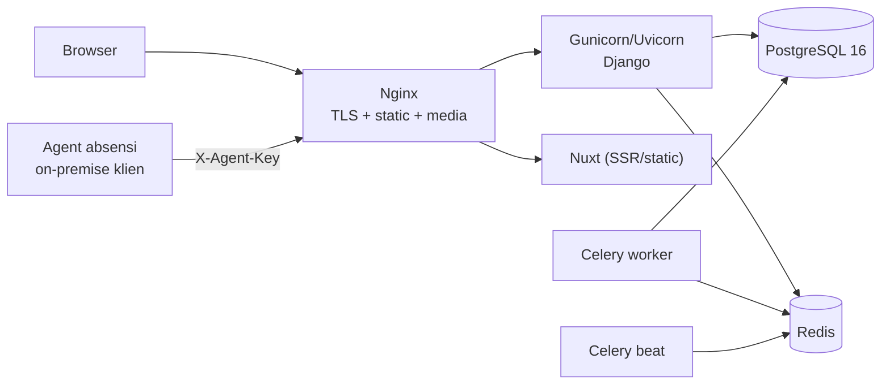

# Production

!!! danger "Belum siap produksi"
    `config/settings/production.py` isinya **dua baris**:

    ```python
    from .base import *

    DEBUG = False
    ```

    Halaman ini mendaftar apa yang **harus** ditambahkan sebelum sistem ini menghadap internet. Sebagian di antaranya bukan pengetatan opsional — beberapa membiarkan lubang yang nyata.

---

## Yang harus diperbaiki sebelum go-live

### 1. CORS terbuka untuk semua origin

```python
# config/settings/base.py
CORS_ALLOW_ALL_ORIGINS = True     # ← tidak di-override di production.py
```

Situs mana pun bisa memanggil API ini dari browser pengguna yang sedang login.

```python
# yang seharusnya di production.py
CORS_ALLOW_ALL_ORIGINS = False
CORS_ALLOWED_ORIGIN_REGEXES = [r"^https://[\w-]+\.meinova\.id$"]
CORS_ALLOW_CREDENTIALS = True
```

Regex, bukan daftar tetap — tiap tenant punya subdomainnya sendiri.

### 2. Security header Django

Tidak satu pun diset:

```python
SECURE_SSL_REDIRECT = True
SECURE_HSTS_SECONDS = 31536000
SECURE_HSTS_INCLUDE_SUBDOMAINS = True
SECURE_HSTS_PRELOAD = True
SESSION_COOKIE_SECURE = True
CSRF_COOKIE_SECURE = True
SECURE_PROXY_SSL_HEADER = ("HTTP_X_FORWARDED_PROTO", "https")
X_FRAME_OPTIONS = "DENY"
SECURE_CONTENT_TYPE_NOSNIFF = True
```

`python manage.py check --deploy --settings=config.settings.production` akan mendaftarnya.

### 3. `ALLOWED_HOSTS`

Diambil dari env, tapi **harus memuat pola subdomain tenant** — kalau tidak, tenant baru mendapat `DisallowedHost` dan gejalanya terlihat seperti tenantnya salah dibuat.

### 4. Endpoint schema `AllowAny`

`GET /api/framework/schema/<module>/` dan `<resource>/ui-schema/` **tanpa auth**, disengaja supaya generator bisa jalan.

Artinya **struktur field seluruh sistem terekspos publik.** Datanya tidak, tapi struktur tabel Employee, Payroll, dan Security bisa dibaca siapa saja yang tahu URL-nya.

Pilihan: batasi di reverse proxy (hanya dari IP developer), atau terima risikonya secara sadar dan catat.

### 5. Logging

`config/settings/logging.py` **kosong**. Tidak ada konfigurasi `LOGGING` sama sekali.

Ini bukan kenyamanan: beberapa jalur di sistem ini sengaja **menelan exception dan hanya mencatat log** — pencatatan audit yang gagal, verifikasi nama saat sync absensi, `sync_leave_balances` yang gagal, kondisi workflow yang tidak bisa dinilai. Tanpa logging terkonfigurasi, semuanya hilang.

### 6. Media & static

- `MEDIA_URL` hanya dilayani Django **saat `DEBUG`** (`config/urls.py`). Di produksi tidak ada yang melayaninya.
- Storage-nya `TenantFileSystemStorage` dengan `MULTITENANT_RELATIVE_MEDIA_ROOT = "%s"` — file terpisah per schema, tapi tetap di disk lokal. Tidak scale ke lebih dari satu server aplikasi.
- `collectstatic` belum ada di prosedur deploy.

### 7. `SECRET_KEY` dan kredensial agent absensi

`SECRET_KEY` dari env; pastikan **berbeda dari nilai development**.

`MEINOVA_AGENT_API_KEY` **sudah dihapus** (SEC-ATT-SYNC-1) dan tidak dibaca
lagi. Tiap agent memakai kredensial per device, terikat tenant, diterbitkan
per tenant:

```bash
python manage.py tenant_command attendance_agent_key issue <DEVICE_CODE> --schema=<tenant>
```

Kunci tampil sekali — isi ke `ERP_API_KEY` di `.env` agent. Rotasi: `rotate`;
cabut: `revoke`. Device harus sudah ada di Attendance Device tenant itu.

---

## Arsitektur minimum



Wildcard DNS + wildcard TLS (`*.meinova.id`) — tenant ditentukan hostname.

---

## Yang harus jalan sebagai service

| Service | Perintah |
|---|---|
| Web | `gunicorn config.wsgi:application` |
| Worker | `celery -A config worker -l info` |
| Beat | `celery -A config beat -l info --scheduler django_celery_beat.schedulers:DatabaseScheduler` |

**Beat hanya boleh satu instance.** Dua beat = jadwal jalan dua kali; untuk `hr.dispatch_employee_reminders` itu berarti pengingat ganda ke seluruh HR.

Worker boleh banyak. Konfigurasinya sudah aman untuk itu:

```python
CELERY_TASK_ACKS_LATE = True
CELERY_TASK_REJECT_ON_WORKER_LOST = True
CELERY_WORKER_PREFETCH_MULTIPLIER = 1
CELERY_TASK_SOFT_TIME_LIMIT = 3300   # 55 menit
CELERY_TASK_TIME_LIMIT = 3600
```

`acks_late` + `prefetch_multiplier = 1` dipilih karena task di sini panjang dan tidak boleh hilang saat worker mati — import ribuan baris absensi tidak boleh perlu diulang dari awal.

!!! note "`CELERY_TIMEZONE = Asia/Jakarta`, sengaja lepas dari `TIME_ZONE = UTC`"
    `TIME_ZONE` menentukan cara timestamp disimpan, dan itu benar tetap UTC. Tapi **jadwal ditulis dalam jam kerja orang**: "kirim pengingat jam 6 pagi" berarti jam 6 di tempat pegawainya bekerja. Dengan UTC, entri itu jalan jam 1 siang tanpa ada yang menyadarinya — jadwalnya "benar" menurut berkas konfigurasi.

---

## Deploy

Urutannya bukan preferensi — lihat [Release](../08-development/Release.md).

```bash
python manage.py migrate_schemas --shared
python manage.py migrate_schemas
python manage.py collectstatic --noinput
# restart web, worker, beat
# jalankan seed yang diperlukan
```

`migrate_schemas` menyentuh **setiap** schema tenant dan makan waktu sebanding jumlah tenant. Jangan jalankan diam-diam sebagai bagian dari startup container.

---

## Redis: empat DB index, jangan dicampur

| Index | Env | Untuk |
|---|---|---|
| `/0` | `REDIS_URL` | Celery broker |
| `/1` | `REDIS_CACHE_URL` | Django cache |
| `/2` | `REDIS_CHANNELS_URL` | Channels (masih dikomentari) |
| `/3` | `CELERY_RESULT_BACKEND` | hasil task |

Mencampurnya membuat hasil task tertimpa cache dan gagalnya sangat sulit dilacak.

---

## Checklist go-live

- [ ] `python manage.py check --deploy` bersih
- [ ] `CORS_ALLOW_ALL_ORIGINS = False` + regex subdomain
- [ ] Security header diset
- [ ] `LOGGING` terkonfigurasi — beberapa kegagalan **hanya** muncul di log
- [ ] Nginx melayani `/media/` dan `/static/`
- [ ] Wildcard TLS
- [ ] Backup PostgreSQL terjadwal **dan sudah pernah diuji restore**
- [ ] Beat hanya satu instance
- [ ] `SECRET_KEY` berbeda dari dev; tiap agent absensi memakai kunci device-nya sendiri (`attendance_agent_key issue`)
- [ ] Endpoint schema `AllowAny` diputuskan: dibatasi atau diterima
- [ ] Verifikasi login dengan akun **non-superuser**
