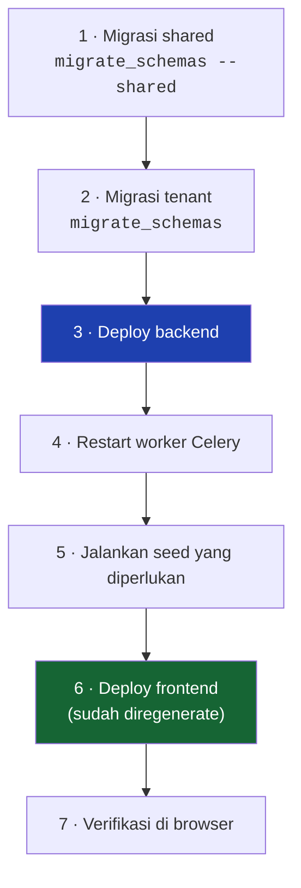

# Release

Merilis sistem ini berarti merilis **dua repo yang saling bergantung**, plus menjalankan migrasi di **setiap schema tenant**. Urutannya bukan preferensi.

---

## Urutan rilis



**Backend selalu lebih dulu.** Frontend hasil generate memanggil endpoint yang harus sudah ada; backend yang lebih baru dengan frontend lama umumnya aman (field baru diabaikan), kebalikannya tidak.

---

## Kenapa tiap langkah ada

| Langkah | Kalau dilewati |
|---|---|
| `migrate_schemas --shared` | tabel `tenants` tidak ikut terbarui |
| `migrate_schemas` | tenant lama kehilangan kolom baru — dan kegagalannya per-tenant, jadi sebagian klien jalan sebagian tidak |
| Restart worker Celery | **registry importer diisi saat `AppConfig.ready()`** — worker lama tidak mengenal importer baru dan job-nya gagal `No importer registered for module '...'` |
| Seed | menu baru tidak bisa dibatasi per role; model baru → tombol Save **403 setelah form diisi** |
| Regenerate FE | perubahan schema **tidak terlihat sama sekali**, tanpa error |

---

## Seed yang aman dijalankan tiap rilis

Semuanya idempotent:

```bash
SCHEMA=<tenant>
python manage.py tenant_command seed_menus           --schema=$SCHEMA
python manage.py tenant_command seed_security_roles  --schema=$SCHEMA
python manage.py tenant_command seed_workflows       --schema=$SCHEMA
python manage.py tenant_command seed_administration --only=numbering --schema=$SCHEMA
```

- `seed_security_roles` **menambahkan** izin, tidak pernah mencabut — role yang sudah disunting orang tidak dikembalikan ke bawaan
- `seed_menus` mencocokkan lewat **`route`**, bukan judul, jadi centang yang sudah disimpan tidak hilang saat label diubah

!!! warning "Seed data uji jangan pernah jalan di produksi"
    `seed_demo_workforce`, `seed_roster_demo`, `seed_workflow_demo`, `seed_demo_attendance`, `reset_demo_data`.

    Yang terakhir **menghapus** data — dan pembersihannya menyaring lewat awalan nomor pegawai (`HO*`, `GBE*`) serta akun `demo.*`. Itu sebabnya data uji sengaja tidak meniru pola penomoran klien.

---

## Rilis yang butuh seed satu kali

Beberapa perubahan menuntut perintah yang **hanya dijalankan sekali**, dan melewatkannya menghasilkan kegagalan yang jauh dari sumbernya:

| Perubahan | Perintah | Kalau dilewati |
|---|---|---|
| Kalender & hari libur ditambahkan ke seeder | `seed_administration --only=calendar` | perhitungan hari cuti jatuh ke fallback Senin–Jumat, libur nasional ikut memotong saldo |
| Perbaikan `is_base_currency` | `seed_administration --only=currency` | tidak ada mata uang dasar → import payroll menolak baris penempatan gaji |
| `RosterPolicy` diperkenalkan | `migrate_roster_assignments` (`--dry-run` dulu) | pegawai lama tidak terpetakan; yang ambigu **dilewati**, bukan ditebak |
| Profile import attendance dipindah ke jalur generik | `migrate_attendance_import_profiles` | profile lama tidak terbaca jalur baru |
| Pintasan beranda dibersihkan | `seed_dashboard` | `[Vue Router warn] No match found` di beranda tiap dimuat |

Catat perintah semacam ini di **deskripsi PR**, bagian "Seed yang harus dijalankan setelah deploy".

---

## Verifikasi setelah rilis

- [ ] Login dengan akun **non-superuser** — penjagaan izin baru terlihat di sana
- [ ] Sidebar muncul lengkap (kalau kosong: `seed_menus` belum jalan)
- [ ] Modul yang berubah dibuka, kolomnya tidak ada yang "-"
- [ ] Tombol Save benar-benar menyimpan (kalau 403: `seed_security_roles`)
- [ ] `/api/docs/` bisa dibuka
- [ ] Satu import file dicoba (kalau importer berubah)
- [ ] Log worker Celery bersih

---

## Rollback

Yang mudah dan yang tidak:

| | Rollback |
|---|---|
| Kode backend/frontend | mudah — deploy commit sebelumnya |
| Migrasi skema | sulit — `migrate_schemas <app> <nomor>` harus dijalankan **per tenant**, dan migrasi yang menghapus kolom **tidak bisa mengembalikan datanya** |
| Seed | tidak ada rollback — seed idempotent, bukan reversible |

!!! danger "Backup sebelum migrasi yang menghapus atau mengganti nama kolom"
    Rename `Site` → `Location` menyentuh model, FK di seluruh modul, dan empat migrasi lain yang harus menyatakan `run_before`. Perubahan sebesar itu tidak punya jalan mundur yang murah.

---

## Versi

Belum ada tag versi di repo (2 commit). Kalau nanti dipakai, [Changelog](../00-overview/Changelog.md) yang jadi catatannya, dan **satu nomor versi untuk kedua repo** — merilisnya terpisah berarti ada kombinasi versi yang tidak pernah diuji.

---

## Yang belum ada

- **CI/CD.** Tidak ada `.github/`. Seluruh langkah di atas manual.
- **Migrasi otomatis saat deploy.** Untuk multi-tenant ini justru harus disengaja — `migrate_schemas` pada puluhan tenant bukan operasi yang boleh berjalan diam-diam.
- **Health check endpoint.**
- **`production.py` praktis kosong** (cuma `DEBUG = False`) — belum ada hardening. `CORS_ALLOW_ALL_ORIGINS = True` di `base.py` **tidak** di-override di sana.

Lihat [Production](../07-deployment/Production.md).
