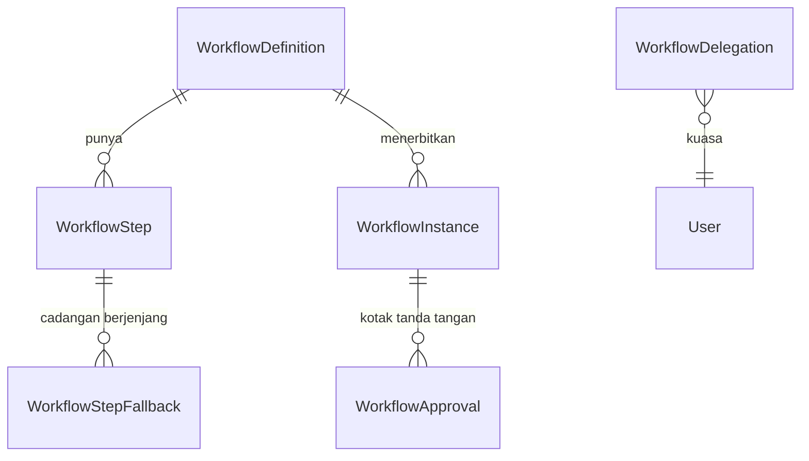
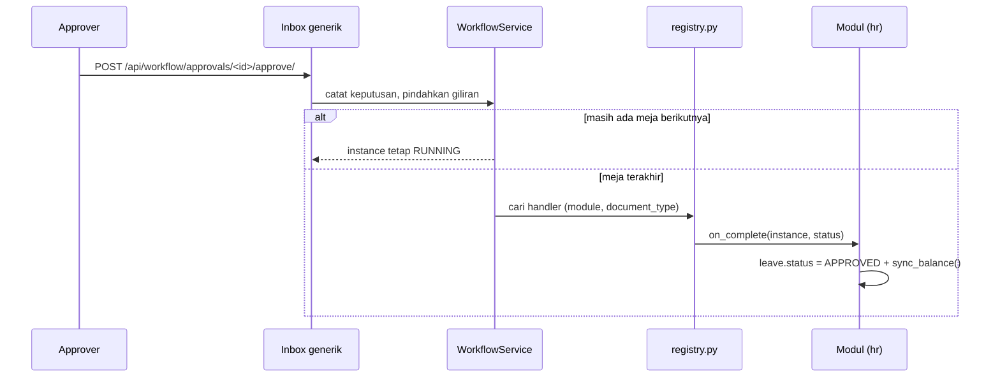

# Alur Persetujuan Dokumen (Engine Workflow)

`apps/workflow` adalah engine approval **generik** — bukan milik HR. Modul lain menyambung tanpa satu baris pun kode baru di sisi engine.

!!! info "Dulu ada tiga implementasi paralel"
    `apps/framework/approval` dan `apps/administration/models/workflow.py` (duplikat, 0 baris, tidak pernah dipakai) sudah **dihapus**; datanya dipindah lewat data migration `workflow.0002_migrate_framework_approval`. Kalau menemukan rujukan ke `ApprovalFlow`/`ApprovalRequest`, itu kode mati.

---

## Model



| Model | Isi |
|---|---|
| `WorkflowDefinition` | satu alur; punya cakupan company/branch/location/employee_group |
| `WorkflowStep` | satu meja; tipe approver, cakupan pencarian, kondisi, cadangan |
| `WorkflowInstance` | satu dokumen yang sedang/pernah berjalan |
| `WorkflowApproval` | satu baris keputusan (satu kotak tanda tangan) |
| `WorkflowDelegation` | surat kuasa menandatangani |

---

## Dokumen ditunjuk string, bukan `GenericForeignKey`

```python
WorkflowService.submit(
    document=leave,
    module="hr",
    document_type="leave_request",
    ...
)
```

`module` + `document_type` + `object_id` (string). Kunci yang sama persis dengan kunci pencarian alurnya, dan engine jadi **tidak perlu mengenal ContentType maupun model modul mana pun**.

Konsekuensinya: tidak ada integritas referensial di level database. Yang menjaganya constraint `uq_workflow_open_instance` plus kenyataan bahwa penghapusan dokumen di codebase ini selalu soft.

---

## Engine tidak menyentuh kolom status modul mana pun

Ini pembagian tanggung jawab yang paling penting dipahami.



Modul mendaftarkan handler-nya:

```python
# apps/hr/workflow_handlers.py
from apps.workflow.registry import register_completion

@register_completion("hr", "leave_request")
def _complete_leave(instance, status): ...
```

**Di-import dari `AppConfig.ready()`.** Kalau lupa, tombol Approve tetap jalan tapi status dokumennya **tidak ikut berpindah, dan gagalnya diam.**

!!! warning "Tidak ada hook per-step"
    Satu-satunya callback adalah `on_complete`, yang jalan saat **seluruh** instance selesai. Jadi step di tengah tidak bisa diberi nama "Issued By" atau "Diterbitkan" — approver menekan tombol, giliran pindah, dan kolom status modulnya belum bergerak sama sekali. Labelnya akan berbohong.

    Itu sebabnya di alur site, HRGA (yang menerbitkan tiket) ditaruh di meja **terakhir**, bukan di tengah.

---

## Cakupan alur: berjenjang lewat skor `specificity`

`WorkflowDefinition` punya `company` / `branch` / `location` / `employee_group`. **Kosong berarti "berlaku untuk semua", bukan "tidak berlaku"** — jebakan yang sama dengan `LeavePolicy` dan `RosterPolicy`.

Bobotnya 8 / 4 / 2 / 1. Alur yang menyebut company menang atas yang cuma menyebut lokasi.

Inilah yang membuat alur cuti Head Office (`location = Jakarta HO`, spec 2) menang atas alur standar (spec 0) **tanpa** ada yang mengatur prioritas manual.

---

## Lima tipe approver

| `ApproverType` | Mencari | Catatan |
|---|---|---|
| `manager` | garis pelaporan antarorang | `level` = berapa tingkat naik |
| `position` | hierarki `Position.reports_to` | |
| `department_head` | pemegang jabatan `is_manager` di department pegawai | **tidak punya cakupan dan tidak bisa diberi** — departmentnya sendiri yang jadi cakupannya |
| `role` | pemegang Role | satu-satunya yang bisa menghasilkan **beberapa** approver → di situlah `approval_mode` ANY/ALL + `minimum_approvals` berpengaruh |
| `user` | orang tertentu | |

**Approver adalah User, bukan Employee.** Approval dijalankan lewat akun dan kotak masuk disusun per akun; pegawai tanpa akun **tidak pernah** jadi approver, dan resolver melaporkannya dengan menyebut nomor pegawainya. `approver_employee` ikut disimpan terpisah — formulir tercetak menulis nama pegawai dan jabatannya, bukan username.

### `approver_scope` — sejauh mana pemegang role dicari

Hanya berpengaruh untuk tipe `role`. Nilainya: `tenant` / `company` (bawaan) / `branch` / `location` / `division` / `department` / `section`.

Dibandingkan dengan penempatan **pegawai subjek dokumen**, bukan pengaju.

!!! danger "Tanpa ini, kebocorannya diam"
    Sebelum `approver_scope` ada, pencarian berhenti di company. Begitu satu company punya beberapa site, step "KTT Site" menarik KTT **seluruh** site dan pengajuan Gebe ikut mendarat di kotak masuk orang Halmahera. Dokumennya memang tampil — cuma di meja yang salah.

Satu definisi boleh (dan harus) mencampur cakupan: meja per-site (`location`/`section`) berdampingan dengan meja lintas-site (`company`) untuk HRGA yang duduk di kantor pusat.

**Kolom yang dipilih wajib terisi di penempatan pegawainya.** Kosong = step-nya tidak menemukan siapa pun, **bukan** dilonggarkan diam-diam jadi se-company — melonggarkan otomatis persis kebocoran yang mau dicegah.

### Cadangan berjenjang — `WorkflowStepFallback`

`fallback_role` tunggal tidak cukup untuk turunan yang memang bertingkat. Meja Admin Section pada alur site harus jatuh ke **Admin Department pegawainya** dulu, baru melebar ke HR — dan tingkat tengah itu tidak boleh se-company.

```
HR-TR-SITE step #1:
  ADMIN-SECTION    @section
  → ADMIN-DEPARTMENT @department
  → HR-ADMIN         @location
  → HR-ADMIN         @company
```

- **Yang pertama menemukan orang yang menang**, sisanya tidak dicoba. Menggabungkan semua tingkat jadi satu kumpulan approver bukan cadangan, itu rapat.
- Step tanpa baris `WorkflowStepFallback` tetap memakai `fallback_role` lama, se-company. Perilaku alur yang sudah berjalan tidak berubah.
- **`fallback_role` selalu dicari se-company**, tidak mewarisi cakupan sempit step-nya — mewarisinya membuat cadangan praktis mati. Batas yang tidak pernah dilewati tetap company.
- Alasan kegagalan menyebut **setiap** tingkat yang sudah dicoba beserta cakupannya.

!!! note "Belum ada layarnya"
    Rantai `WorkflowStepFallback` baru bisa diisi lewat seed; form step di layar Workflow Definitions masih hanya menampilkan `fallback_role` tunggal.

---

## Submit: semua kotak dibuat di depan

```python
WorkflowService.submit(document=..., module=..., document_type=...,
                       initiator_employee=...)
```

**Seluruh baris keputusan dibuat saat submit**, lengkap dengan nama approver-nya. Dua alasan:

1. Formulir tercetak harus memperlihatkan semua kotak tanda tangan sejak awal.
2. Approver **dibekukan** — mutasi atasan minggu depan tidak boleh mengubah siapa yang seharusnya menandatangani dokumen yang sudah berjalan.

Tiga aturan pembentukannya:

| Keadaan | Perilaku |
|---|---|
| Approver duplikat (satu orang jadi atasan sekaligus kepala departemen) | Barisnya **tetap dicetak** dengan keterangan "sudah terwakili step #N", ditandai `SKIPPED` |
| Pengusul kebetulan jadi approver (`initiator_employee`) | `SKIPPED` berbunyi "Diajukan olehnya" — tidak ada yang menyetujui usulannya sendiri |
| Approver tidak ketemu | **Pengajuan gagal seluruhnya** (rollback), dengan pesan menyebut kolom mana yang kosong — kecuali step `is_required=False`, yang jadi `SKIPPED` |

Aturan ketiga sengaja keras: dokumen yang berjalan dengan satu kotak kosong akan mengendap tanpa ada yang merasa ditagih.

Untuk menjawab "kenapa pengajuan saya gagal" **tanpa membuat dokumen**:

```
POST /api/workflow/definitions/<id>/preview_approvers/
```

---

## Step bersyarat — `WorkflowStep.condition`

JSON kecil yang bisa divalidasi, bukan ekspresi bebas — alur dikonfigurasi lewat layar setting oleh orang HR.

```json
{"all": [{"field": "total_days", "op": "gte", "value": 5}]}
```

Digabung lewat `all` / `any` / `not`. Dinilai terhadap `WorkflowInstance.context` — cuplikan nilai dokumen yang **dibekukan saat pengajuan**, supaya syarat sebuah step tidak berubah di tengah jalan gara-gara dokumennya disunting.

**Kondisi yang tidak bisa dinilai dianggap terpenuhi**, bukan gagal: step approval yang hilang gara-gara salah ketik konfigurasi jauh lebih berbahaya daripada step tambahan yang seharusnya dilewati. Dicatat di log.

Bentuknya sengaja **sama dengan `visible_when` di schema field** — satu dialek kondisi untuk dua keperluan.

---

## Kotak masuk

```
GET  /api/workflow/approvals/inbox/
GET  /api/workflow/approvals/summary/
POST /api/workflow/approvals/<id>/approve/
POST /api/workflow/approvals/<id>/reject/
POST /api/workflow/approvals/<id>/return/
```

**Satu kotak masuk untuk semua modul.** Approver tidak boleh harus membuka layar Cuti untuk menyetujui cuti dan layar TR untuk menyetujui TR.

`pending_for(user)` menyaring ke **step terdepan** lewat `F("instance__current_step")`. Step #2 belum jadi urusan siapa-siapa selama step #1 belum diputuskan — menagihnya lebih awal membuat approver menyetujui sesuatu yang bisa saja ditolak di bawahnya.

Superuser boleh **memutuskan** (tanpa itu, satu `reports_to` yang kosong mengunci dokumen tanpa jalan keluar selain lewat shell) tapi sengaja **tidak** melihat seluruh kotak masuk tenant. Diperiksa **paling akhir**, supaya superuser yang kebetulan juga approver tercatat sebagai approver, bukan "dilewati sebagai superuser".

---

## Delegasi

**Delegasi tidak mengubah siapa approver-nya.** Baris keputusan tetap atas nama atasan yang seharusnya menandatangani (`approver`); yang berubah cuma siapa yang boleh menekan tombolnya (`acted_by`), plus `acted_via_delegation` yang menunjuk surat kuasanya.

Mengganti approver-nya akan membuat formulir tercetak menunjukkan nama berbeda dari struktur organisasi, dan jejak "kenapa yang tanda tangan orang ini" hilang.

- Cakupannya `module` + `document_type` + periode. Kosong = semua.
- Kuasa **berantai** (A→B, B→C) terbaca sampai kedalaman 5, dengan pagar terhadap rantai berputar.
- Dua kuasa aktif dengan cakupan tumpang tindih **ditolak** — kalau dibiarkan, siapa yang menang jadi soal urutan `id`.
- Orang boleh mengurus kuasanya **sendiri** tanpa menunggu IT (`CanManageDelegation`). Atasan yang mau cuti tidak perlu tiket ke helpdesk.

---

## Siapa boleh melihat apa

Layar Running Documents **bukan papan pengumuman** — `document_label` memuat jenis cutinya ("Cuti Melahirkan", "Cuti Duka") lengkap dengan tanggalnya.

`selectors.visible_instances(user)`:

| Siapa | Melihat |
|---|---|
| Superuser + role di `settings.WORKFLOW_MONITOR_ROLES` (bawaan `HR-ADMIN`, `HR-MANAGER`) | semua |
| Selain itu | hanya yang terlibat: pengaju, subjeknya, atau yang pernah kebagian kotak tanda tangan (termasuk yang gilirannya sudah lewat), plus `acted_by` |

**Penyaringannya berbasis keterlibatan, bukan lokasi.** Konsekuensinya: role pemantau berlaku **se-tenant**, bukan sebatas lokasi pemegangnya. HR admin yang ditempatkan di Gebe tetap melihat dokumen Jakarta.

Cakupan data (`RoleDataPermission`) **sengaja tidak dipasang** di jalur workflow — memasangnya membuat approver lintas lokasi tidak bisa menyetujui dokumen yang mendarat di mejanya.

---

## Siapa boleh mengubah konfigurasi

Mengubah `WorkflowDefinition`/`WorkflowStep` sama dengan menentukan **siapa yang menyetujui dokumen siapa**. Tanpa penjagaan, pegawai mana pun bisa menambahkan dirinya sebagai approver cutinya sendiri — dan dokumen yang berjalan sesudahnya tidak terlihat janggal sama sekali, karena alurnya memang "sesuai konfigurasi".

`CanConfigureWorkflow`: **baca terbuka, tulis terkunci** untuk superuser + `settings.WORKFLOW_CONFIG_ROLES` (bawaan `["WORKFLOW-ADMIN"]`).

Membaca sengaja dibiarkan: layar dokumen menampilkan nama alur dan judul step-nya, dan pengaju berhak tahu ke meja mana dokumennya berjalan.

---

## Progress, tooltip, dan tautan

Dihitung di serializer, bukan di FE:

- **`progress.percent` menghitung baris `SKIPPED` sebagai selesai.** Step yang dilewati memang tidak perlu ditunggu siapa pun. Dokumen yang sudah berhenti selalu 100% — bar setengah penuh pada dokumen yang ditolak membuat orang mengira masih ada yang harus menekan tombol.
- **`waiting_for.since`** diambil dari keputusan terakhir **sebelum** baris yang ditunggu, bukan dari tanggal pengajuan. Dokumen yang sudah lewat dua meja baru mendarat di meja ketiga kemarin; menghitungnya sejak pengajuan menyalahkan orang yang salah.
- **`document_url`** dari `registry.register_route()`. Engine tidak boleh menebak — rute `leave_request` yang halamannya `/hr/leave/` tidak bisa disimpulkan dari nama modulnya. Belum terdaftar = `None`, dan FE cukup tidak menampilkan tombolnya.

---

## Alur yang sudah diseed

`python manage.py tenant_command seed_workflows`

| Kode | Dokumen | Cakupan |
|---|---|---|
| `HR-LEAVE-STD` | cuti | global |
| `HR-HO-LEAVE` | cuti | Head Office; step HR Manager bersyarat ≥ 5 hari |
| `HR-LEAVE-SITE` | cuti | site — enam meja |
| `HR-TRAVEL-REQUEST` | travel request | global |
| `HR-TR-SITE` | travel request | site — enam meja |
| `HR-EMPLOYEE-ACTION` | employee action | Atasan → HR → HR Manager (meja ketiga bersyarat) |
| `HR-ROSTER-SETUP`, `HR-ROSTER-ADJUSTMENT` | roster | |

Lokasi Head Office dicari berjenjang: kode persis → nama mengandung "head office" → token "HO" berdiri sendiri. **Token, bukan `icontains="ho"`** — substring itu ikut mencocokkan "Sorong" dan "Ternate".

### Alur site: enam meja

Pegawai site mengajukan sendiri →

1. **Admin Section** (`@section`)
2. **Admin HR Site** (`@location`, review)
3. **Atasan Langsung** (`manager`)
4. **HR Manager Site** (`@location`)
5. **KTT Site** (`@location`)
6. **HRGA** (`@company`, terbitkan tiket)

Rantai yang sama dipakai Travel Request **dan** Cuti — dua definisi dengan `steps` identik, beda `document_type`. Pegawai site yang pulang cuti tetap harus dibelikan tiket, jadi memisahkan alurnya berarti dua rantai yang harus dijaga tetap sama.

Lima meja pertama ada di site, jadi dokumen tidak menyeberang ke Jakarta sampai tiketnya benar-benar dibeli. Tiga meja terakhir **tanpa `fallback_role`**: kalau tidak ada pemegangnya, yang salah datanya — dokumen yang lolos tanpa meja itu lebih berbahaya daripada pengajuan yang ditolak dengan alasan jelas.
