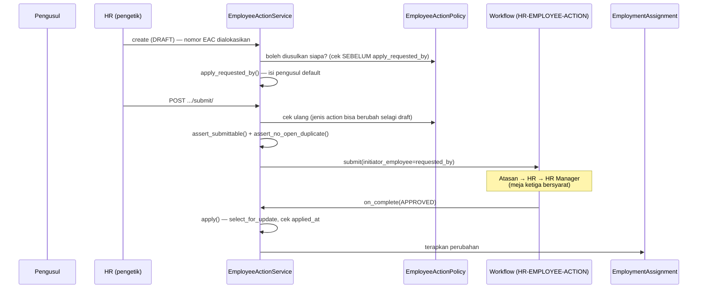

# Alur Employee Action

Perubahan kepegawaian — perpanjangan kontrak, pengangkatan, promosi, kenaikan gaji, pengunduran diri — sebagai **dokumen berapproval**, bukan sebagai pengetikan ulang kolom.

---

## Masalah yang diselesaikannya

Tab Employment dulu memuat delapan belas kolom dalam satu tumpukan, dan semuanya boleh diketik ulang kapan saja. Akibatnya:

- Memperpanjang kontrak berarti **menimpa** `contract_end` yang lama. Pegawai yang sudah tiga kali diperpanjang lalu diangkat terlihat seperti tidak pernah berkontrak.
- Tidak ada satu baris pun yang bisa ditunjuk saat orangnya bertanya *"sejak kapan saya permanen?"*
- Kombinasi `Employment Type = Permanent` + `Contract End = 2026-08-03` tersimpan tanpa keberatan, dan tidak bisa dibedakan dari kontrak yang memang masih berjalan.

---

## `EmploymentAssignment` = keadaan sekarang, `EmployeeAction` = transaksi yang mengubahnya

| | `EmploymentAssignment` | `EmployeeAction` |
|---|---|---|
| Jumlah baris | satu per pegawai | banyak per pegawai |
| Isi | keadaan sekarang | usulan perubahan + status + jejak persetujuan |

**Bukan history model kedua.** Riwayat dibaca dari baris yang sudah `APPLIED` — satu tabel, satu kebenaran.

!!! warning "`EmployeeMovement` adalah kode mati"
    Di `apps/hr/models/employee_history.py`, tidak pernah punya migration maupun export. **Jangan dihidupkan sebagai riwayat paralel.**

Dua belas jenis (`EmployeeActionType`): perpanjangan/perubahan kontrak, jenis kepegawaian, probation, status, transfer, promosi, demosi, mutasi jabatan, gaji, resign, terminasi.

---

## Alur



Endpoint: `submit/`, `withdraw/`, `approve/`, `reject/`, `apply/`.

---

## Kolom terkunci ada di service, bukan cuma di tampilan

`EmploymentService.PROTECTED_FIELDS` — jenis, status, kontrak, probation, confirmation, terminasi.

| Operasi | Perilaku |
|---|---|
| **Create** pegawai | Bebas. Pegawai baru boleh membawa keadaan awalnya; belum ada sejarah yang bisa hilang. |
| **Update** | Ditolak, dengan pesan yang menyebut Employee Action mana yang harus dipakai. |
| Lewat `EmployeeActionService.apply()` | `EmploymentService.save(via_action=True)` melewatinya. **Hanya jalur itu yang boleh.** |

!!! danger "Diperiksa dengan membandingkan nilai, bukan melihat kunci mana yang dikirim"
    Form mengirim seluruh isi tab apa adanya. Menolak setiap kiriman yang **memuat** kunci terkunci membuat menyimpan Job Location pun ditolak dengan alasan kontrak.

**Sengaja tidak terkunci:** `join_date`, `employee_group`, `job_location`, `point_of_hire`, dan seluruh work arrangement. Itu koreksi data yang wajar — menguncinya berarti salah ketik satu huruf harus lewat tiga meja.

---

## `EmploymentType.requires_contract` yang menentukan, bukan kodenya

Tenant yang menamai masternya sendiri tidak boleh kehilangan kolom kontrak hanya karena kodenya bukan `CONT`. Pola yang sama dengan `RotationPurpose.deducts_leave`.

Dari sini juga:

- `EmploymentAssignment.clean()` menolak Contract End yang masih menempel di pegawai Permanent
- `_apply_employment_type_change` **membersihkan** kontrak lama saat Contract → Permanent diterapkan

---

## Siapa boleh mengusulkan — `EmployeeActionPolicy`

Diatur master tersendiri, **bukan izin model**.

> Django Permission cuma tahu `add_employeeaction` dan tidak mengenal `action_type`. Memecah izin per model tidak akan pernah bisa membedakan kenaikan gaji dari perpanjangan kontrak.

Berjenjang lewat skor `specificity` (company 4 / location 2 / employee group 1). **Jenis yang tidak punya aturan tetap boleh diajukan siapa pun yang punya izin** — master yang belum diseed tidak boleh mengunci modulnya.

Lima tipe pengusul (`ActionInitiator`), kosakatanya sengaja dipinjam dari `ApproverType`: `any` / `manager` / `department_head` / `role` / `employee`. Dinilai terhadap **pegawai yang datanya diubah**, bukan terhadap yang mengetik.

Bawaan (`tenant_command seed_employee_action_policy`):

| Jenis | Pengusul |
|---|---|
| gaji, promosi, demosi, mutasi jabatan | Kepala Departemen |
| transfer | Atasan Langsung |
| pengunduran diri | pegawainya sendiri |
| sisanya | tidak dibatasi — perpanjangan kontrak dan koreksi status memang administrasi HR |

Seed **tidak menimpa** baris yang sudah disunting.

### `requested_by` ≠ `created_by`

Yang pertama **pengusul**, yang kedua **pengetik**, dan keduanya sering berbeda: kepala departemen menyampaikan usulan lisan, HR yang memasukkannya.

`allow_on_behalf` mengizinkan itu asalkan Requested By diisi; `on_behalf_role` membatasi siapa yang boleh. Dimatikan = usulannya harus dibuat sendiri.

!!! danger "Urutan pemeriksaannya penting"
    Pemeriksaan jalan **sebelum** `apply_requested_by` mengisikan pengusul default. Terbalik, dan kolom yang kosong telanjur diisi nama pengetiknya — sehingga penolakannya berbunyi *"Hesti bukan Kepala Departemen"*: benar, tapi tidak memberi tahu bahwa yang perlu dilakukan adalah **mengisi Requested By**.

Diperiksa saat **create dan submit**. Hanya saat submit berarti HR baru tahu usulannya tidak sah setelah seluruh isinya diketik; hanya saat create berarti jenis action yang diganti selagi draft lolos tanpa diperiksa ulang.

Superuser dilewati, sama seperti di engine workflow.

---

## Pengusul tidak menyetujui usulannya sendiri

`WorkflowService.submit(initiator_employee=...)` menyemai peta approver dengan pengusulnya, jadi meja yang jatuh kepadanya ditandai `SKIPPED` berbunyi "Diajukan olehnya".

Barisnya **tetap dicetak** — kotak tanda tangan atasan wajib ada di dokumen tercetak — dan membiarkannya `PENDING` cuma satu klik yang hasilnya sudah pasti.

Kwarg-nya opsional, jadi Cuti dan Travel Request tidak berubah perilakunya.

---

## Penerapan

Definisi `HR-EMPLOYEE-ACTION`: Atasan → HR → HR Manager. Meja ketiga bersyarat `action_type in [employment_type_change, salary_change, promotion, demotion, resignation, termination]` — **satu definisi untuk dua belas jenis**, bukan dua belas rantai yang harus dijaga tetap sama.

| Aturan | Alasan |
|---|---|
| **`applied_at` yang jadi penjaga idempotensi, bukan `status`** | Baris dikunci `select_for_update` lalu **dibaca ulang** dari database; memeriksa instance yang sudah di tangan membuat dua permintaan bersamaan sama-sama membaca "belum diterapkan" |
| **Gagal menerapkan tidak membatalkan persetujuan** | Alurnya sudah selesai dan keputusan approver-nya sah. Ditempel ke `apply_error` **pada dokumennya** (bukan cuma log server), diulang lewat `POST .../apply/` |
| Validasi sungguhan di `assert_submittable`, saat **Submit** | Pola yang sama dengan `TravelRequestService.assert_no_leave_conflict` |
| **Dua dokumen terbuka sejenis ditolak** | Dua perpanjangan yang berjalan bersamaan diterapkan berturut-turut dan yang belakangan menimpa yang duluan — dua-duanya "disetujui", dua-duanya terlihat benar |

### Efek per jenis

**Gaji → baris payroll baru, bukan menimpa.** `PayrollAssignment` memang sudah effective-dated (`is_current` + `effective_from`); baris lama ditutup `effective_to`. Kolom non-gaji (BPJS, metode bayar) **disalin** — kenaikan gaji tidak boleh diam-diam mengosongkannya.

**Organisasi → kolom yang tidak diusulkan tidak ikut dikosongkan.** Promosi yang cuma menyebut jabatan tidak boleh menghapus department dan cost center. Jejak "dari mana ke mana"-nya ada di `values_before`, bukan di assignment yang memang hanya menyimpan keadaan sekarang.

---

## Form dinamis, bukan dua belas layar

`visible_when` pada `action_type`: Salary Change memunculkan 14 kolom dari 46, Transfer 23.

Kolom pembanding `current_*` **read-only berpasangan** dengan tiap `proposed_*`, supaya yang memutuskan melihat **nilai sekarang → nilai usulan** dalam satu layar.

Dua tab: `general` (Document) dan `change` (Change Details). Tab Change Details memang kosong sampai Action Type dipilih — itu jawabannya, bukan alasan menampilkan empat puluh kolom sekaligus.

`document_number` dan `status` ber-`modes=["edit"]`: keduanya ditentukan backend, dan kotak kosong berlabel begitu di layar create akan dicoba diisi orang.

!!! note "Employee Action tidak punya tab di kartu Employee, dan itu disengaja"
    Kartu pegawai menjawab "keadaannya sekarang apa". Employee Action adalah dokumen berjalan dengan status dan alurnya sendiri, dan sudah punya modul **HR → Employee Actions**.

    Yang tersisa di kartu pegawai cuma pintu masuknya: tombol **Actions** (`action.create_resource`) yang membuka form dokumen yang sama dengan pegawainya sudah terisi dan **tidak bisa dipilih ulang**. Dari menu global, form yang sama tetap meminta pegawainya dipilih — satu deklarasi field, dua pintu masuk.

    Hasilnya terbaca di tab **History** begitu dokumennya diterapkan.

---

## Timeline riwayat

```
GET /api/hr/employees/<id>/employment-history/
```

Dirakit dari action `APPLIED` + satu baris `HIRE` dari `join_date`.

Lewat `get_object()` supaya `RoleDataPermission` ikut berlaku — tanpa itu riwayat kontrak dan gaji seluruh tenant terbaca lewat satu URL yang ditebak.

### Kerahasiaan — `EmployeeDataPolicy`

`RoleDataPermission` menjawab "**baris** yang mana", dan itu tidak cukup: begitu seorang pegawai masuk cakupan admin site, **seluruh** riwayatnya ikut terbaca — kenaikan gaji, demosi, alasan pengunduran diri.

Empat kelompok riwayat (`EmployeeDataSubject`), bukan dua belas jenis: `history_salary`, `history_separation`, `history_movement`, `history_contract`. Yang memutuskan kerahasiaan berpikir "riwayat gaji", bukan "salary_change".

Yang boleh melihat adalah **himpunan**, bukan satu pilihan: `allow_self` / `allow_manager` (+ `manager_levels`) / `allow_department_head` / `role`. "HR Manager atau atasan atau yang bersangkutan" tidak bisa dinyatakan dengan satu nilai.

- **Dibuang dari payload, bukan ditandai.** Tidak ada baris "3 perubahan disembunyikan" — penanda seperti itu sudah memberi tahu bahwa ada kenaikan gaji, dan itu setengah dari informasinya.
- **Baris Hire selalu tampil**, tapi rincian kontraknya ikut disembunyikan kalau `history_contract` dibatasi.
- **Riwayat kontrak dan transfer sengaja tidak dibatasi.** Pembedanya bukan sensitif atau tidak, melainkan apakah orang di sekitarnya perlu tahu untuk bekerja: admin site perlu tahu kontrak siapa yang akan habis.
- `viewer` **dioper eksplisit**, tidak diambil dari `CurrentRequestMiddleware` — kerahasiaan yang bergantung pada variabel konteks gagal ke arah yang salah: terbuka, diam-diam.

!!! bug "Jebakan yang sudah kena sekali"
    Accessor akun → pegawai itu `user.employee_profile` (`OneToOneField` ber-`related_name`), **bukan** `user.employee`. `getattr` mengembalikan `None` tanpa error, jadi "pegawainya sendiri" dan "atasan langsung" **tidak pernah** cocok — riwayat gajinya sendiri pun tertutup untuknya, tanpa satu pesan pun.

Kartu pegawai punya **tiga jalur** dan menutup satu tidak menutup dua lainnya: serializer (`_mask_hidden`), endpoint sub-resource (Payroll/Bank/Family/Medical/Documents — masing-masing endpoint tersendiri), dan **export CSV** (`resolve_export_value` membaca instance, bukan serializer). Di CSV kolomnya **dibuang seluruhnya**, bukan dikosongkan per baris — CSV yang sebagian selnya terisi justru membocorkan polanya.

---

## Seed & data uji

```bash
python manage.py tenant_command seed_employee_action_policy
python manage.py tenant_command seed_employee_data_policy
python manage.py tenant_command seed_employee_action_demo
```

Data uji: perpanjangan kontrak yang disetujui penuh (GBE003), pengangkatan jadi karyawan tetap (HO004), satu yang menunggu meja pertama (GBE006), satu draft (HO002). Dijalankan lewat service + kotak masuk approver, jadi rantai persetujuannya ikut teruji.

**Dokumen yang sudah `APPLIED` tidak dibuat ulang** saat seed diulang — menghapus lalu membuatnya lagi berarti kontraknya diperpanjang dua kali dan riwayat pegawainya berubah tiap seed dijalankan.

Nomor: deret `hr/employee_action` (prefix `EAC`) lewat `seed_administration --only=numbering`.
