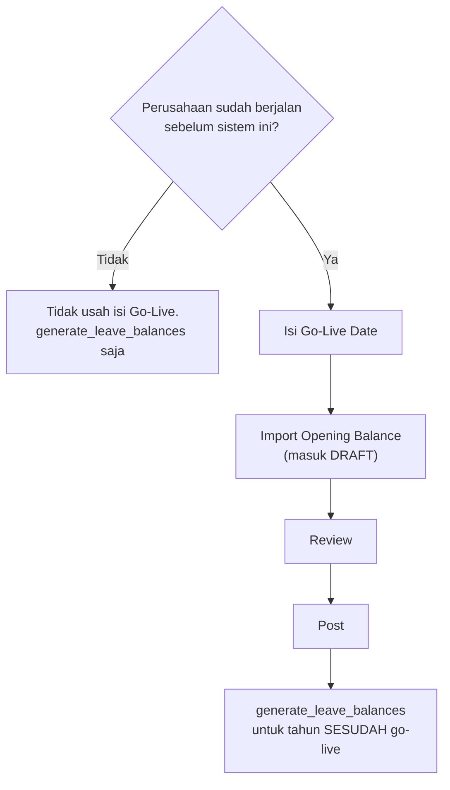

# Go-Live Cuti: tenant yang baru mulai hari ini

!!! abstract "Ringkasan"
    Tenant yang mulai dipakai **di tengah tahun** membawa satu persoalan yang tidak
    dipunyai tenant baru: pegawainya sudah memakai sebagian jatah cutinya di sistem
    lama, dan angka itu harus masuk tanpa mengarang histori. Halaman ini menelusuri
    keputusannya, jebakan dobel hitungnya, dan contoh import yang sudah diuji.

!!! tip "Urutannya — dan ia sengaja tidak dimulai dari generate"
    ```text
    1. Leave Policy berdiri
             ↓
    2. Set Go-Live Date          → HR → Leave Go-Live
             ↓
    3. Import Opening Balance    → masuk sebagai DRAFT
             ↓
    4. Review                    → periksa angkanya, belum berlaku
             ↓
    5. Post                      → jadi saldo pegawai
             ↓
    6. Leave Request berjalan seperti biasa
             ↓
    7. Entitlement Generator hanya untuk hak cuti SETELAH go-live
    ```

    Untuk perusahaan yang sudah berjalan, **jangan** memulai dengan
    `generate_leave_balances --year=<tahun go-live>`. Saldo awal bukan tambahan di
    atas jatah tahun berjalan — ia **adalah** saldonya. Begitu Go-Live Date terisi,
    jatah tahun itu tidak diterbitkan sama sekali untuk pegawai yang sudah bekerja
    sebelum tanggal tersebut, dan generatornya kembali bekerja normal mulai 1 Januari
    berikutnya.

Bacaan pendampingnya: [Menentukan Saldo Cuti](Leave-Balance-Setup.md) untuk rumus
jatahnya, dan [Urutan Entry](Employee-Onboarding-Flow.md) untuk langkah sebelum ini.

---

## 1. Satu pertanyaan yang harus dijawab lebih dulu

Klien menyerahkan satu kolom bernama **"sisa cuti"**. Sebelum satu baris pun
diimport, kolom itu harus dipastikan artinya — karena dua tafsirnya menghasilkan
angka akhir yang berbeda enam sampai dua belas hari per orang, dan selisihnya
**tidak terlihat di layar mana pun** sesudah tersimpan.

| Tafsir | Bunyinya | Contoh |
|---|---|---|
| **A — sudah termasuk jatah tahun berjalan** | "Jatah 2026-nya 12, dia sudah pakai 5, sisa 7" | yang paling lazim di Indonesia |
| **B — hanya sisa tahun-tahun sebelumnya** | "Sisa 2025 yang dibawa 7; jatah 2026 belum diberikan" | perusahaan yang jatahnya terbit di ulang tahun kerja |

Tanyakan begini, jangan menebak dari angkanya:

> *"Kalau seseorang belum pernah ambil cuti sama sekali tahun ini, di kolom itu
> angkanya berapa?"*

Jawaban **12** berarti Tafsir A. Jawaban **0** berarti Tafsir B.

---

## 2. Kenapa ini menentukan: jebakan dobel hitung

Rumus kartu saldo menjumlahkan ketiga kantongnya:

```text
remaining = entitlement + carried_over + opening_balance + adjustment
            − used − carried_over_forfeited − opening_forfeited
```

`opening_balance` **ditambahkan** di atas `entitlement`, tidak menggantikannya.
Jadi kalau angka klien bertafsir A lalu diimport apa adanya sesudah jatah tahun
berjalan diterbitkan, hasilnya:

| Langkah | entitlement | opening | **remaining** |
|---|---|---|---|
| `generate_leave_balances --year=2026` | 12,0 | 0,0 | 12,0 |
| import saldo awal 7 hari | 12,0 | 7,0 | **19,0** ← salah |

Angka terverifikasi pada `HO001` Sarah Wibowo di tenant demo. Tidak ada peringatan,
tidak ada baris merah — kartunya cuma berbunyi 19, dan tidak ada di layar yang
memberi tahu bahwa lima hari yang sudah dipakai tahun ini tidak pernah ikut masuk.

Yang menutupnya **Go-Live Date** perusahaannya. Terisi, jatah tahun go-live tidak
diterbitkan sama sekali untuk pegawai yang sudah bekerja sebelum tanggal itu — beserta
alasan yang terbaca di kartu — dan yang berlaku angka di dokumen saldo awal. Rinciannya
di bagian 3.

---

## 3. Tiga resep, dan mana yang dipakai

### Resep 1 — Go-live 1 Januari

Tidak ada persoalan sama sekali. Terbitkan jatahnya, dan import saldo awal **hanya**
kalau perusahaan memang membawa sisa tahun lalu.

```bash
python manage.py tenant_command generate_leave_balances --year=2026 --schema=<tenant>
python manage.py tenant_command generate_leave_balances --year=2027 --schema=<tenant>
```

### Resep 2 — Go-live tengah tahun, catatan cuti tahun berjalan tersedia

Yang paling bersih, dan yang paling jarang bisa dijalankan.

1. Terbitkan jatahnya seperti biasa — `entitlement` = 12
2. Import saldo awal = sisa **tahun-tahun sebelumnya** saja (Tafsir B); lewati kalau
   perusahaan tidak membawa sisa
3. Masukkan cuti Januari–Agustus 2026 sebagai catatan berstatus **`RECORDED`**

Langkah ketiga bukan mengarang histori: cutinya benar-benar terjadi, tanggalnya
nyata, dan `RECORDED` memang jalur yang disediakan untuk "sudah disetujui di luar
sistem". `used` terisi sendiri karena ia **dijumlah ulang** dari catatan cuti, dan
pegawainya bisa melihat kapan cutinya diambil — sesuatu yang hilang di kedua resep
lain.

!!! warning "Belum ada import massal untuk catatan cuti"
    Importer yang terdaftar hari ini cuma tiga: `hr/employees`, `hr/attendance`, dan
    `hr/leave-opening-balances`. Cuti Januari–Agustus harus diketik dari layar Leave
    satu per satu. Untuk 26 pegawai itu wajar; untuk 400 pegawai tidak.

### Resep 3 — Go-live tengah tahun, hanya punya angka sisa

Keadaan yang paling lazim, dan yang jadi resep bawaan di halaman ini.

**Isi Go-Live Date perusahaannya.** Itu satu langkah, sekali, dan sesudahnya jatah
tahun go-live tidak diterbitkan lagi untuk siapa pun yang sudah bekerja sebelum
tanggal itu — tidak lewat `generate_leave_balances`, tidak lewat penyimpanan kartu
pegawai, tidak lewat jalur mana pun. Yang berlaku angka di dokumen saldo awal:

| Kolom | Nilai |
|---|---|
| `entitlement` 2026 | 0,0 — *"Cuti 2026 dipegang sistem lama — go-live 2026-09-01. Saldonya masuk lewat Leave Opening Balance, bukan dihitung dari policy."* |
| `opening_balance` | 7,0 |
| `adjustment` | 0,0 — **tidak disentuh**, tetap milik koreksi manusia |
| **`remaining`** | **7,0** |
| `entitlement` 2027 | 12,0 — kembali normal |

Tanggalnya **per company**, bukan satu setelan tenant: tenant berisi dua belas badan
usaha lazim memindahkannya bertahap, dan satu setelan tenant memaksa yang belum siap
ikut pindah. Perusahaan yang **tidak** punya baris Go-Live sama sekali dianggap tidak
pernah bermigrasi — jatahnya terbit seperti biasa, jadi tenant yang memang mulai dari
nol tidak berubah satu angka pun.

!!! info "Pegawai yang masuk SESUDAH go-live tetap dapat jatahnya"
    Batasnya `join_date < go_live_date`. Yang direkrut pada atau sesudah hari go-live
    dipegang sistem ini sejak hari pertama, jadi jatahnya dihitung normal (prorata
    menurut policy) — mereka memang tidak punya saldo lama yang bisa menjelaskan
    jatah nol. Ini cabang yang paling gampang ikut termatikan; dikunci test di
    `apps/hr/tests/leave/test_go_live.py`.

!!! note "Penanda per baris sudah dibuang"
    Dulu ada kolom **Sudah Termasuk Jatah Tahun Ini** (`replaces_entitlement`) yang
    memutuskan arti angka per baris. Itu kesalahan bentuk: satu kolom yang membuat
    angka yang sama berarti 7 di satu baris dan 7-di-atas-12 di baris sebelahnya,
    dengan bawaan yang justru lebih jarang benar — dan enam bulan kemudian tidak ada
    cara tahu keputusan mana yang diambil untuk sebuah baris.

    Sekarang saldo awal punya **satu** arti: saldo aktual pegawai pada tanggal
    go-live. Setiap baris yang sudah di-post memegang tahunnya, tanpa syarat. Nol hari
    pun memegang tahunnya — "saldo saya nol saat go-live" adalah pernyataan tentang
    tahun itu, sama tegasnya dengan tujuh.

---

## 4. Kenapa butuh penanda, bukan sekadar "jangan terbitkan jatahnya"

Itu jalan yang paling jelas, dan ia **rapuh dengan cara yang tidak terlihat**.

Import saldo awal sudah membuat kartunya sendiri kalau belum ada, dengan
`entitlement` = 0. Jadi sekilas cukup: jangan jalankan `generate_leave_balances`
untuk tahun go-live, dan kartunya berbunyi 7.

Masalahnya `EmploymentService.sync_leave_balances` berjalan **tanpa syarat** setiap
kali penempatan kepegawaian seseorang disimpan — bukan hanya saat Join Date berubah,
karena `save()` sudah meng-`setattr` seluruh payload sebelum nilai lamanya sempat
dibandingkan. Terverifikasi di tenant demo:

| Langkah | entitlement | opening | **remaining** |
|---|---|---|---|
| sesudah import saldo awal, tanpa penanda | 0,0 | 7,0 | 7,0 |
| **satu kali simpan kartu pegawai** | 12,0 | 7,0 | **19,0** |

Satu orang HR membetulkan satu huruf di kolom Job Location, dan saldo cuti orang itu
naik dua belas hari tanpa satu pun pesan. Yang paling merugikan: gejalanya muncul
berminggu-minggu kemudian, jauh dari tindakan yang menyebabkannya.

Karena itu keputusannya disimpan **di dokumennya**, dibaca `LeaveEntitlementCalculator`
setiap kali jatah dihitung — bukan diberlakukan sekali lalu diharapkan bertahan.
Ketujuh jalur ini sudah diuji pada `HO001`:

| Sesudah | jatah 2026 | saldo awal | sisa | jatah 2027 |
|---|---|---|---|---|
| import | 0,0 | 7,0 | **7,0** | 12,0 |
| simpan kartu pegawai | 0,0 | 7,0 | **7,0** | 12,0 |
| `generate_leave_balances --year=2026` diulang | 0,0 | 7,0 | **7,0** | 12,0 |
| penanda dimatikan | 12,0 | 7,0 | 19,0 | 12,0 |
| dinyalakan lagi | 0,0 | 7,0 | **7,0** | 12,0 |
| dokumennya dihapus | 12,0 | 0,0 | 12,0 | 12,0 |
| dipulihkan | 0,0 | 7,0 | **7,0** | 12,0 |

Dua baris terakhir yang paling penting: keputusannya **bisa dibalik**. Menghapus
dokumennya mengembalikan jatah tahun itu seperti semula, dan tidak ada satu angka pun
yang tertinggal di kolom lain. Itulah yang tidak dipunyai jalan pintas lewat
`adjustment`: begitu dokumennya dibuang, koreksi −12 tetap menempel di kartu dan tidak
ada yang tahu lagi asal-usulnya.

---

## 5. Langkah lengkap Resep 3

### Langkah 1 — Pastikan prasyaratnya berdiri

```bash
python manage.py tenant_command seed_leave_policy      --schema=<tenant>
python manage.py tenant_command seed_import_profiles   --schema=<tenant>
```

Yang harus ada: master `LeaveType`, `LeavePolicy` yang cocok, Join Date terisi di
setiap pegawai, dan profil import `LEAVE-OPENING-CSV-DEFAULT`.

### Langkah 2 — Tetapkan Go-Live Date

Layar: **HR → Attendance & Leave → Leave Go-Live**, satu baris per perusahaan. Atau
dari baris perintah:

```bash
python manage.py tenant_command leave_go_live --company=MMR --date=2026-09-01 --schema=<tenant>
```

```text
Go-live MMR = 2026-09-01 (cut-off 2026-08-31).
  Jatah 2026 tidak lagi diterbitkan untuk pegawai yang masuk sebelum 2026-09-01.
  Saldonya masuk lewat Leave Opening Balance.
```

**Cut-off diturunkan**, tidak diketik: ia selalu sehari sebelum go-live. Dua tanggal
yang harus selalu berselisih satu hari cepat atau lambat berselisih dua, dan yang
membacanya tidak punya cara tahu mana yang benar. Angka yang diminta ke sistem lama
adalah saldo **per tanggal cut-off**.

!!! danger "Jangan jalankan `generate_leave_balances` untuk tahun go-live sebagai langkah pembuka"
    Bukan karena berbahaya — sesudah Go-Live Date terisi, perintah itu justru aman
    diulang dan akan menulis `entitlement` = 0 beserta alasannya. Tapi menjalankannya
    sebagai langkah pembuka menanamkan urutan yang salah di kepala orang yang
    menyiapkan tenant berikutnya: yang menentukan saldo awal adalah **dokumen saldo
    awal**, bukan generator. Jalankan generatornya untuk tahun **sesudah** go-live:

    ```bash
    python manage.py tenant_command generate_leave_balances --year=2027 --schema=<tenant>
    ```

### Langkah 3 — Import saldo awalnya

Layar: **HR → Attendance & Leave → Leave Opening Balance → Import**
(`/hr/leave-opening-balances/import`). Rinciannya di bagian 6.

Kolom tanggal boleh dikosongkan seluruhnya — ikut Go-Live Date perusahaannya. Itu
bukan kenyamanan: satu baris yang tanggalnya meleset ke tahun lain mendarat di kartu
saldo tahun yang salah, dan yang membacanya cuma melihat saldo pegawai itu nol.

### Langkah 4 — Review

**Barisnya masuk sebagai DRAFT dan belum menyentuh kartu cuti siapa pun.** Kartunya
belum ada sama sekali — bukan kartu berisi nol; keduanya berbeda arti, dan yang kedua
terbaca seperti saldo yang memang habis.

```bash
python manage.py tenant_command leave_go_live --status --schema=<tenant>
```

```text
COMPANY    GO-LIVE      CUT-OFF        DRAFT  POSTED    BELUM  KEADAAN
------------------------------------------------------------------------------------
MMR        2026-09-01   2026-08-31         3       0       23  23 pegawai belum punya saldo awal

MMR — 23 pegawai sudah bekerja sebelum go-live tapi belum punya saldo awal:
    HO004      Clara Wijaya
    HO005      Farah Anindita
    ...
```

Yang diperiksa di tahap ini ada empat, dan yang terakhir paling mudah terlewat:

1. Kolom **Validation** — baris berstatus **REVIEW** lebih dulu. Sistem tidak bisa
   memeriksa angkanya (histori pemakaiannya tidak pernah ikut pindah), tapi bisa
   memeriksa **kelayakannya**: saldo di atas nol untuk orang yang belum genap masa
   tunggunya. Rinciannya di 6.1.2.
2. Kolom **Reason** — alasan statusnya, ditambah peringatan lain: nama yang tidak
   cocok dengan nomornya, tanggal yang menyimpang dari go-live.
3. Angka `days` dicocokkan dengan file klien.
4. Kolom **BELUM** — pegawai yang sudah bekerja sebelum go-live tapi **tidak ada di
   file sama sekali**.

Ketiga kolom kelayakan (**Join Date**, **Eligible Date**, **Validation**) ikut di
daftar Leave Opening Balance, bukan cuma di layar preview. Tombol Post ada di baris
itu, jadi bahan untuk memutuskannya harus ada di baris itu juga — layar preview yang
sudah ditinggalkan tidak bisa dibuka lagi.

Baris yang salah tinggal disunting atau dihapus; selama masih draft, tidak ada yang
perlu dibatalkan.

!!! danger "Pegawai yang tidak ada di file gagal tanpa suara"
    Barisnya tidak ditolak — barisnya memang tidak ada. Tidak muncul di laporan error,
    tidak muncul di preview, dan kartu saldonya cuma berbunyi nol: **tidak bisa
    dibedakan dari orang yang saldonya memang habis terpakai.** Karena itu baris
    bernilai nol pun wajib ikut di file, dan karena itu kolom BELUM ada. Yang masuk
    kerja **sesudah** go-live sengaja tidak dihitung di sana — jatahnya dari policy
    seperti biasa, dan mendaftarnya cuma membuat daftar ini berisik lalu berhenti
    dibaca orang.

### Langkah 5 — Post

Tombol **Post** di baris dokumennya, atau **Post All** untuk seluruh batch. Dari
baris perintah:

```bash
python manage.py tenant_command leave_go_live --company=MMR --post --schema=<tenant>
```

Inilah langkah yang membuat saldo awal jadi **saldo pegawai**: kartu cutinya
diterbitkan, `opening_balance` terisi, dan sejak itu cutinya bisa diajukan.

Tiap baris di-post di savepoint sendiri — satu pegawai yang datanya bermasalah tidak
membatalkan dua ratus sembilan puluh sembilan lainnya. Yang gagal disebut namanya di
akhir keluaran.

!!! note "Baris yang sudah di-post tidak bisa disunting di tempat"
    Angkanya sudah menempel di kartu cuti orang dan sudah dibaca pengajuan yang
    berjalan di atasnya. Tarik dulu lewat **Unpost**, betulkan, lalu Post lagi — tiga
    tindakan yang terlihat dan tercatat, bukan satu perubahan diam-diam. Unpost tidak
    dilarang walau cutinya sudah dipakai: yang ditarik cuma pemberiannya, dan
    `advance_used` memang ada untuk menjelaskan kartu yang jadi minus.

### Langkah 6 — Verifikasi

```python
# python manage.py shell
from django_tenants.utils import schema_context

with schema_context("<tenant>"):
    from apps.hr.models import LeaveBalance

    for b in LeaveBalance.objects.select_related("employee").filter(year=2026):
        print(b.employee.employee_number, b.entitlement, b.opening_balance,
              b.adjustment, b.remaining)
```

Yang dicocokkan: kolom `remaining` harus sama persis dengan kolom "sisa cuti" di file
klien, dan `adjustment` harus **nol di semua baris** — kalau ada yang terisi, itu
koreksi manusia yang memang disengaja, bukan sisa tambalan migrasi.

Contoh terverifikasi di tenant demo dengan Go-Live Date 1 September 2026:

```text
HO001   ANNUAL   ent=0.0   opening=7.0   used=0.0   REMAINING=7.0
HO002   ANNUAL   ent=0.0   opening=4.0   used=0.0   REMAINING=4.0
HO003   ANNUAL   ent=0.0   opening=5.0   used=0.0   REMAINING=5.0
```

7, bukan 19. Dan tetap 7 sesudah `generate_leave_balances --year=2026` dijalankan dua
kali, sesudah kartu pegawainya disimpan ulang, dan sesudah baris itu di-unpost lalu
di-post lagi. Jatah 2027 kembali 12 untuk ketiganya.

Hasil pada file lengkap, 22 dokumen bertanda dari 26 pegawai:

```text
NOMOR    NAMA                JATAH SALDO_AW   KOREKSI       SISA
HO001    Sarah Wibowo          0.0      7.0       0.0        7.0
HO002    Hesti Rahayu          0.0      4.0       0.0        4.0
LOK003   Rahmat Tidore         0.0     12.0       0.0       12.0
LOK004   Sultan Ahmad          2.0      0.0       0.0        2.0   <- tanpa dokumen
SGA004   Citra Halimah         0.0      0.0       0.0        0.0   <- dokumen 0 hari
TOTAL 2026  jatah=2.0  saldo awal=136.0
```

Dua baris terakhir yang paling menjelaskan bentuknya. `LOK004` tidak ikut di file —
ia baru berhak November 2026, jadi di sistem lama pun belum punya jatah, dan prorata
2,0 hari dari policy tetap berlaku untuknya. `SGA004` ikut dengan **nol hari**, dan
itu berbeda artinya: jatahnya sudah habis terpakai di sistem lama.

## 6. Import saldo awal

### 6.1 Bentuk filenya

CSV, satu baris per pegawai per jenis cuti. Enam kolom itu isi template yang
diunduh, urutannya urutan orang mengisinya:

```csv
employee_code,employee_name,leave_type,opening_date,opening_balance,remark
```

| Kolom | Wajib | Isi |
|---|---|---|
| `employee_code` | ya | nomor pegawai, dicocokkan tanpa peduli besar-kecil huruf |
| `employee_name` | tidak | **hanya untuk diperiksa** — lihat 6.1.1. Tidak pernah menentukan barisnya mendarat di siapa |
| `leave_type` | ya | **kode** jenis cuti (`ANNUAL`); nama ikut diterima (`Cuti Tahunan`) |
| `opening_date` | tidak | tanggal go-live — **bukan** 1 Januari. Dikosongkan = ikut tanggal Leave Go-Live perusahaannya; ditolak kalau perusahaannya belum punya |
| `opening_balance` | ya | angka; nol sah, negatif ditolak |
| `remark` | tidak | keterangan, terbaca di dokumennya nanti |

Dua kolom di luar template tetap dikenali kalau filenya memuatnya: `year` (kartu tahun
mana yang dituju) dan `expires_at` (tanggal hangus). Keduanya dikosongkan = diturunkan
service dari tanggal berlaku dan Leave Policy.

!!! success "Tidak ada kolom yang memutuskan arti angkanya"
    Angka di kolom saldo **selalu** berarti satu hal: sisa cuti pegawai pada tanggal
    cut-off. Dulu ada kolom `replaces_entitlement` yang mengubah artinya per baris, dan
    kolom itu sudah dibuang — yang menentukan sekarang Go-Live Date perusahaannya, satu
    tanggal untuk semua orang. Pertanyaan di bagian 1 tetap harus dijawab, tapi
    jawabannya menentukan **angka apa yang diminta ke klien**, bukan kolom apa yang
    dicentang.

Unduh kerangkanya lewat **Download Template** di layar import, atau
`GET /api/imports/hr/leave-opening-balances/template/`.

### 6.1.1 `employee_name` adalah alarm, bukan gerbang

Pencocokan pegawai tetap **murni lewat `employee_code`**, sama seperti sync absensi:
nama tidak pernah ikut menentukan, supaya hasilnya bisa ditebak dan tidak tergantung
ejaan. Yang dilakukan kolom ini cuma membandingkan — kalau
`AttendanceEmployeeMatcher.names_match()` menilai itu orang lain, barisnya **tetap
lolos** dan peringatannya muncul di kolom **Catatan** layar preview
("Nama di file 'Rahmat Tidore' tidak cocok dengan HO001 (Sarah Wibowo) — periksa
nomornya."). Perbandingannya longgar: `SARAH  wibowo` dan `Sarah Wibowo` orang yang
sama, gelar dan inisial diabaikan.

Kolom ini ada di template justru karena kolom nama **selalu** ditambahkan orang sendiri
kalau tidak disediakan — dan kolom yang tidak dikenal importer akan diisi lalu diabaikan
tanpa satu pun tanda, padahal itu kolom yang paling dipercaya pembaca filenya. Kolom
Employee di layar preview tetap menampilkan nama dari **master**, bukan dari file; yang
dari file hanya dipakai untuk baris yang nomornya tidak ketemu, supaya barisnya masih
bisa dicari di file aslinya.

### 6.1.2 Kolom preview dan tiga status validasinya

Layar preview menampilkan sebelas kolom, dan enam di antaranya memang yang diminta
HR untuk memutuskan: **Employee**, **Join Date**, **Eligible Date**, **Opening
Balance**, **Validation**, **Remark** (plus **Reason** yang menjelaskan statusnya).

**Eligible Date** = Join Date + masa tunggu di Leave Policy (`eligible_after_months`,
lazimnya 12 bulan). Kosong berarti belum bisa dihitung — Join Date pegawainya belum
diisi, atau jenis cutinya belum punya policy; sebabnya ada di kolom Reason.

| Status | Kapan | Contoh |
|---|---|---|
| **VALID** | sudah berhak pada tanggal berlaku | `HO001` masuk 07 Jan 2019, berhak 07 Jan 2020, saldo 7 |
| **VALID - NOT YET ELIGIBLE** | belum berhak, saldonya nol | `HO004` masuk 02 Mar 2026, berhak 02 Mar 2027, saldo 0 |
| **REVIEW** | belum berhak tapi saldonya di atas nol; atau kelayakannya tidak bisa dinilai | `LOK004` masuk 10 Nov 2025, berhak 10 Nov 2026, saldo 2 |
| **ERROR** | barisnya ditolak — pegawai tidak ada, tanggal tidak terbaca, saldo negatif | satu-satunya yang tidak bisa di-confirm |

Batas "sudah berhak" **inklusif**: `HO003` yang berhak 15 Agustus 2026 dengan go-live
19 Agustus 2026 berstatus VALID, bukan REVIEW.

!!! success "REVIEW tidak menolak dan tidak mengubah angkanya"
    Baris yang saldonya mendahului tanggal berhaknya **tetap** boleh diimport dan
    **tetap** boleh di-post, dengan angka apa adanya. Dua "perbaikan" yang sama-sama
    salah: menolaknya menghentikan migrasi pada baris yang bisa jadi memang benar —
    perusahaan lamanya boleh saja memberi cuti lebih awal, dan keputusan itu sudah
    diambil sebelum sistem ini ada. Memaksanya jadi nol membuang angka yang cuma
    dipegang klien, tanpa jejak. Yang benar: tandai, dan serahkan ke satu-satunya
    pihak yang memegang berkas migrasinya.

!!! warning "Saldo nol bukan temuan"
    Nol adalah jawaban yang sah — dan barisnya tetap wajib ada di file. Ia yang
    membuktikan orangnya **tidak terlewat**; kartu bersaldo nol karena habis terpakai
    dan kartu bersaldo nol karena barisnya tidak pernah diimport terlihat sama persis.

### 6.2 Judul kolom boleh bahasa Indonesia

Importer membawa daftar alias, jadi file klien tidak perlu diubah judulnya. Yang
diterima antara lain:

| Target | Alias yang dikenal |
|---|---|
| `employee_code` | `employee code`, `employee number`, `nomor pegawai`, `nip`, `nik_karyawan` |
| `employee_name` | `employee name`, `nama pegawai`, `nama karyawan`, `nama` |
| `leave_type` | `leave type`, `jenis cuti`, `tipe_cuti` |
| `opening_date` | `opening date`, `effective date`, `tanggal berlaku`, `tanggal` |
| `opening_balance` | `days`, `balance`, `saldo awal`, `saldo` |
| `remark` | `remarks`, `keterangan`, `catatan`, `note` |

!!! warning "Spasi tidak diubah jadi garis bawah"
    Parser meng-`strip().lower()` judul kolom dan berhenti di situ. Jadi
    `Employee Code` mendarat sebagai `employee code` — dan itu alias yang **berbeda**
    dari `employee_code`. Keduanya kebetulan sudah terdaftar; kalau menambah alias
    baru, daftarkan dua-duanya. Gagalnya diam: kolomnya terbaca kosong, lalu barisnya
    ditolak sebagai "employee_code is required" padahal isinya ada.

### 6.3 Contoh yang sudah diuji

Judul kolomnya sengaja bahasa Indonesia, untuk membuktikan pencocokan aliasnya:

```csv
Employee Number,Nama Pegawai,Jenis Cuti,Saldo Awal,Keterangan
HO001,Sarah Wibowo,ANNUAL,7,Sisa per 31 Agustus 2026 dari sistem HR lama
HO002,Hesti Rahayu,ANNUAL,4,Sisa per 31 Agustus 2026 dari sistem HR lama
HO003,Bimo Nugroho,Cuti Tahunan,5,Sisa per 31 Agustus 2026 dari sistem HR lama
SGA004,Citra Halimah,ANNUAL,0,Saldo habis terpakai di sistem lama
```

Kolom tanggal sengaja **tidak ada** — ketiganya ikut Go-Live Date perusahaannya
(1 September 2026). Hasil sungguhan di tenant demo:

```text
PREVIEW  valid=3  invalid=0
  baris 2  HO001 | Sarah Wibowo  | date=2026-09-01 | 7 hari
  baris 3  HO002 | Hesti Rahayu  | date=2026-09-01 | 4 hari
  baris 4  HO003 | Bimo Nugroho  | date=2026-09-01 | 5 hari

EXECUTE  created=3  updated=0  duplicate=0  failed=0   -> semuanya DRAFT

POST     3 saldo awal di-post.

HO001   ANNUAL   ent=0.0   opening=7.0   REMAINING=7.0
HO002   ANNUAL   ent=0.0   opening=4.0   REMAINING=4.0
HO003   ANNUAL   ent=0.0   opening=5.0   REMAINING=5.0
```

Empat pegawai sengaja **tidak** ikut di file: `HO004`, `SGA006`, `LOK008`, dan
`LOK004` belum genap 12 bulan pada tanggal go-live, jadi di sistem lama pun mereka
belum pernah punya jatah — dan prorata dari policy tetap berlaku untuk mereka. Baris
bernilai nol seperti `SGA004` justru **wajib ikut**: "nol karena habis terpakai" dan
"belum diimport" harus bisa dibedakan.

!!! warning "Baris bernilai nol WAJIB ikut di file"
    "Nol karena habis terpakai di sistem lama" dan "belum diimport" adalah dua keadaan
    yang sangat berbeda, dan kartunya terlihat sama persis. Baris nol yang di-post tetap
    memegang tahunnya — yang jatahnya habis terpakai tidak boleh mendapat dua belas hari
    lagi di sini.

### 6.4 Jalannya

| Tahap | Yang terjadi |
|---|---|
| **Upload + Preview** | Tiap baris dinormalisasi, divalidasi, relasinya di-resolve, lalu kelayakannya dinilai (6.1.2). **Tidak satu baris pun ditulis.** |
| **Perbaiki** | Baris yang ditolak muncul dengan nomor baris file (header = 1). Betulkan filenya, ulangi preview. |
| **Confirm** | Job Celery diantre, balas `202` + `jobPublicId`. Progresnya di `GET /api/imports/jobs/<public_id>/`. Barisnya masuk sebagai **DRAFT**. |
| **Review** | Baris terbaca di daftar Leave Opening Balance. **Belum menyentuh kartu cuti siapa pun.** Yang salah tinggal disunting atau dihapus. |
| **Post** | `POST .../{id}/post/` atau `POST .../post-all/`. Kartu saldonya terbit, `opening_balance` terisi. |

Penulisannya lewat `LeaveOpeningBalanceService`, bukan `objects.create` — di sanalah
penurunan tahun, pembekuan tanggal hangus, sinkronisasi kartu saldo, dan jejak
auditnya berada.

!!! warning "Confirm bukan akhir dari import"
    Sebelum ada langkah Post, `confirm` langsung mengubah saldo cuti seluruh
    perusahaan — dan sebuah file yang kolomnya tertukar sudah menempel di kartu orang
    sebelum satu pun manusia sempat membacanya. Sekarang Confirm cuma menuliskan
    barisnya; yang membuatnya berlaku adalah Post.

!!! note "Preview aman diulang berapa kali pun"
    Ia membaca, memvalidasi, dan mencocokkan relasi tanpa menyentuh database.
    Satu-satunya tahap yang menulis adalah Confirm.

### 6.5 Katalog penolakan

Semuanya muncul di layar preview lengkap dengan nomor barisnya — bukan di laporan
error yang baru bisa dibuka setelah job selesai. Pesan sungguhan dari tenant demo:

| Baris | Kolom | Pesan |
|---|---|---|
| pegawai tidak ada | `employee_code` | `Pegawai 'HO999' tidak ditemukan.` |
| jenis cuti salah | `leave_type` | `Jenis cuti 'CUTI-TAHUNAN' tidak ada di master.` |
| tanggal sebelum masuk kerja | `opening_date` | `Lebih awal dari Join Date pegawai (2025-11-10).` |
| saldo negatif | `days` | `Saldo awal tidak boleh negatif. Untuk koreksi pengurangan, pakai Adjustment di kartu saldo.` |
| tanggal mustahil | `opening_date` | `Tanggal '31/04/2026' tidak bisa dibaca. Pakai format YYYY-MM-DD, atau isi datetime_formats di Import Profile.` |
| sudah pernah diimport | `employee_code` | `Sudah punya saldo awal 7 hari untuk jenis cuti ini (berlaku 2026-08-19).` |

Yang terakhir yang membuat import ini aman diulang: **satu baris per pegawai per
jenis cuti**, ditegakkan `uniq_active_hr_leave_opening_balance`. File yang tidak
sengaja diimport dua kali ditolak seluruhnya di preview, bukan menimpa angka orang.

!!! tip "Tanggal berformat Amerika"
    File export `M/D/YYYY` wajib memakai profil **`LEAVE-OPENING-CSV-US-DATE`**.
    Tanpa itu `5/2/2026` terbaca sebagai 5 Februari — **tanpa error**, dan tanggal
    berlakunya meleset tiga bulan.

---

## 7. Yang perlu disadari sesudahnya

- **Duplikat di dalam satu file lolos preview.** Saat preview belum satu baris pun
  tertulis, jadi dua baris `HO001` sama-sama terlihat sah. Yang kedua ditolak saat
  Confirm dengan pesan yang menyebut sebabnya. Periksa duplikat di spreadsheet
  sebelum upload.
- **Tanggal hangus dibekukan saat dokumen dibuat**, diturunkan dari
  `carry_over_expiry_months` pada policy. Untuk `ANNUAL-STD` bawaan yang
  `allow_carry_over`-nya mati, hasilnya `None` — saldo awalnya tidak pernah hangus.
- **Penghangusannya sendiri belum dieksekusi.** Kolom dan alokasi FIFO-nya sudah ada;
  perintah yang menghanguskannya belum. Lihat
  [Menentukan Saldo Cuti](Leave-Balance-Setup.md).
- **`LeaveBalance.opening_balance` jangan pernah diketik langsung.** Ia dijumlah ulang
  dari dokumen; isian manual tertimpa tanpa satu pun pesan. Yang boleh diketik
  `adjustment`.
- **Koreksi sesudah import, selama masih draft**, lewat dokumennya — buka baris Leave
  Opening Balance-nya dan ubah angkanya. Belum ada apa pun yang perlu dibatalkan.
- **Koreksi sesudah Post** butuh Unpost dulu. Itu disengaja: angkanya sudah menempel
  di kartu cuti orang, dan menggesernya tanpa peristiwa yang bisa ditunjuk membuat
  saldo seseorang berubah tanpa sebab yang terbaca di layar mana pun.
- **Baris yang draft tidak dihitung apa pun** — tidak menyumbang ke
  `opening_balance`, dan tidak memegang tahunnya di kalkulator jatah. Kalau
  ikut dihitung, sebuah file yang belum diperiksa siapa pun sudah mengosongkan jatah
  cuti orang.
- **Baris saldo awal yang sudah ada sebelum langkah Post diperkenalkan otomatis
  berstatus POSTED** (migrasi `hr/0048`). Kalau tidak, seluruh saldo migrasi yang
  sudah berjalan akan hilang dari kartu pada perhitungan ulang berikutnya, tanpa satu
  pun pesan dan tanpa ada yang mengubah datanya.
- **Keputusan go-live-nya bisa dibatalkan.** Matikan `is_active` pada barisnya
  (`leave_go_live --deactivate`), jalankan `generate_leave_balances` untuk tahun itu,
  dan jatahnya kembali dihitung dari policy seperti semula. Saldo awal yang sudah
  di-post tidak ikut hilang. Sudah diuji bolak-balik, dan tidak ada angka yang
  tertinggal di kolom lain.
- **`adjustment` tidak dipakai sama sekali** dalam alur ini, dan memang jangan.
  Kolom itu untuk koreksi yang keputusannya diambil manusia satu per satu; kalau
  keadaan migrasi ikut disimpan di sana, "koreksi 3 hari karena lembur Lebaran" tidak
  bisa lagi dibedakan dari sisa tambalan go-live.

---

## 8. Ringkasan keputusannya



Pertanyaan di bagian 1 tetap harus dijawab — ia yang menentukan **angka mana** yang
diminta ke klien. Yang berubah cuma siapa yang menutup jebakan dobel hitungnya: dulu
satu kolom per baris file, sekarang satu tanggal per perusahaan.

---

## Bacaan lanjutan

- [Menentukan Saldo Cuti](Leave-Balance-Setup.md) — rumus jatah, tiga kantong, alokasi FIFO
- [Urutan Entry: Employee sampai Cuti](Employee-Onboarding-Flow.md) — langkah sebelum dan sesudah ini
- [Saldo Awal & Pengecualian Presensi](../03-modules/hr/Leave-Opening-Attendance-Exception.md) — desain modelnya
