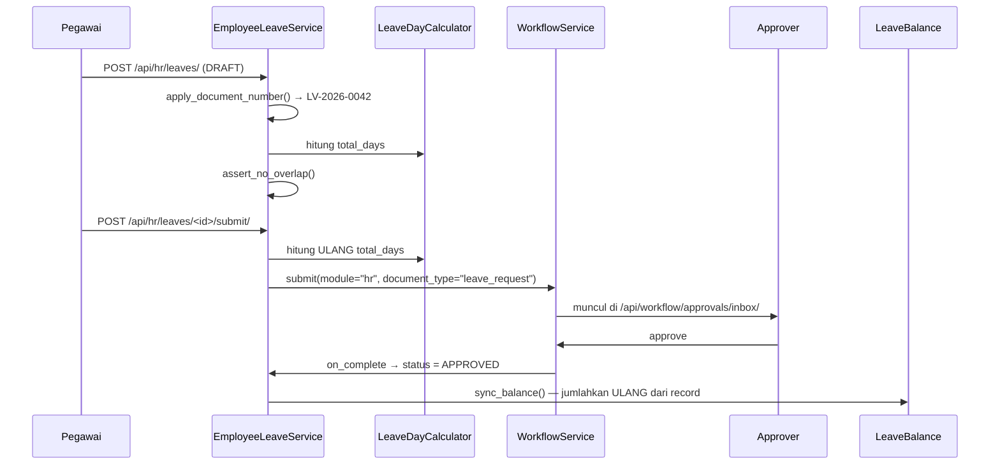
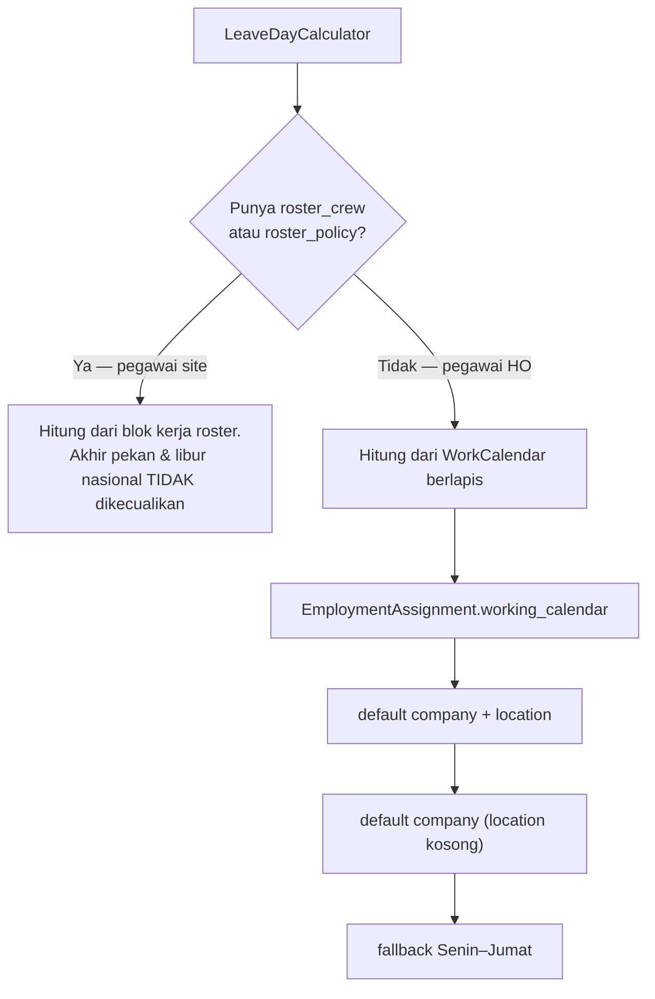

# Alur Cuti

`EmployeeLeave` melayani **dua hal sekaligus**, dan itu disengaja.

| Jalur | Siapa | Status awal | Lewat approval? |
|---|---|---|---|
| **Pencatatan** | HR mengetik cuti yang sudah terjadi, atau Travel Request menerbitkannya | `RECORDED` | Tidak |
| **Pengajuan** | Pegawai membuat sendiri | `DRAFT` → `SUBMITTED` | Ya |

Memisahkannya jadi dua tabel akan membuat kartu cuti seseorang harus dijumlahkan dari dua sumber, dan pegawai yang pindah HO↔site jadi kasus khusus permanen.

---

## Alur pengajuan



Endpoint:

```
POST /api/hr/leaves/<id>/submit/
POST /api/hr/leaves/<id>/withdraw/
POST /api/hr/leaves/<id>/approve/
POST /api/hr/leaves/<id>/reject/
POST /api/hr/leaves/<id>/return/
```

---

## Perhitungan hari — satu form, dua cara hitung

**Form cuti sengaja TIDAK dipisah antara pegawai HO dan pegawai site.** Yang berbeda bukan jenis cutinya, melainkan cara menghitung harinya — dan itu properti *pola kerja pegawai* (`EmploymentAssignment`), bukan properti record cuti.

`LeaveDayCalculator` (`apps/hr/api/leave/calculator.py`) memilih cabangnya:



Pegawai site tetap bekerja saat blok kerjanya jatuh di hari Minggu atau tanggal merah — **rosternya sendiri yang jadi kalender**.

Contoh nyata di tenant demo, cuti 14–18 Agustus 2026 (5 hari kalender):

| | Hari terpotong |
|---|---|
| Pegawai HO | **2** (Sabtu, Minggu, dan 17 Agustus keluar) |
| Pegawai site | **5** |

!!! danger "`total_days = 0` itu sah, bukan error"
    Pegawai roster yang mengambil cuti saat blok off-nya memotong **nol** hari. Itu jawaban desain untuk "boleh ambil cuti tahunan saat hari off?": boleh, dan tidak memakan saldo, jadi tidak perlu aturan khusus apa pun.

    Validasi hanya menolak nilai **negatif**. Jangan kembalikan jadi `> 0`.

`total_days` boleh diisi manual, dan **isian manual selalu menang** — ada kasus yang tidak bisa disimpulkan dari kalender.

`total_days` dihitung **ulang tepat sebelum submit**, bukan dipercaya apa adanya: syarat step workflow bergantung padanya, dan angka basi membangun rantai persetujuan yang salah secara diam-diam.

---

## Saldo — `LeaveBalance`

`used` **disimpan, bukan dihitung on-the-fly**, supaya bisa disortir dan difilter di tabel.

**Dijumlahkan ulang dari record `EmployeeLeave` setiap kali cuti dibuat/diubah/dihapus** — bukan ditambah/dikurangi inkremental. Penjumlahan ulang tidak bisa hanyut. Saat update, kombinasi (pegawai, tipe, tahun) **sebelum** perubahan ikut disinkronkan.

| Konstanta | Isi | Untuk |
|---|---|---|
| `LEAVE_DEDUCTING_STATUSES` | `RECORDED` + `APPROVED` | menghitung `used` |
| `LEAVE_BLOCKING_STATUSES` | `RECORDED` + `APPROVED` + **`SUBMITTED`** | mendeteksi tumpang tindih |

`SUBMITTED` ikut di daftar kedua tapi **tidak** di yang pertama: cuti yang belum disetujui tidak boleh sudah mengurangi jatah orang (kalau ditolak, tidak ada yang perlu dikembalikan) — tapi dua pengajuan di tanggal yang sama tetap salah.

`EmployeeLeaveService.set_status` **selalu** memanggil `sync_balance`. Perpindahan status tanpa perhitungan ulang meninggalkan kartu cuti yang salah tanpa ada yang tahu.

**Saldo boleh minus.** Belum ada penjagaan over-draw; kalau nanti diperlukan, tempatnya di `EmployeeLeaveService`, bukan di model.

---

## Jatah cuti — `LeavePolicy`

Sebelum ini tidak ada aturan jatah sama sekali: `LeaveType` isinya cuma kode dan nama, dan `LeaveBalance` diketik tangan per pegawai per tahun. Angka 12 di kartu seseorang tidak menunjuk aturan mana pun.

**Yang disimpan aturannya, bukan angkanya.** Angka per pegawai tetap di `LeaveBalance`; kebijakan yang menerbitkannya.

```bash
python manage.py tenant_command generate_leave_balances --year=2027
# --dry-run dan --verbose-rows tersedia
```

Aturan pentingnya:

- **`adjustment` tidak pernah disentuh generator.** Itu yang membuat perhitungan ulang aman dijalankan kapan saja — koreksi manual ("tambahan 3 hari karena lembur Lebaran") tetap utuh. Yang ditulis ulang cuma `entitlement`; `used` milik `LeaveBalanceService`.
- **Pencocokan berjenjang lewat skor `specificity`**, bukan urutan baris. Aturan bercompany menang atas yang global. **Kosong berarti "berlaku untuk semua"**, bukan "tidak berlaku" — itu jebakan paling gampang di layar settingnya.
- **Nol selalu punya alasan yang bisa dibaca** (`Entitlement.reason`): *"Baru berhak 2027-08-09 — 12 bulan sejak masuk 2026-08-09"*, *"Join Date pegawai belum diisi"*. Saldo nol tanpa penjelasan adalah keluhan yang paling sering sampai ke HR.
- **Jenis cuti tanpa policy tidak menghasilkan baris saldo sama sekali.** Cutinya tetap bisa dicatat, cuma tidak ada angka yang dipotong — perilaku yang benar untuk cuti tak berkuota.

Seed bawaan: `tenant_command seed_leave_policy` — **hanya** `ANNUAL-STD` (12 hari setelah 12 bulan, prorata periode pertama, sesuai UU Ketenagakerjaan).

!!! warning "Jangan seed jatah untuk jenis cuti yang tidak punya dasar"
    `SICK-STD` sempat diseed 30 hari dan angka itu **karangan** — undang-undang tidak mengatur kuota hari sakit per tahun, melainkan skala upah selama sakit berkepanjangan (100/75/50/25%). Angka karangan di master lebih berbahaya daripada tidak ada angka: orang menganggapnya sudah divalidasi. Sudah ditarik lewat `OBSOLETE_CODES`.

    Cuti besar, melahirkan, dan haid juga belum punya policy — sengaja, sampai aturan perusahaannya jelas.

**Saldo terbit sendiri saat Join Date diisi** (`EmploymentService.sync_leave_balances`). Pemicunya Join Date / Employee Group / Employment Type. Hanya tahun berjalan dan tahun depan yang disentuh — saldo yang sudah terpakai dan ditutup tidak boleh berubah gara-gara koreksi data induk hari ini. Kegagalannya `logger.exception` dan **tidak** menggagalkan penyimpanan pegawai.

---

## Nomor dokumen

`EmployeeLeave.document_number` dari deret `hr/leave` (prefix `LV`), diberikan saat record **dibuat** untuk **semua** jalur (diajukan pegawai, dicatat HR, terbitan Travel Request).

Tidak pernah dihitung ulang saat update — nomor yang sudah dirujuk di surat harus tetap menunjuk dokumen yang sama.

Deret yang belum diseed menghasilkan nomor kosong dan **recordnya tetap tersimpan**: cuti tidak boleh gagal dicatat gara-gara master penomoran belum diisi.

Nomornya ikut ke `WorkflowInstance.document_number`, jadi bisa dicari di layar monitoring.

---

## Penjagaan lain

**Cuti `SUBMITTED`/`APPROVED` tidak bisa disunting** (`assert_editable`). Perpindahan status oleh engine sendiri dikecualikan — tanpa itu `on_complete` yang menulis `APPROVED` ditolak penjagaannya dan alurnya berhenti tepat di langkah terakhir.

Tumpang tindih dicek **lintas jenis cuti** — orang tidak bisa sedang cuti tahunan sekaligus sakit di hari yang sama. Pesannya menyebut nomor dokumen yang bentrok; "sudah ada cuti lain" tanpa menyebut yang mana tidak bisa ditindaklanjuti. Detailnya di [Overview](Overview.md#cuti-tumpang-tindih-dua-pintu-satu-penjagaan).

---

## Yang belum ada

- **Eksekusi carry-over.** Kolomnya sudah ada di `LeavePolicy`, yang memindahkan sisa antar tahun belum.
- **Pembatasan pemakaian per bulan berjalan** untuk akrual bulanan.
- **`schema.actions` belum digenerate FE** untuk modul Leave — tombolnya sudah ditulis di schema dan endpointnya jalan, tinggal `pnpm meinova generate hr/leave`.
