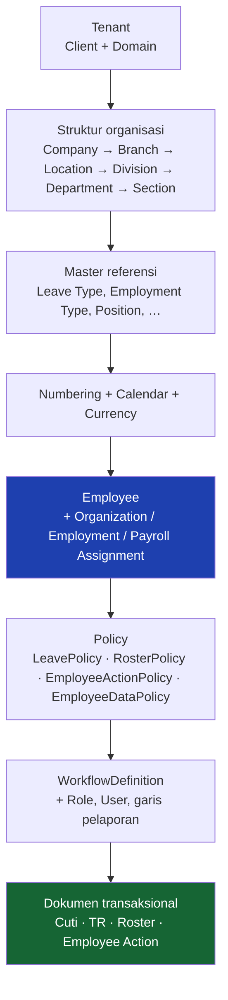
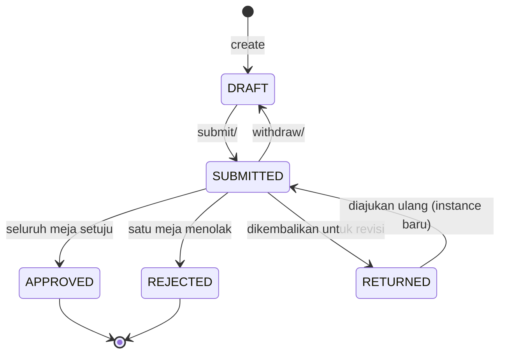
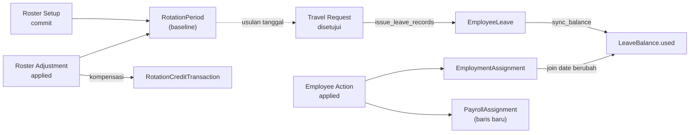

# Alur Bisnis — Overview

Halaman ini menjelaskan **bagaimana pekerjaan bergerak** di sistem ini: dari master data yang harus ada lebih dulu, sampai dokumen yang diajukan, disetujui, dan menghasilkan efek samping.

Kalau kamu mencari *bagaimana kodenya disusun*, itu di [Siklus Request](../02-Framework/Request-Lifecycle.md). Halaman ini soal *apa yang terjadi di dunia nyata*.

---

## Tiga jenis data, tiga perlakuan berbeda

Membedakan ketiganya lebih dulu menghemat banyak salah tempat.

| Jenis | Contoh | Ciri | Perlakuan |
|---|---|---|---|
| **Master referensi** | Leave Type, Gender, Employment Type, Bank | `code` + `name`, jarang berubah | CRUD biasa, diseed, tidak berapproval |
| **Master struktural** | Company, Location, Employee, Roster Policy | mengikat data lain lewat FK ber-`PROTECT` | CRUD, dijaga cakupan data |
| **Dokumen transaksional** | Cuti, Travel Request, Employee Action, Roster Setup | punya `status`, punya nomor dokumen, punya jejak persetujuan | melewati engine workflow |

**Aturan yang menentukan:** kalau sesuatu perlu dijawab dengan "siapa yang menyetujui ini dan kapan", ia dokumen transaksional — bukan master, walaupun bentuk tabelnya mirip.

---

## Urutan ketergantungan data

Modul HR tidak bisa dipakai sebelum lapis di bawahnya terisi. Ini urutan yang harus diikuti saat menyiapkan tenant baru:

Perintah seed-nya berurutan di [Onboarding](../08-development/Onboarding.md#4-seed-berurutan).

!!! warning "Hanya Company yang wajib"
    Seluruh level organisasi di bawahnya (Branch, Location, Division, Department, Section) **nullable dan boleh dilompati** — baik di master maupun di `OrganizationAssignment`. Itu disengaja: satu struktur yang sama melayani UMKM satu kantor sampai tambang multi-lokasi.

    Konsekuensinya kode **hanya unik per company**, bukan global. Jangan pernah mencari Branch/Location/Department/Position hanya dari `code` — wajib disaring lewat induknya, dan penyaringannya memakai pola "cocok dengan induk **ATAU** induknya null".

---

## Struktur organisasi: tiga lapis penjagaan

Sengaja bertumpuk, karena dua yang pertama bisa dilewati.

| Lapis | Mekanisme | Bisa dilewati? |
|---|---|---|
| 1. Form | `lookup_params` menyaring isi dropdown | Ya — pemanggil API langsung |
| 2. Import | resolver berantai (`ORGANIZATION_CHAIN`) | Ya — bukan jalur API |
| 3. Model | `OrganizationAssignment.clean()` | **Tidak** |

Lapis ketiga yang benar-benar menjaga. Dua lapis pertama ada supaya orang tidak perlu ditolak setelah mengisi seluruh form.

---

## Employee: satu orang, empat penempatan

`Employee` sendiri hanya identitas. Yang menentukan perilakunya ada di empat model penempatan terpisah — dan memisahkannya begini yang membuat perubahan bisa punya tanggal berlaku:

| Model | Isi | Relasi |
|---|---|---|
| `OrganizationAssignment` | company, branch, location, division, department, section, position | OneToOne |
| `EmploymentAssignment` | join date, jenis & status kepegawaian, kontrak, roster policy, point of hire, kalender kerja | OneToOne |
| `PayrollAssignment` | payroll group, gaji, tax status (PTKP), BPJS | banyak baris, effective-dated (`is_current`) |
| `EmployeeBankAccount`, pendidikan, keluarga, dokumen, medis | sub-data | banyak baris |

**Yang menentukan pola kerja seseorang ada di `EmploymentAssignment`**, dan itu yang membelah hampir semua perhitungan HR jadi dua cabang:

| | Pegawai kantor (HO) | Pegawai site |
|---|---|---|
| Penanda | tanpa `roster_crew` / `roster_policy` | punya salah satunya |
| Kalender | `WorkCalendar` (Senin–Jumat, libur nasional keluar) | blok roster (`RotationPeriod`) |
| Hitungan hari cuti | hari kerja kalender | hari blok kerja |
| Travel Request | tidak punya kepulangan untuk diajukan | jalur utamanya |

Contoh nyata cuti 14–18 Agustus 2026 (5 hari kalender): pegawai HO memotong **2 hari** (Sabtu, Minggu, dan 17 Agustus libur nasional keluar), pegawai site memotong **5 hari**.

!!! danger "Kalender ditentukan location, bukan jenis pegawai"
    `resolve_calendar` memenangkan kalender yang cocok company **+** location sebelum kalender company saja. Pegawai kantor yang `location`-nya diisi site akan mewarisi kalender **operasional** site — tujuh hari kerja seminggu — sehingga cuti seminggunya memotong 7 hari, bukan 5.

    Perbaikannya: isi `EmploymentAssignment.working_calendar` eksplisit. Itu lapisan pertama dan selalu menang.

---

## Bentuk umum sebuah dokumen transaksional

Keempat modul dokumen di sistem ini mengikuti bentuk yang sama. Mengenalinya sekali cukup untuk membaca keempatnya.

| Tahap | Yang terjadi |
|---|---|
| **Create** | Nomor dokumen dialokasikan dari `NumberingSequence`. Nomor tidak pernah dihitung ulang saat update — yang tercetak harus tetap menunjuk dokumen yang sama. |
| **Submit** | Validasi sungguhan jalan di sini (`assert_submittable`). Seluruh baris keputusan dibuat **di depan**, lengkap dengan nama approver-nya. |
| **Berjalan** | Kotak masuk generik (`/api/workflow/approvals/inbox/`) menampilkan meja yang sedang jadi giliran approver itu. |
| **Selesai** | Callback `on_complete` milik modulnya memindahkan kolom status dan menjalankan efek sampingnya. |

**`RETURNED` adalah keadaan keempat, bukan varian ditolak.** Tanpa itu, satu tanggal yang salah ketik hanya punya dua pilihan: ditolak (dan pengajunya harus membuat dokumen baru) atau disetujui dengan isi yang salah.

Detail engine-nya: [Alur Persetujuan Dokumen](Document-Approval.md).

---

## Urutan pengisiannya

Sebelum satu dokumen pun bisa diajukan, masternya harus berdiri dalam
urutan tertentu — dan tiap langkah yang tertukar gagal tanpa pesan.
[Urutan Entry: dari Employee sampai Cuti](Employee-Onboarding-Flow.md)
menelusurinya langkah demi langkah untuk kantor pusat **dan** site,
lengkap dengan akun peragaan tiap meja.

Satu langkah di dalamnya punya dokumennya sendiri karena angkanya paling
sering dipertanyakan: [Menentukan Saldo Cuti](Leave-Balance-Setup.md) —
dari empat kolom di kartu pegawai sampai angka di kartu cuti, beserta
alasan setiap saldo yang nol.

Tenant yang pindah dari sistem lain punya persoalannya sendiri, dan
angkanya gampang jadi dobel: [Go-Live Cuti](Leave-Go-Live.md) —
apa yang diimport, apa yang dihitung ulang, dan contoh file CSV-nya.

---

## Empat alur nyata

| Alur | Dokumen | Ciri khasnya |
|---|---|---|
| [Cuti](Leave-Request.md) | `EmployeeLeave` | **Dua jalur di satu tabel** — pencatatan (langsung `RECORDED`) dan pengajuan (lewat approval) |
| [Travel Request](Travel-Request.md) | `TravelRequest` | Enam meja di alur site; menerbitkan catatan cuti saat disetujui |
| [Roster](Roster-Management.md) | `RosterSetupRequest` → `RotationPeriod` | Setup massal satu dokumen; jadwal berversi, bukan disunting di tempat |
| [Employee Action](Employee-Action.md) | `EmployeeAction` | Dua belas jenis perubahan kepegawaian dalam satu form dinamis |

---

## Efek samping yang saling menyentuh

Ini yang paling sering luput saat menambah fitur: satu dokumen jarang berdiri sendiri.

Aturan yang menjaga semuanya tetap konsisten:

1. **Satu sumber angka.** `LeaveBalance.used` **selalu** dijumlahkan ulang dari record `EmployeeLeave` oleh `EmployeeLeaveService`, tidak pernah ditambah/dikurangi inkremental — penjumlahan ulang tidak bisa hanyut. Roster tidak menghitung cutinya sendiri; ia hanya menaut.
2. **Efek samping dijalankan saat disetujui, bukan saat diketik.** Cuti yang belum disetujui tidak boleh sudah mengurangi saldo; kalau ditolak, tidak ada yang perlu dibatalkan.
3. **Gagal menerapkan tidak membatalkan persetujuan.** Alurnya sudah selesai dan keputusan approver-nya sah. Kegagalannya ditempel ke `apply_error` pada dokumennya dan diulang lewat `POST .../apply/`.
4. **Validasi yang sungguhan jalan saat Submit, bukan saat penerbitan.** Kalau menunggu sampai approver terakhir menekan tombol, kegagalannya membatalkan persetujuan yang sah dan muncul di layar orang yang tidak bisa memperbaikinya.

---

## Cuti tumpang tindih: dua pintu, satu penjagaan

Contoh konkret dari prinsip di atas, dan pola yang layak ditiru.

Pegawai site bisa mendapat cuti lewat **dua jalur**: baris `TravelRequestPurpose` yang `deducts_leave`, dan modul Cuti langsung. Tanpa penjagaan, tujuh hari yang sama terpotong dua kali dan tidak ada yang berbunyi sampai orangnya membandingkan kartu cuti dengan dokumen TR.

Penjagaannya berlapis, dan **lapisannya sengaja berbeda perilaku**:

| Lapis | Kapan | Perilaku |
|---|---|---|
| `EmployeeLeaveService.assert_no_overlap` | create & update | **Menolak**, dengan menyebut nomor dokumen yang bentrok |
| `TravelRequestService.assert_no_leave_conflict` | **Submit** | **Menolak**, sebelum siapa pun menyetujui |
| `issue_leave_records` | saat disetujui | **Tidak melempar** — bentrokan sejenis ditaut ke catatan yang ada, yang beda jenis dilewati + `logger.warning` |

Yang dihitung bentrok: `RECORDED` + `APPROVED` + **`SUBMITTED`**. Yang terakhir ikut walau belum memotong saldo — dua pengajuan di tanggal yang sama tetap salah. `DRAFT`/`REJECTED`/`CANCELLED` **tidak** menghalangi.

Dicek **lintas jenis cuti**: orang tidak bisa sedang cuti tahunan sekaligus sakit di hari yang sama.

---

## Pola "alarm, bukan gerbang"

Ada kelas masalah yang **tidak boleh** memblokir, dan sistem ini konsisten memperlakukannya begitu:

| Kasus | Kenapa tidak diblokir |
|---|---|
| Nama tidak cocok saat sync absensi | Absensi tidak boleh hilang gara-gara ejaan nama. Record tetap ditulis + `name_warning` |
| Celah/tumpang tindih antar periode roster | Menggeser satu blok selalu melewati keadaan tumpang tindih sebelum blok berikutnya digeser — menolak membuat jadwal bersambung mustahil disunting |
| Pasangan back-to-back belum ada | Pegawai yang belum punya pasangan tetap harus bisa dibuatkan jadwal |
| Widget dashboard yang datanya kosong | Kosong adalah keadaan yang sah |

Kebalikannya juga berlaku: hal yang **harus** memblokir tidak boleh diturunkan jadi peringatan — approver yang tidak ketemu menggagalkan seluruh pengajuan, karena dokumen yang berjalan dengan satu kotak kosong akan mengendap tanpa ada yang merasa ditagih.
