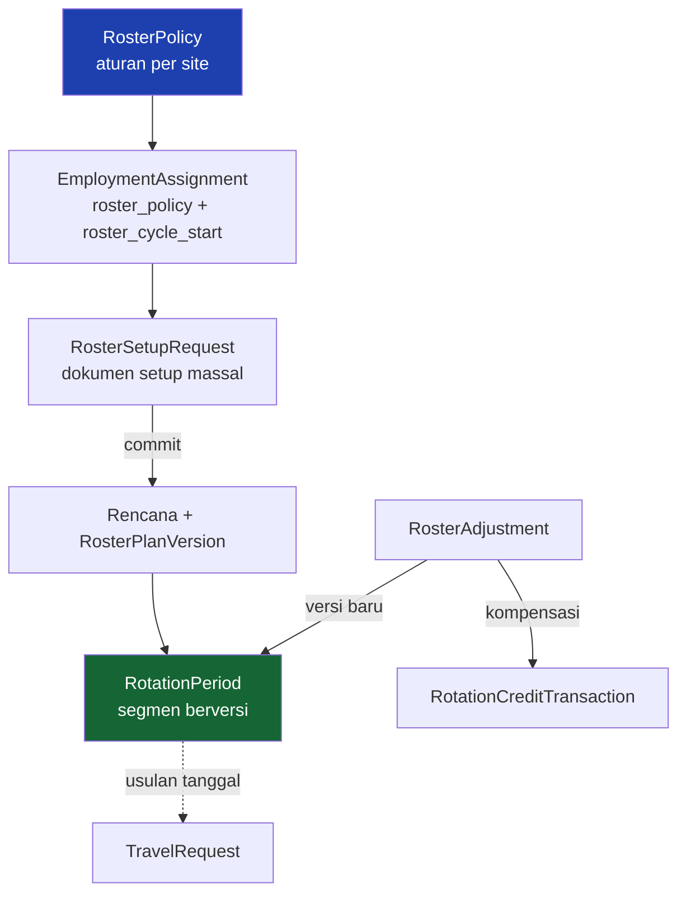

# Alur Manajemen Roster Site

Pegawai tambang bekerja dalam siklus: sekian minggu di site, sekian minggu field break, dengan hari perjalanan di antaranya. Modul ini yang menerbitkan dan memelihara jadwalnya.

!!! info "Ada dua jalur, dan keduanya masih hidup"
    | Jalur | Jangkar | Kapan dipakai |
    |---|---|---|
    | **Lama** — `SiteRotation.generate_periods` | `RosterCrew.cycle_start_date` | dokumen yang sudah terlanjur dibuat begitu |
    | **Baru** — Roster Setup | `EmploymentAssignment.roster_cycle_start` | jalur utama sekarang |

    Bedanya bukan kosmetik: yang lama **membangun ulang seluruh dokumen** tiap kali dipanggil, yang baru **tidak pernah menyentuh satu baris pun yang sudah lewat**.

    Di tabel Roster Schedule keduanya berdampingan — itu sebabnya ada kolom **Roster Policy**, supaya rencana yang lahir dari dokumen Setup tidak terbaca seperti data yang belum diisi.

---

## Peta konsep



---

## `RosterPolicy` yang menentukan, bukan `RosterCrew`

Urutan wewenangnya **dibalik** dari desain lama:

- `RosterPolicy` membawa pola siklus (`cycle_work_days` / `cycle_off_days`, keduanya **nullable** — policy tanpa pola berarti aturan site saja)
- `EmploymentAssignment.roster_policy` + `roster_cycle_start` yang menempelkannya ke orang
- Crew dan Work Schedule **mengikuti**

Constraint lama `uniq_active_rosterpolicy_target (company, location)` **dicabut** — satu site harus bisa punya 6:2 dan 8:2 berdampingan. Penggantinya `uniq_active_rosterpolicy_default` yang dikondisikan ke `is_default=True`.

Pemetaan pegawai lama: `tenant_command migrate_roster_assignments` (`--dry-run` tersedia), yang **melewati** yang ambigu alih-alih menebak.

### Jangkar per pegawai, bukan per crew

Dua pegawai dengan policy yang sama boleh punya Current Cycle Start berbeda — di site yang gelombangnya bergantian, itu justru keadaan normal.

`roster_start_basis` (`work_start` / `site_arrival` / `travel_departure`) yang menentukan artinya. **Tanpa disebut, satu angka "1 Agustus" bisa berarti tiga jadwal berbeda.**

---

## Empat jenis segmen, bukan dua

`RosterSegmentType` = `WORK` / `TRAVEL_OUT` / `FIELD_BREAK` / `TRAVEL_IN`.

Satu putaran: **`WORK → keluar → FIELD_BREAK → kembali`**.

`RotationPeriod.period_type` jadi kolom **turunan** untuk pemanggil lama.

Aturan yang menjaganya:

- Segmen travel adalah **pita kalender rencana, bukan booking**. Tidak boleh ada kolom `ticket_number` / `transport_*` / `accommodation_*` / `origin` / `destination` di `RotationPeriod` — tanggal penerbangan hanya di `TravelArrangement`.
- Nol hari travel = **nol baris**, bukan cabang `if` di sepanjang generator. Itu satu-satunya perlakuan khusus untuk pegawai lokal.
- `travel_out_counts_as_roster_day` / `travel_in_counts_as_roster_day` (dua flag terpisah, dua-duanya default `False`) hanya memengaruhi **rekap** `on_site_days` — **tidak pernah** memendekkan blok kerja. Pegawai 42/14 yang dua hari di kapal tetap menjalani 42 hari di site.

!!! danger "`RosterPolicyResolver.travel_days_for()` wajib dioper policy-nya"
    Kalau pemanggil sudah memegang policy-nya, oper `policy=`. Tanpa itu ia me-resolve ulang dari penempatan pegawai dan bisa mendarat di policy lain — atau tidak menemukan satu pun, sehingga hari perjalanan jatuh ke nol untuk rencana yang policy-nya justru menetapkannya.

    **Gagalnya diam:** jadwalnya tetap terbit, cuma tanpa satu pun segmen travel. Ketahuan lewat test, bukan lewat layar.

---

## `RosterCalculationService` — seluruh rumus, tanpa satu pun query

`apps/hr/api/roster/calculation.py`. Itu yang membuat **preview, penulisan, dan perhitungan ulang memakai jalan yang sama**, dan bisa diuji tanpa menyiapkan tenant.

Batasnya **tanggal** (`horizon_end`), bukan jumlah siklus. Dipagari `MAX_HORIZON_MONTHS = 24` dan `MAX_SEGMENTS_PER_PLAN = 400` **di dalam kalkulator**, supaya query param yang salah ketik tidak bisa memintanya membuat roster tak hingga.

Dua detail yang gampang salah:

- **Nomor putaran naik saat blok kerja dibuka**, bukan saat daftar blok habis. Bedanya baru kelihatan saat jadwal disambung dari tengah siklus.
- `summarize()` mengembalikan tanggal sebagai **string ISO**, karena rekapnya dibekukan ke `RosterPlanVersion.summary` yang sebuah JSONField.

### Matematika siklus

`cycle_travel_days` = **TOTAL hari perjalanan pulang-pergi**, bukan sekali jalan. `2` berarti sehari keluar + sehari kembali, jadi:

```
cycle_length = work + off + travel        (bukan work + off + 2 × travel)
```

Angka ganjil dipecah **tidak rata, kelebihannya ke sisi keluar** (3 → 2 keluar, 1 kembali), karena perjalanan Sorong/Ternate → site sudah dihitung On Site sehingga sisi kembali lebih pendek.

Travel dihitung **sekali per putaran**, sudah diverifikasi test (`test_cycle_advance_counts_travel_once`).

!!! bug "Bug yang sudah diperbaiki, layak diingat"
    `SiteRotationService.apply_cycle_pattern` dulu memakai `work + off + travel * 2` saat menurunkan `start_date` dokumen baru dari jangkar crew. Tanggal mulai yang terisi otomatis mendarat di tanggal yang **bukan** awal siklus crew mana pun, meleset `travel` hari tiap putaran, dan melesetnya **menumpuk sepanjang tahun**. Hanya kena dokumen baru yang `start_date`-nya dikosongkan; yang diketik manual selalu aman.

---

## Versi, bukan sunting di tempat

`RotationPeriod` punya `version_from` / `version_to`. Baris yang berubah **ditutup**, lalu diganti baris baru milik versi berikutnya.

Baris yang **berakhir sebelum tanggal berlaku tidak disentuh sama sekali** — dimiliki bersama semua versi. Itu yang membuat `TravelRequest.rotation_period` yang menunjuknya tetap sah setelah berapa pun penyesuaian.

**Nomor urut tidak pernah dipakai ulang.** Constraint berlaku untuk seluruh baris rencana termasuk yang ditutup, jadi baris pengganti mengambil nomor berikutnya dari yang tertinggi. Konsekuensinya nomor urut **berlubang** di versi berjalan — dan itu benar: urutan tampilan ditentukan tanggal, nomor urut cuma identitas baris.

---

## Setup massal — `RosterSetupRequest`

Satu dokumen, satu pengajuan, satu item kotak masuk. Datanya tetap per pegawai (`RosterSetupLine`).

```
Company → Site → (Department) → Section → Employees
```

Endpoint:

```
GET  /api/hr/roster-setups/<id>/candidates/
POST /api/hr/roster-setups/<id>/add-employees/
GET  /api/hr/roster-setups/<id>/preview/
POST /api/hr/roster-setups/<id>/submit/
POST /api/hr/roster-setups/<id>/withdraw/
POST /api/hr/roster-setups/<id>/commit/
```

Dua aturan yang lahir dari bentuk engine, bukan dari selera:

1. **Satu batch = satu Site.** Kalau bercampur, cakupan approver tidak bisa ditentukan.
2. **Satu batch = satu atasan**, untuk step yang memang berangkat dari satu pegawai (`manager` / `department_head` / `position`).

!!! note "Aturan (2) diubah 1 Sep 2026"
    Sebelumnya berbunyi *"alurnya hanya boleh memakai step Role/User"* dan
    setiap step per-pegawai ditolak mentah-mentah. Benar sebagai pengamatan,
    salah sebagai aturan — yang dibuangnya justru meja yang paling diminta:
    persetujuan **atasan langsung** pegawai yang dijadwalkan.

    Sekarang step per-pegawai boleh dipakai **kalau seluruh baris dokumen
    menghasilkan approver yang sama**. Diperiksa
    `RosterSetupService.batch_approver_findings()` lewat `resolve_approvers()`
    yang sama dengan yang dipakai engine, dan dilaporkan **di preview**
    (`workflow_validations`, kode `mixed_approver`) — bukan cuma saat Submit.
    Pesannya menyebut siapa membawahi siapa, supaya dokumennya dipecah per
    atasan.

Alur bawaannya karena itu **tiga meja**: Admin Department/Section membuat &
mengajukan → **HR Admin Site** → **Atasan Langsung** → **HR Manager Site** →
commit otomatis.

Sampel organisasi untuk cakupan role diambil dari nomor pegawai terkecil —
deterministik, supaya dua submit yang sama menghasilkan approver yang sama.
Untuk step per-pegawai, aturan (2) yang membuatnya **terbukti mewakili** batch,
bukan sekadar deterministik.

Hasil preview memisahkan **`can_commit`** ("isinya benar?") dari
**`can_submit`** ("bisa dijalankan lewat alurnya?"). Seed peragaan commit
langsung tanpa approval dan memakai yang pertama.

### Commit per baris

Di dalam savepoint sendiri: **satu baris gagal tidak membatalkan dua puluh sembilan lainnya.** Yang gagal ditandai `FAILED` + alasannya, dan `POST .../commit/` bisa diulang — ia melewati baris yang sudah `COMMITTED`.

Dibatasi `MAX_SETUP_LINES = 200`; di atas itu batch dipecah per Section.

!!! danger "`refresh_from_db()` tidak membersihkan cache prefetch"
    `line_count` dan `committed_count` dibaca dari `obj.lines.all()` yang di-prefetch `get_object()` **sebelum** aksinya jalan. `add-employees` sempat membalas "2 pegawai ditambahkan" bersama `line_count: 0` — dan yang dilihat pengguna cuma angka nol, sehingga fiturnya terbaca gagal padahal barisnya tersimpan.

    Keempat action karena itu membaca ulang lewat `self.get_queryset().get(pk=...)`, bukan `refresh_from_db()`.

### Preview wajib, dan sama persis dengan yang disimpan

`RosterGenerationService.preview()` dipakai tiga layar: setup satuan, tiap baris dokumen bulk, dan review sebelum submit.

Temuan dipisah **blocking** vs **warning**. Menyamakannya berarti salah satu dari dua kesalahan: jadwal yang jelas salah tetap terbit, atau pegawai yang cuma belum punya pasangan back-to-back tidak bisa dibuatkan jadwal sama sekali.

**Pasangan back-to-back selalu warning.** Tidak boleh ada satu jalur pun yang memblokir karena kolom itu kosong, dan **tidak ada auto-sync** jadwal pasangan di fase ini.

### Penyaring berjenjang: Company → Site → Department → Section

Department dan Section **opsional dan berdiri sendiri** — Section boleh diisi tanpa Department, karena di banyak tenant ia memang menempel langsung ke Location. Yang dijaga `clean()` cuma konsistensinya.

Karena itu `depends_on` Section tetap `["company", "location"]`, **tanpa** `department`: menyebutnya membuat Section mati selama Department kosong.

!!! warning "Company ditanyakan lebih dulu, dan itu bukan kenyamanan"
    Master tenant demo memuat 12 company dengan 11 baris bernama persis "Default Location". Tanpa Company di kepala dokumen, dropdown Site menampilkan tiga belas baris yang sepuluh di antaranya tidak bisa dibedakan satu sama lain.

    Dan `RosterSetupRequest.clean()` menolak Site yang bukan milik company terpilih — penyaringan form bisa dilewati pemanggil API langsung, dan dokumen yang company-nya salah mengambil nomor dari deret perusahaan yang salah.

---

## Adjustment vs perubahan policy permanen

**Jangan dicampur.**

| | Adjustment | Perubahan policy permanen |
|---|---|---|
| Apa | versi baru pada rencana yang sama | era lama **ditutup** (`effective_to`), era baru berdiri sebagai rencana tersendiri |
| Contoh | kapal delay, blok diperpanjang | pola site berubah dari 6:2 jadi 8:2 |

Kalau semuanya jadi adjustment, "pola apa yang berlaku tahun lalu" tidak bisa dijawab lagi. Kalau semuanya jadi era baru, setiap kapal yang telat melahirkan dokumen rencana baru.

### Delapan jenis, dan yang membedakan **siapa penyebabnya**

Bukan berapa harinya — itu tidak bisa disimpulkan sistem dari selisih tanggal.

| Jenis | Efek |
|---|---|
| `deferred_leave` (mundur cuti disetujui KTT) | tambahan off = hari ÷ rasio |
| `late_return` (terlambat karena kesalahan pegawai) | tambahan on-site = hari × rasio |
| `loyalty` (mundur cuti tanpa persetujuan) | **tidak mengubah apa pun** — dokumen menyebutnya loyalitas |
| `no_impact` (pesawat cancel) | tidak mengubah apa pun |

Dua yang terakhir **tetap dicatat dan tetap punya penjelasan tertulis**. "Kenapa jadwal saya tidak berubah" harus ada jawabannya.

Aturan lain:

- **Blok berikutnya tidak dipendekkan** saat blok kerja diperpanjang. Yang tertahan di site seminggu tetap berhak atas field break penuh.
- **`extend_period` menggeser sisanya lebih dulu, baru memperpanjang bloknya.** Terbalik, dan geseran berikutnya berangkat dari keadaan yang sudah tumpang tindih.
- Idempotensinya dijaga **`applied_at` yang dibaca ulang di bawah `select_for_update`**, bukan `status` — dua permintaan bersamaan sama-sama membaca "approved" sebelum salah satunya sempat mengubahnya.
- **Kegagalan penerapan tidak membatalkan persetujuan**; ditempel ke `apply_error` dan diulang lewat `POST .../apply/`.
- `select_for_update(of=("self",))` wajib di `recalculate()`: `roster_policy` dan `current_version` nullable, jadi `select_related` merakit LEFT JOIN dan PostgreSQL menolak FOR UPDATE di sisi nullable-nya.

---

## Rotation Credit — terpisah total dari cuti tahunan

Bukan `LeaveType`, bukan `LeaveBalance`, **tidak punya tahun**.

Ledger **append-only** (`RotationCreditTransaction`): `update()` dan `soft_delete()` **melempar**. Koreksi lewat `ADJUSTMENT_PLUS`/`MINUS`, pembatalan lewat `REVERSAL` yang menunjuk barisnya (satu kali saja, dijaga constraint).

`days` **selalu positif** — arahnya dari `entry_type`. Dua cara menulis pengurangan yang sama membuat penjumlahannya bergantung mana yang kebetulan dipakai.

**Rasio dihitung dari pola pegawai sendiri** (56:14 = 4, 42:14 = 3), bukan didaftar per pola di master — perusahaan yang besok memakai 9:3 tidak perlu menunggu ada yang menambah baris.

!!! example "Sisa yang dibawa adalah hari kerja, bukan pecahan kredit"
    7 hari rasio 3 = **2 kredit, sisa 1**. Berikutnya 5 + carry 1 = 6 → **2 kredit, sisa 0**.

    "1 hari lembur site kamu belum genap jadi kredit" bisa dijelaskan; "0,33 kredit" tidak.

Saldo (`RotationCreditBalance`) **dihitung ulang dari ledger** tiap transaksi — alasan yang sama dengan `LeaveBalance.used`.

**Kompensasi off lewat ledger, bukan langsung.** Tambahan off dari adjustment masuk sebagai kredit lalu dipakai lewat dokumen `Use Rotation Credit`. Memberikannya langsung berarti dua sumber angka untuk hak yang sama.

---

## Rolling horizon

```bash
python manage.py tenant_command extend_roster_horizon --threshold-days=60 --months=6 --dry-run
```

Menyambung jadwal yang sisanya tinggal sedikit. **Tidak butuh approval** karena tidak ada keputusan yang dibatalkannya — ia menempel halaman baru di bawah kalender, bukan mencetak ulang kalendernya.

**Belum dijadwalkan otomatis** — masih dijalankan manual. Celery Beat sendiri sudah aktif (`DatabaseScheduler`), jadi menambahkannya cukup satu entri jadwal; tasknya wajib menyebar per schema seperti `hr.dispatch_employee_reminders`.

---

## Jalur lama: `SiteRotation.generate_periods`

Masih ada dan masih jalan. Yang perlu diketahui kalau menyentuhnya:

!!! danger "Generate = bangun ulang SELURUHNYA"
    Untuk dokumen yang sudah berjalan, **jangan pakai itu**. Satu penyesuaian lapangan saja sudah menandai hampir semua baris `is_manual_override`, dan sejak itu `generate_periods` ditolak.

Tiga operasi penggantinya bekerja **dari satu titik ke depan**:

| Endpoint | Isi | Untuk |
|---|---|---|
| `POST .../extend-periods/` | `{"cycles": 3}` atau `{"until": "2027-12-31"}` | menyambung di ujung |
| `POST .../regenerate-from/` | `{"from_sequence": 5}` | ganti pola berlaku ke depan saja |
| `POST .../shift-periods/` | `{"from_sequence": 3, "days": -2}` | geser jadwal; polanya tidak berubah |

`shift-periods` menyaring **kronologis** (`(start_date, sequence) >= anchor`), bukan `sequence >= N`, karena baris sisipan mendapat nomor urut terakhir yang bebas walau tanggalnya di tengah.

Setelah menggeser biasanya muncul satu peringatan gap di sambungan — **itu benar**: apakah orangnya libur lebih lama atau ditahan di transit adalah keputusan yang tidak boleh ditebak kode.

!!! bug "Endpoint yang pernah mati tanpa suara"
    Dekorator `@action(url_path="shift-periods")` menempel ke helper `_user` yang kebetulan ditulis persis di bawahnya, jadi rutenya memanggil helper itu dan `shift_periods` **tidak pernah terdaftar sama sekali**. Dekorator selalu mengikat ke **method berikutnya**.

**Celah & tumpang tindih antar periode = peringatan, bukan penolakan** (`build_schedule_warnings()`). Alasannya bentuk penyuntingannya: tabel inline menyimpan baris satu per satu, jadi menggeser satu blok selalu melewati keadaan tumpang tindih sebelum blok berikutnya ikut digeser.

---

## Seed & data uji

```bash
python manage.py tenant_command seed_roster_policy      # aturan + kota POH
python manage.py tenant_command seed_roster_demo        # dokumen setup + kredit + adjustment
python manage.py tenant_command report_rotation_cycles  # cetak tabel periode + rekap setahun
```

`seed_roster_demo` memilih site dari **jumlah pegawai**, bukan dari kode yang ditebak — master tenant lazim memuat sebelas baris "Default Location" kosong, dan menebak `GBE` meleset begitu klien menamainya lain.

`--employees` bawaannya **0 = semua**, dan itu bukan detail: menyetup sebagiannya saja meninggalkan daftar Roster Schedule yang separuh barisnya ber-Roster Crew dan separuhnya ber-Roster Policy.

---

## Yang belum ada

- `travel_day_mode = ACTUAL_ITINERARY` — kolomnya sudah tersimpan, rekonsiliasi rencana ↔ realisasi belum ada
- Layar pembanding back-to-back
- Eksekusi kedaluwarsa kredit (`credit_expiry_months` tersimpan tapi belum dibaca)
- Notifikasi H-7
