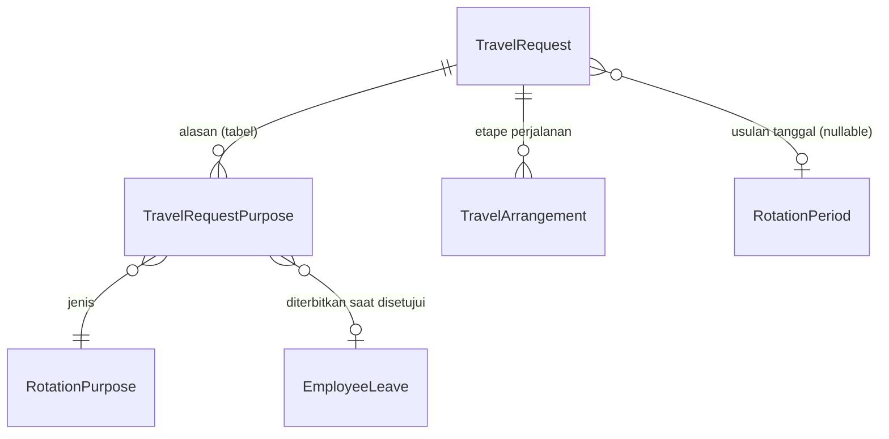
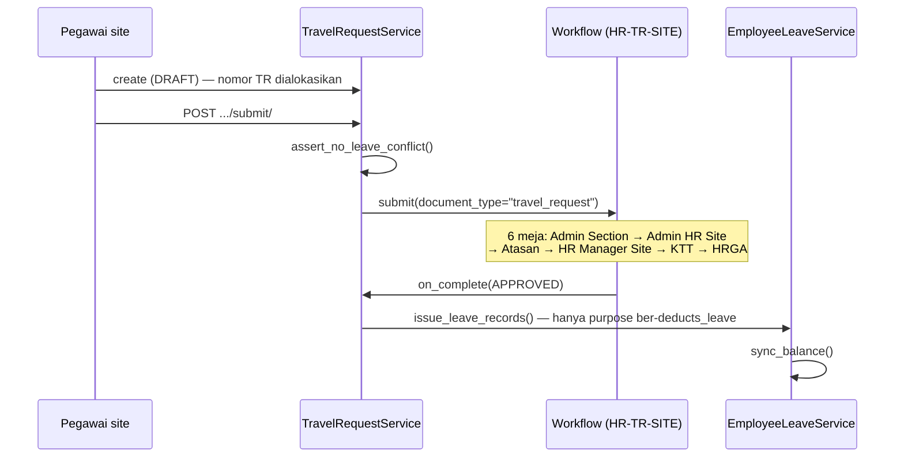

# Alur Travel Request

Dokumen pengajuan **satu kepulangan** pegawai site: berangkat dari site ke Point of Hire, menjalani field break atau cuti, lalu kembali.

---

## Jangan tertukar dengan Roster Schedule

Ini pernah tertukar dan menyeret desain approval ke tempat yang salah.

| | `SiteRotation` / Roster Schedule | `TravelRequest` |
|---|---|---|
| Apa | **jadwal kerja setahun** — kapan seseorang on dan off | **dokumen pengajuan satu kepulangan** |
| Sifat | alat perencanaan | yang diajukan, disetujui, dan dibelikan tiket |
| Jumlah per orang | satu jadwal | banyak TR setahun |
| Nomor | prefix `RST` | prefix `TR` |

**Roster bukan syarat TR.** `TravelRequest.rotation_period` **nullable** — pegawai site yang jadwalnya belum disusun tetap harus bisa mengajukan. Kalau diisi, tanggalnya disalin dari blok off itu (`apply_rotation_period`), dan blok jadwal cuma **usulan** tanggal, bukan pengunci.

---

## Bentuk dokumen



### `TravelRequestPurpose` — satu form, beberapa alasan

Satu pengajuan boleh memuat 7 hari Field Break lalu 7 hari Cuti Tahunan. Yang membedakan keduanya `RotationPurpose.deducts_leave`.

!!! info "`RotationPurpose` bukan `LeaveType`, dan itu disengaja"
    Master tersendiri, karena isinya dua jenis barang: **Field Break** adalah blok off rosternya sendiri dan tidak memotong saldo; **Cuti Tahunan** memotong. Menaruh Field Break di `LeaveType` membuatnya ikut muncul di dropdown modul Cuti dan bisa dibuatkan saldo.

    `deducts_leave` yang jadi penentu, dan `leave_type` **wajib** diisi begitu penanda itu menyala — "memotong saldo" tanpa menyebut saldo yang mana tidak bisa dieksekusi.

### `TravelArrangement` — satu baris = satu **etape**, bukan satu arah

Rutenya bersambung dan berbeda per orang karena Point of Hire-nya berbeda:

| POH | Etape |
|---|---|
| Jakarta | 13 Sep Jakarta→Sorong, 14 Sep Sorong→Gebe |
| Makassar | dua etape yang sama **di hari yang sama** |

Tiba bersamaan, berangkat berbeda. Tiap etape punya moda, nomor tiket, dan penginapan transitnya sendiri — memadatkannya jadi satu baris per arah (constraint lama `uniq_active_hr_travel_arrangement_direction`) membuat semuanya jatuh ke satu kolom teks yang tidak bisa dilaporkan.

Sekarang `sequence` per arah + constraint `(request, direction, sequence)`.

- Nomornya diisi `TravelArrangementService.apply_sequence` kalau dikosongkan, dan **wajib** `default=None` di serializer — `UniqueTogetherValidator` yang dibangkitkan DRF menuntut semua anggota constraint hadir di payload dan membalas "This field is required" sebelum service jalan.
- `build_from_period` membuat **satu** etape per arah, `origin`/`destination` dari Location dan Point of Hire pegawai. Rute transitnya tidak ditebak — itu bergantung jadwal penerbangan hari itu.
- `origin`/`destination` sengaja **teks bebas**: Sorong dan Ternate belum tentu ada di master City/Location, dan memaksa tiap bandara transit dibuatkan baris master lebih dulu akan menghentikan orang yang cuma mau mengetik nomor tiket.

!!! danger "Tanggal penerbangan hanya disimpan di TR"
    `TravelArrangement` menggantikan `RotationTravel` yang dulu menempel ke blok jadwal. Jadwal roster hanya **menghitung** perkiraan jendela travel (`RotationPeriod.travel_window_start/_end`) untuk ditampilkan.

    Menyimpannya di dua tempat berarti dua tanggal keberangkatan untuk penerbangan yang sama. **Jangan kembalikan baris travel ke roster.**

---

## Alur



Enam meja alur site dijelaskan di [Alur Persetujuan Dokumen](Document-Approval.md#alur-site-enam-meja).

### `assert_no_leave_conflict` dipanggil saat **Submit**

Bukan saat penerbitan di akhir alur. Kalau menunggu sampai HRGA menekan Approve, kegagalannya membatalkan persetujuan yang sah dan muncul di layar orang yang **tidak bisa memperbaikinya** — pengajunya yang harus mengubah tanggal, dan dia sudah tidak memegang dokumen itu.

### `issue_leave_records` dipanggil saat **disetujui**, bukan saat diketik

Cuti yang belum disetujui tidak boleh sudah mengurangi saldo; kalau ditolak, tidak ada yang perlu dibatalkan.

- Lewat `EmployeeLeaveService`, **bukan** `objects.create` — service itu yang menghitung hari kerja dan menjumlahkan ulang `LeaveBalance.used`.
- `employee_leave_id` yang sudah terisi **dilewati**, jadi approve ulang setelah withdraw tidak memotong dua kali.
- Di titik ini bentrokan **tidak melempar**: alurnya sudah disetujui, membatalkannya lebih merusak daripada bentrokannya sendiri. Yang sejenis ditaut ke catatan cuti yang ada, yang beda jenis dilewati + `logger.warning`.

---

## Penjagaan

**Dokumen `SUBMITTED`/`APPROVED` tidak bisa disunting** (`assert_editable`, dipanggil dari ketiga service: request, purpose, arrangement). Tarik dulu pengajuannya — dan itu tindakan yang terlihat.

---

## Point of Hire

`EmploymentAssignment.point_of_hire` (FK `City`) — **bukan** alamat domisili dan **bukan** `job_location` yang teks bebas. Kolom ini yang menentukan ke mana tiket pulang ditanggung tiap blok off.

Ia juga yang menentukan **berapa hari perjalanan**: dokumen klien menyebut POH Makassar 2 hari, Yogyakarta/Bandung/Luwuk Banggai 3 hari — walau satu crew dan satu pola roster. Pemetaannya di `RosterTravelDay`, berjenjang:

```
EmploymentAssignment.travel_days_override
  → tabel RosterTravelDay (site, POH)
    → RosterPolicy.default_travel_days
      → 0
```

!!! warning "Nambah kolom employment ke form Employee butuh empat sentuhan"
    Yang kelewat gagal tanpa suara:

    1. Field di `serializers/mixins/employment.py` (`source="employment.<kolom>"`)
    2. Namanya di `fields` milik `EmployeeSerializer` — **tidak terdaftar = PATCH balas 200 lalu nilainya dibuang**
    3. `EmploymentService.FIELDS`
    4. Schema di `schema/fields/employment.py`

    `roster_crew` dan `roster_start_override` pernah kena persis ini — ada di model dan di schema, tidak ada di dua sentuhan sisanya, jadi dropdown-nya tampil kosong walau datanya terisi.

    Catatan: response PATCH `/api/hr/employees/<id>/` memang mengembalikan nilai employment yang **basi** (dirakit dari instance sebelum `EmploymentService.save()`). GET berikutnya sudah benar, dan FE memang refetch setelah simpan.

---

## Terbuka: cuti tahunan di dalam blok off memotong 0 hari

`LeaveDayCalculator` menghitung hari **kerja yang hilang**, dan pegawai roster yang cuti saat blok off-nya tidak kehilangan hari kerja apa pun — perilaku yang memang sudah didesain begitu.

Konsekuensinya baris "Cuti Tahunan" di dalam blok off **tidak mengurangi saldo**, sehingga labelnya tidak berpengaruh apa-apa.

Belum diputuskan apakah TR harus memotong sebesar hari kalender barisnya sendiri.

---

## Yang belum ada

- **Cetak PDF.** Approval sudah jalan; yang tersisa merender PDF dari `approval.steps` sebagai kotak tanda tangan.
- **Notifikasi H-7.** `request_lead_days` / `notify_lead_days` / `urgent_purposes` sudah tersimpan di `RosterPolicy`, muncul di layar settingnya, tapi **belum ada satu baris kode pun yang membacanya**. Penjadwalnya bukan penghalang: Celery Beat sudah aktif dan `hr.dispatch_employee_reminders` sudah jalan tiap pagi — polanya tinggal ditiru.
