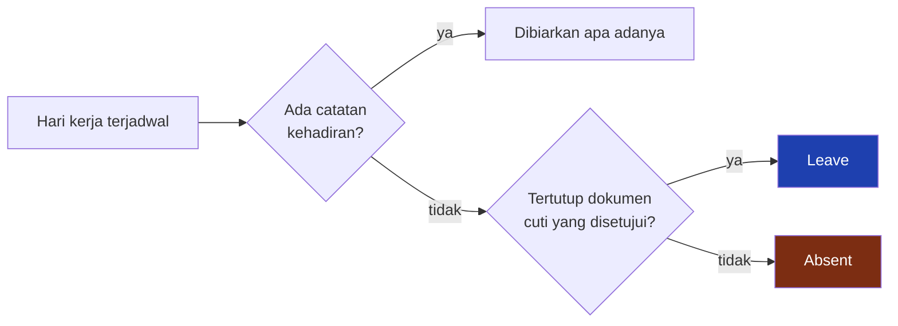
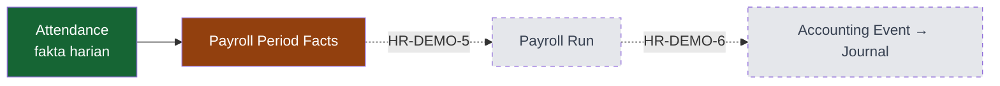

# Attendance — Penutupan, Koreksi & Batas Modul

Halaman ini menjelaskan bagaimana ketidakhadiran menjadi terlihat, bagaimana kesalahan diperbaiki, dan sampai mana tanggung jawab modul Attendance berakhir.

---

## Attendance Closing

Di sistem ini **ketidakhadiran bukan sebuah baris — ia adalah baris yang tidak ada.** Mesin sidik jari hanya mengirim tap, jadi orang yang tidak masuk tidak menghasilkan apa pun.

Konsekuensinya kalau dibiarkan: pembilang selalu sama dengan penyebut, dan "Tingkat Kehadiran" berbunyi 100 % selamanya. Dan bukan cuma demi dashboard — HR perlu **melihat** siapa yang tidak hadir di layar, bukan menyimpulkannya dari baris yang hilang. Daftar yang benar tidak bisa disusun dari ketiadaan.

Penutupan hari adalah proses yang mengubah ketiadaan itu menjadi catatan.

### Empat aturan yang membentuknya

| Aturan | Alasannya |
|---|---|
| **Hari ini tidak ditutup** | Orang yang belum menekan mesin jam sembilan pagi bukan mangkir — dia belum datang. Menutup hari berjalan berarti menerbitkan tuduhan yang terbantah sendiri beberapa jam kemudian. |
| **Cuti yang disetujui bukan mangkir** | Kalau tidak, setiap orang yang mengambil haknya terhitung bolos — dan justru unit yang paling tertib administrasinya yang angkanya paling jelek. |
| **Tidak pernah menimpa** | Hanya hari yang benar-benar kosong yang diisi. Baris hasil tap, import, atau koreksi tangan tidak disentuh sama sekali, jadi proses ini aman diulang berapa kali pun. |
| **Yang ditulis ditandai** | Baris hasil kesimpulan sistem terlihat berbeda dari baris yang berasal dari mesin. Tanpa penanda itu, "tidak hadir menurut hitungan sistem" tidak bisa dipisahkan dari "tidak hadir yang diketik atasannya". |

### Terbukti — sebelum dan sesudah

Satu pegawai kantor, satu hari kerja terjadwal, tanpa satu pun bukti kehadiran:

| | Sebelum penutupan | Sesudah penutupan |
|---|---|---|
| Baris presensi | **tidak ada** | ada |
| Status | — | **Absent** |
| Sumber | — | System |
| Jam masuk | — | kosong |
| Jam kerja | — | 0 |
| Persetujuan | — | Draft |
| Catatan | — | *"Ditutup otomatis: hari terjadwal tanpa catatan kehadiran."* |

Pada data peragaan, penutupan menerbitkan **35 baris Absent** dari 1.167 hari kerja terjadwal. Tidak satu pun ditulis langsung oleh proses pembuatan data — semuanya lahir dari mesin penutup hari.

### Yang tidak pernah ditutup

Penutupan hanya melihat **hari kerja terjadwal**. Karena itu tidak pernah terbit Absent untuk:

* hari field break dan hari perjalanan kru site;
* hari pemulihan antar pergantian shift;
* hari libur yang berlaku untuk pegawai berkalender;
* tanggal sebelum bergabung dan sesudah berhenti;
* pegawai yang Employee Group-nya mematikan Attendance.

---

## Manual Correction

Mesin kadang tidak merekam. Jalan keluarnya bukan menebak, melainkan koreksi yang **tercatat sebagai koreksi**.

Koreksi menyimpan tiga hal sekaligus: nilai barunya, penanda bahwa baris ini disentuh tangan, dan alasan tertulisnya. Yang ditetapkan orang hanya **jamnya** — status, keterlambatan, dan jam kerja bersih tetap diturunkan ulang dari Attendance Policy.

### Terbukti — satu hari tanpa tap pulang

| | Sebelum | Sesudah |
|---|---|---|
| Tap mesin tersimpan | **1** (hanya masuk) | 1 — tidak berubah |
| Jam masuk | 09:54 | 09:54 |
| Jam pulang | **kosong** | **18:14** |
| Jam kerja bersih | 0 | **440 menit** |
| Status | Present | Present |
| Ditandai koreksi tangan | tidak | **ya** |
| Alasan | — | *"Tap pulang tidak terekam mesin. Jam pulang dikoreksi berdasarkan catatan pengawas shift."* |
| Disunting oleh | — | **HR Admin** |

Perhatikan baris pertama: **bukti mentahnya tidak ikut berubah.** Mesin tetap merekam satu tap, dan itu tetap benar. Yang bertambah adalah kesimpulan harian beserta nama orang yang bertanggung jawab atasnya.

---

## Attendance → Payroll Boundary

Modul Attendance berhenti pada **fakta**. Ia tidak menghitung uang dan tidak memutuskan apa pun tentang gaji.

Yang dibaca Payroll dari sebuah periode:

| Fakta | Dari mana |
|---|---|
| Hari hadir | baris berstatus Present atau Late |
| Hari tidak hadir | baris berstatus Absent |
| Hari tidak hadir yang tertutup cuti | baris Absent pada tanggal yang punya dokumen cuti |
| Menit terlambat | kolom menit terlambat |
| Menit terlambat yang dimaafkan izin | kolom terpisah — angka aslinya tetap utuh |
| Menit pulang cepat | kolom menit pulang cepat |

### Tiga hal yang sering tertukar

!!! danger "Bukti lembur ≠ lembur disetujui ≠ lembur dibayar"
    | Istilah | Artinya | Statusnya |
    |---|---|---|
    | **Bukti lembur** | pegawai tercatat pulang lewat jadwal, di atas ambang | **IMPLEMENTED** — dihitung presensi |
    | **Transaksi lembur** | dokumen lembur yang diajukan dan disetujui | **HR-DEMO-3** |
    | **Lembur dibayar** | komponen upah pada slip gaji | **HR-DEMO-5** |

    Ketiganya angka yang berbeda dan tidak pernah otomatis menjadi satu sama lain.

    **Tidak ada proses yang mengubah bukti lembur menjadi calon transaksi lembur.** Itu **KNOWN LIMITATION**, bukan jalur yang sedang berjalan. Pada data peragaan, 272 baris membawa bukti lembur dan **nol** transaksi lembur — dan itu memang keadaan yang benar hari ini.

---

## Anomali yang sengaja dibiarkan

Data peragaan memuat penyimpangan yang **belum diselesaikan**, dan itu disengaja: penyimpangan itulah bahan peragaan modul berikutnya.

| Anomali | Jumlah | Akan dijelaskan oleh |
|---|---:|---|
| Hari tidak hadir tanpa keterangan | 35 | dokumen **Cuti** — sesudah disetujui, penutupan menuliskannya *Leave*, bukan *Absent* |
| Terlambat **dan** pulang cepat pada hari yang sama | 65 | **Izin Kehadiran** — sebagian menitnya dimaafkan, angka aslinya tetap tercatat |
| Keterlambatan di atas dua jam, bertanda kewajiban cuti | 7 | **Cuti** atau pembebasan atasan yang beralasan |
| Baris membawa bukti lembur | 272 | **Lembur** — diajukan dan disetujui satu per satu |

Secara keseluruhan **534 dari 1.167 baris** membawa pengecualian yang belum dijelaskan dokumen apa pun — terlambat, pulang cepat, atau tidak hadir. Seluruhnya ditandai **tanpa izin**, dan itu memang keadaan yang benar hari ini: belum ada satu pun dokumen yang menjelaskannya.

Semuanya **HR-DEMO-3**. Menyelesaikannya sekarang berarti tidak ada lagi yang bisa diperagakan di sana.

---

## Known Limitations

| # | Keterbatasan | Dampaknya bagi manajemen |
|---|---|---|
| 1 | Hari libur tidak menghapus hari kerja roster | Safety Stand-Down tidak otomatis membebaskan kru site |
| 2 | Attendance Policy tidak punya tanggal berlaku | Perhitungan ulang periode lama memakai aturan hari ini |
| 3 | Sebagian status hanya ada di daftar, tidak pernah terbit | Pulang cepat, hari libur, hari off, dan bukti tidak lengkap dikenali lewat angka/ketiadaan baris, bukan lewat status |
| 4 | Tidak ada penguncian periode presensi | Baris periode lama masih bisa dihitung ulang kapan saja |
| 5 | Tidak ada jalur dari bukti lembur ke transaksi lembur | Lembur tetap harus diajukan manual |
| 6 | Slip gaji tidak ikut berubah saat presensi berubah | Perlu dijalankan ulang secara sadar di fase Payroll |
| 7 | Status aktif/nonaktif pegawai tidak menghentikan penjadwalan | Pegawai nonaktif tanpa tanggal berhenti tetap dijadwalkan; pembatasannya dilakukan lewat cakupan proses |

Rincian teknis dan buktinya: [Technical Reference](Technical-Reference.md).
