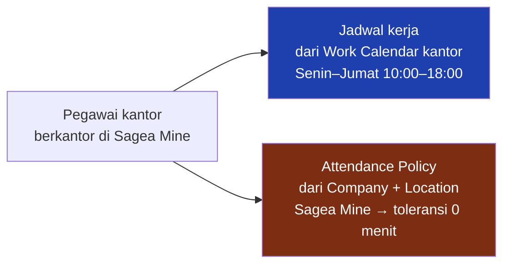
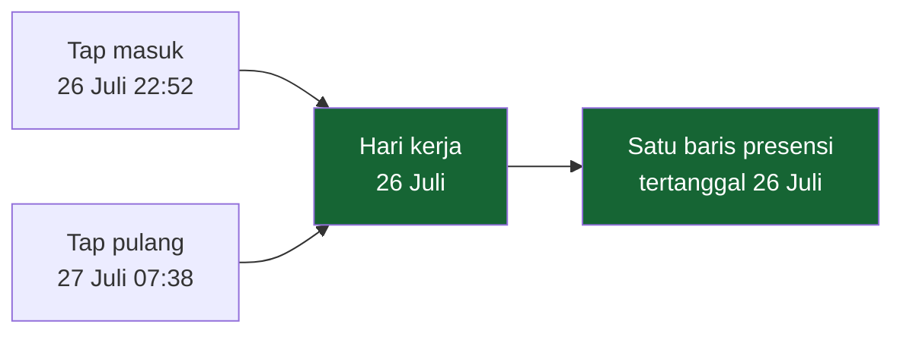

# Attendance — Aturan & Perhitungan

Halaman ini menjelaskan aturan yang mengubah jam tap menjadi angka: toleransi keterlambatan, pulang cepat, shift malam, dan hari libur.

Semua contoh di bawah diambil dari data peragaan yang berjalan, bukan dari ilustrasi.

---

## Attendance Policy

Attendance Policy adalah **aturan perusahaan**, bukan isian per baris. Ia menyimpan berapa menit keterlambatan yang dimaafkan, berapa menit pulang cepat yang dimaafkan, kapan sebuah kelebihan jam mulai dihitung sebagai lembur, dan berapa lama istirahat dipotong.

Satu pegawai bisa cocok dengan beberapa aturan sekaligus. Yang berlaku adalah **yang paling khusus**, dan kekhususannya dinilai dengan skor tetap:

| Yang disebut aturan | Nilai |
|---|---|
| Company | 4 |
| Work Location | 2 |
| Employee Group | 1 |

Kolom yang dikosongkan berarti "berlaku untuk semua". Company mengalahkan Location, dan Location mengalahkan Employee Group — jadi aturan yang menyebut perusahaan tertentu selalu menang atas aturan yang hanya menyebut lokasi.

!!! info "Tidak ada aturan per orang"
    Sistem **tidak menyediakan** pengecualian di tingkat individu. Kalau seseorang perlu perlakuan berbeda, jalannya adalah Employee Group — bukan aturan pribadi. Itu disengaja: toleransi yang bisa diketik per orang berhenti menjadi kebijakan dalam tiga bulan.

### Yang berlaku di tenant peragaan

| Aturan | Company | Location | Toleransi telat | Toleransi pulang cepat | Ambang lembur | Skor |
|---|---|---|---:|---:|---:|---:|
| `ATT-STD` | — | — | 1 menit | 0 | 30 menit | 0 |
| `ATT-MMR-HO` | MMR | Jakarta Head Office | **15 menit** | 1 menit | 30 menit | 6 |
| `ATT-MMR-SITE` | MMR | Sagea Mine | **0 menit** | 0 | 30 menit | 6 |

### Penjadwalan dan kebijakan adalah dua hal berbeda

Contoh yang paling jelas di tenant ini adalah seorang **pegawai kantor yang berkantor di site**:

Jadwalnya mengikuti **kalender kantor**. Kebijakan presensinya mengikuti **lokasi fisiknya**. Keduanya tidak harus datang dari sumber yang sama, dan di kasus ini memang tidak.

Akibat praktisnya: orang ini bekerja dengan jam kantor, tapi toleransi keterlambatannya nol — sama seperti kru tambang di sebelahnya.

**Status: IMPLEMENTED.** Ini bukan pengecualian yang ditulis khusus; ini hasil aturan kekhususan yang berjalan apa adanya.

---

## Late & Grace Period

Toleransi keterlambatan menjawab "berapa menit keterlambatan yang tidak dihitung". Di sistem ini ia **memotong**, bukan sekadar memaafkan: datang 18 menit dengan toleransi 15 menit tercatat terlambat **3 menit**, bukan 18.

Ambang itu tajam, dan ketajamannya bisa diperagakan.

### Terbukti — pegawai kantor Jakarta, toleransi 15 menit

| Datang | Menit terlambat | Status |
|---|---:|---|
| +12 menit | 0 | **Present** |
| +15 menit | **0** | **Present** |
| +16 menit | **1** | **Late** |
| +18 menit | 3 | Late |

### Terbukti — kru site, toleransi 0 menit

| Datang | Menit terlambat | Status |
|---|---:|---|
| +6 menit | **6** | **Late** |

Perilaku kedatangan yang sama menghasilkan angka yang sangat berbeda. Pada data peragaan, dengan sebaran jam kedatangan yang identik:

| | Baris | Terlambat | Persentase |
|---|---:|---:|---:|
| Head Office (toleransi 15 menit) | 362 | 59 | **16,3 %** |
| Sagea Mine (toleransi 0 menit) | 805 | 251 | **31,2 %** |

Selisihnya bukan soal disiplin. Selisihnya adalah kebijakannya.

### Penanda "seharusnya mengambil cuti"

Attendance Policy juga bisa menyatakan: keterlambatan di atas sekian menit sebaiknya diselesaikan dengan cuti, bukan dibiarkan sebagai keterlambatan biasa. Di kantor pusat ambangnya 120 menit dan nilainya 1 hari.

Yang terbit adalah **penanda**, bukan potongan. Saldo cuti tidak pernah berkurang dari sini — yang memotong saldo tetap dokumen cuti yang diajukan dan disetujui. Alasannya dua:

* kasus yang memang ada sebabnya (ban bocor, kapal digeser) harus bisa dianulir atasan tanpa menghapus catatan presensinya;
* pegawai tidak boleh baru tahu saldonya berkurang setelah kejadian.

Atasan bisa **menetapkan angka lain** atau **membebaskan** — dan pembebasan wajib disertai alasan tertulis. Angka menurut aturan tetap tersimpan utuh di belakang keputusan itu, jadi "dibebaskan" tidak pernah tertukar dengan "aturannya memang tidak menyala".

Pada data peragaan, 7 baris membawa penanda ini. Semuanya di kantor pusat, semuanya karena keterlambatan di atas dua jam.

---

## Early Leave

Pulang cepat diukur dengan cara yang sama: selisih jam pulang terhadap jadwal, dikurangi toleransinya.

**Pulang cepat bukan sebuah status.** Ia adalah angka pada baris yang statusnya tetap *Present* atau *Late*. Satu hari bisa membawa keduanya sekaligus.

### Terbukti

| Pegawai | Jadwal | Masuk | Pulang | Status | Telat | Pulang cepat |
|---|---|---|---|---|---:|---:|
| Kantor A | 10:00–18:00 | 09:55 | 16:30 | Present | 0 | **89** |
| Kantor B | 10:00–18:00 | 10:40 | 17:15 | **Late** | 25 | **44** |

Pada data peragaan: 254 baris membawa menit pulang cepat, dan 65 di antaranya terlambat **dan** pulang cepat pada hari yang sama.

---

## Night / Cross-Midnight Shift

Shift malam selesai di tanggal berikutnya. Itu terdengar sepele dan bukan — ia menentukan satu hal yang sangat mudah salah: **tap pulang jam 07:00 pagi itu milik hari kerja yang mana?**

Jawabannya: hari kerja **kemarin**. Dan yang menjawabnya bukan seseorang yang mengira-ngira, melainkan resolver jadwal — sistem mencoba tanggal tap-nya sendiri, lalu tanggal sebelumnya, dan memilih yang jendela jadwalnya memuat tap itu.

### Terbukti — satu contoh lengkap

| | |
|---|---|
| Pegawai | kru Sagea Mine |
| **Hari kerja** | **26 Juli 2026** |
| Shift | Shift 3 — Malam |
| Jadwal | 26 Juli 23:00 → **27 Juli 07:00** |
| Tap masuk (mesin) | 26 Juli 22:52 |
| Tap pulang (mesin) | **27 Juli 07:38** |
| Jam kerja bersih | 466 menit |
| Terlambat | 0 |
| Pulang cepat | 0 |
| Bukti lembur | 38 menit |
| **Status** | **Present** |

Dua tap, dua tanggal kalender, **satu baris presensi**. File mesin tidak membawa satu kolom pun yang menyebut tanggal kerja — itu murni hasil resolusi jadwal.

Pada data peragaan: 283 baris presensi punya jendela jadwal yang menyeberangi tengah malam.

### Rotasi tiga shift

Kru site tidak tetap di satu shift. Contoh nyata satu orang di bulan Agustus:

| Tanggal | Shift |
|---|---|
| 15 – 21 Agustus | Shift 1 — Pagi, 07:00–15:00 |
| **22 – 28 Agustus** | **Shift 3 — Malam, 23:00–07:00 (+1)** |
| **29 Agustus** | **hari pemulihan — tanpa shift** |
| 30 Agustus – 2 September | Shift 2 — Siang, 15:00–23:00 |

Hari pemulihan itu disisipkan aturan jeda minimum antar pergantian shift. Ia **tetap di dalam blok kerja** — bukan hari off, bukan cuti — tapi tidak punya kewajiban presensi, dan penutup hari tidak menandainya mangkir.

---

## Holiday & Non-Working Day

Hari libur punya cakupan. Ada yang berlaku untuk seluruh perusahaan, ada yang hanya untuk satu lokasi.

### Terbukti — dua hari libur dengan cakupan berbeda

| Tanggal | Nama | Cakupan | Nasional? |
|---|---|---|---|
| 17 Agustus 2026 | Hari Kemerdekaan | seluruh perusahaan | ya |
| **4 September 2026** | **Safety Stand-Down Sagea Mine** | **hanya lokasi Sagea Mine** | **tidak** |

Apa yang benar-benar terjadi pada kedua tanggal itu:

| | 17 Agustus (nasional) | 4 September (lokasi Sagea Mine) |
|---|---|---|
| Pegawai kantor Jakarta | **tidak ada baris** — bukan hari kerja | bekerja seperti biasa |
| Pegawai kantor **di Sagea Mine** | **tidak ada baris** | **tidak ada baris** — liburnya berlaku |
| Kru roster Sagea Mine | **tetap bekerja** | **tetap bekerja** |

!!! warning "KNOWN LIMITATION — hari libur tidak menghapus hari kerja roster"
    Hari libur mengurangi hari kerja **pegawai berkalender**. Ia **tidak** mengurangi segmen WORK sebuah roster.

    Artinya: tambang yang beroperasi terus tetap menjadwalkan krunya pada 17 Agustus dan pada hari Safety Stand-Down. Untuk operasi berkelanjutan hal itu sering memang yang diinginkan — tapi konsekuensinya harus dinyatakan terang-terangan:

    **Safety Stand-Down tidak otomatis membebaskan kru roster dari kewajiban presensi.** Kalau stand-down memang harus menghentikan kru, hari itu perlu ditangani lewat penyesuaian roster atau dokumen cuti — bukan lewat master hari libur.

    Perbandingan yang berguna untuk manajemen adalah yang di tabel atas: **pegawai kantor yang berkantor di site libur, kru roster di site yang sama tidak.** Keduanya benar menurut aturan yang berlaku sekarang, dan keduanya berasal dari sumber jadwal yang berbeda.

---

## Perhitungan ulang

Baris presensi yang sudah ada **tidak ikut berubah sendiri** ketika Attendance Policy disunting. Itu keputusan yang disengaja: kalau angkanya dihitung ulang otomatis, laporan bulan lalu yang sudah dikirim ke manajemen berubah diam-diam setiap kali seseorang menggeser satu angka toleransi.

Perhitungan ulang karena itu adalah **tindakan yang dipilih**, dengan rentang tanggal yang disebut. Yang berubah hanya angka turunannya — jam tap tidak pernah ikut bergerak.

!!! warning "KNOWN LIMITATION — Attendance Policy tidak punya tanggal berlaku"
    Sebuah aturan hanya punya satu nilai: yang berlaku sekarang. Tidak ada cara menyatakan "toleransi 15 menit berlaku mulai 1 September".

    Akibatnya, perhitungan ulang atas periode lama memakai aturan **hari ini**, bukan aturan yang berlaku waktu itu. Selama aturannya belum pernah berubah hal ini tidak terasa; begitu berubah, riwayatnya ikut bergeser.
