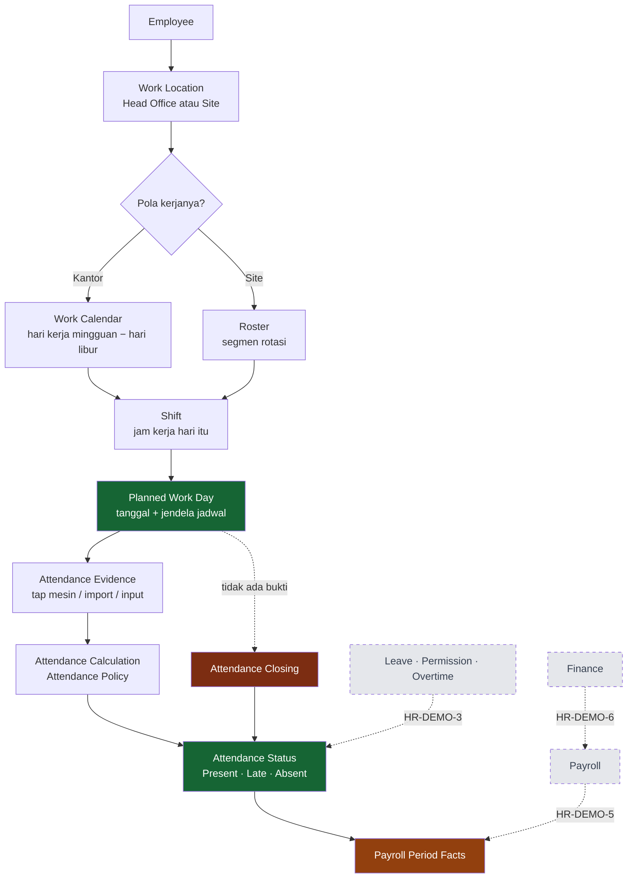

# Attendance — Presensi

Modul Attendance menjawab satu pertanyaan, dan menjawabnya dengan bukti: **hari ini orang ini bekerja atau tidak, dan sesuai jadwalnya atau tidak.**

Halaman ini menjelaskan apa yang dilakukan modulnya, siapa yang memakainya, dan bagaimana satu hari kerja berubah dari jadwal menjadi angka yang bisa dipakai payroll.

---

## Attendance Overview

| Pertanyaan | Jawaban |
|---|---|
| **Apa yang dilakukan modul ini?** | Mencatat kehadiran harian setiap pegawai dan menilainya terhadap jadwal yang sudah ditetapkan. |
| **Siapa yang memakainya?** | Pegawai (melihat catatannya sendiri), atasan langsung (meninjau timnya), HR Admin (memperbaiki dan menutup hari), manajemen (membaca angkanya). |
| **Apa yang harus dikonfigurasi lebih dulu?** | Organisasi dan penempatan, Work Calendar atau Roster, Shift, dan Attendance Policy. Tanpa keempatnya presensi tidak punya pembanding. |
| **Apa yang butuh persetujuan?** | Tidak ada di modul ini. Presensi adalah **fakta**, bukan pengajuan. Yang butuh persetujuan adalah dokumen yang *menjelaskan* penyimpangannya — Cuti, Izin Kehadiran, Lembur. |
| **Data apa yang mengalir ke modul berikutnya?** | Hari hadir, hari tidak hadir, menit terlambat, menit pulang cepat, dan bukti lembur — dibaca Payroll sebagai fakta periode. |

!!! info "Status"
    **IMPLEMENTED.** Seluruh yang dijelaskan di halaman ini berjalan di sistem dan terbukti pada data peragaan 25 Juli – 25 September 2026.

---

## Business Flow

Yang digambar putus-putus **belum tersambung**. Cuti, Izin Kehadiran, dan Lembur adalah penjelasan yang datang *setelah* presensi mencatat penyimpangannya — bukan bagian dari perhitungan presensi. Payroll dan Finance menyusul di fase berikutnya.

---

## Planned Work Day

**Ini fondasinya.** Sistem tidak pernah menerbitkan kewajiban presensi karena seseorang berstatus aktif. Ia menerbitkannya karena hari itu memang hari kerjanya.

Urutan yang dipakai, persis dan tanpa jalan pintas:

1. **Berlaku untuk orang ini?** — Employee Group bisa mematikan Attendance sepenuhnya. Direksi tidak punya kewajiban presensi, dan itu bukan pengecualian yang dimaafkan: mereka **tidak pernah dijadwalkan**.
2. **Sudah masuk, belum keluar?** — tanggal sebelum bergabung dan sesudah berhenti tidak pernah jadi hari kerja.
3. **Pegawai kantor atau pegawai roster?** — pembedanya pola kerjanya, bukan lokasinya.
4. **Kantor:** hari kerja mingguan dari Work Calendar, dikurangi hari libur yang berlaku untuk lokasinya.
5. **Site:** hanya segmen **WORK** dari rosternya. Field break dan hari perjalanan tidak menghasilkan kewajiban — orangnya tidak di tempat mesin berada.
6. **Dikurangi hari pemulihan.** Pergantian shift yang tidak menyisakan istirahat cukup disela satu hari tanpa shift. Hari itu tetap di dalam blok kerja, tapi tidak ada kewajiban presensinya.

Yang tersisa sesudah enam langkah itu adalah **Planned Work Day**, dan hanya hari itu yang bisa melahirkan baris presensi.

!!! success "Terbukti pada data peragaan"
    1.167 baris presensi di jendela 25 Juli – 25 September 2026, dan **seluruh 1.167-nya** jatuh pada hari kerja terjadwal. Nol baris di hari field break, hari perjalanan, hari pemulihan, hari libur kantor, atau tanggal sesudah pegawainya berhenti.

---

## Attendance Evidence

Bukti kehadiran dan kesimpulan kehadiran adalah **dua hal berbeda**, dan sistem menyimpannya terpisah.

| | Bukti mentah | Kesimpulan harian |
|---|---|---|
| Isinya | satu tap: siapa, jam berapa, mesin mana | satu hari kerja: masuk, pulang, status, menit |
| Jumlahnya | beberapa per hari | tepat satu per pegawai per tanggal |
| Boleh diubah? | tidak — tap adalah fakta | ya, lewat koreksi yang tercatat |
| Dihitung ulang? | tidak pernah | ya, kapan pun aturannya berubah |

Memisahkan keduanya punya konsekuensi yang terasa: ketika jadwal seseorang ternyata salah dan harinya perlu dihitung ulang, **ada jalan pulang** — tap aslinya masih utuh.

### Dari mana buktinya datang

| Asal | Yang terlihat di layar | Bukti mentah tersimpan? |
|---|---|---|
| Mesin sidik jari lewat unggah file | `Import` | **ya** — setiap tap |
| Sinkronisasi rekap harian mesin | `Attendance Device` | tidak, mesinnya hanya mengirim rekap |
| Diketik HR / atasan | `Manual` | tidak berlaku |
| Diterbitkan penutup hari | `System` | tidak berlaku — ini kesimpulan, bukan bukti |

---

## Check-In / Check-Out

Jam masuk dan jam pulang adalah **fakta yang tidak pernah digeser sistem**. Toleransi keterlambatan tidak mengubahnya, perhitungan ulang tidak mengubahnya, dan perubahan aturan tidak mengubahnya.

Alasannya sederhana: kalau jamnya ikut digeser, tidak ada lagi cara menjawab "jam berapa sebenarnya dia datang".

Yang disimpan sebuah baris:

| Kolom | Artinya |
|---|---|
| Scheduled Check In / Out | jendela jadwal hari itu, hasil resolusi Shift |
| Check In / Check Out | jam yang benar-benar tercatat |
| First Check In / Last Check Out | tap paling awal dan paling akhir, kalau ada beberapa |
| Worked Minutes | selisih masuk–pulang dikurangi istirahat |

**Tap masuk tanpa tap pulang tetap masuk.** Barisnya terbit dengan jam pulang kosong — dan jam pulang yang kosong tidak boleh terbaca seperti "pulang tepat waktu". Itu keadaan yang lazim di lapangan, dan penyelesaiannya adalah [koreksi tangan](Attendance-Closing.md#manual-correction), bukan menebak jamnya.

---

## Attendance Status

Status yang benar-benar diterbitkan sistem hari ini:

| Status | Kapan terbit | Siapa yang menerbitkan |
|---|---|---|
| **Present** | ada bukti, dan keterlambatannya nol menurut aturan | perhitungan presensi |
| **Late** | ada bukti, dan keterlambatannya di atas toleransi | perhitungan presensi |
| **Absent** | hari terjadwal, tidak ada bukti apa pun | penutup hari |
| **Leave** | hari terjadwal, tertutup dokumen cuti yang disetujui | penutup hari |

!!! warning "KNOWN LIMITATION — status yang ada di daftar tapi tidak pernah terbit"
    Sistem menyimpan daftar status yang lebih panjang: *Sick*, *Permit*, *Business Trip*, *Remote*, *Holiday*, *Day Off*, *Incomplete*. Hari ini **tidak ada satu pun proses yang menuliskannya**. Keempat status di tabel atas adalah seluruh kosakata yang benar-benar dipakai.

    Konsekuensi yang perlu dipahami manajemen:

    * **Pulang cepat bukan sebuah status.** Ia tercatat sebagai menit pulang cepat pada baris yang statusnya tetap *Present* atau *Late*. Satu hari bisa *Late* sekaligus punya menit pulang cepat — dua hal yang berbeda, dicatat terpisah.
    * **Hari libur dan hari off bukan sebuah baris.** Keduanya adalah hari yang tidak pernah punya kewajiban, jadi tidak ada barisnya sama sekali.
    * **Bukti tidak lengkap bukan sebuah status.** Ia terlihat sebagai jam pulang yang kosong.

---

## Angka yang diturunkan setiap baris

| Angka | Diturunkan dari |
|---|---|
| Menit terlambat | selisih jam masuk terhadap jadwal, dikurangi toleransi |
| Menit pulang cepat | selisih jam pulang terhadap jadwal, dikurangi toleransi |
| Bukti lembur | menit di atas jadwal pulang, kalau melewati ambang |
| Jam kerja bersih | masuk sampai pulang, dikurangi istirahat |
| Kewajiban cuti | penanda, kalau keterlambatannya melewati ambang tertentu |

Tidak satu pun dari angka ini boleh dikirim dari layar. Semuanya **diturunkan ulang** dari [Attendance Policy](Attendance-Rules.md) yang berlaku untuk pegawai itu, setiap kali barisnya disimpan. Layar yang mengirim angkanya sendiri akan diam-diam melewati kebijakan yang baru saja diatur orang.

---

## Apa yang dibaca modul berikutnya

Lihat [Attendance Closing & Batas Modul](Attendance-Closing.md#attendance-payroll-boundary).

Contoh nyata yang bisa diperagakan: [Management Examples](Attendance-Examples.md).
