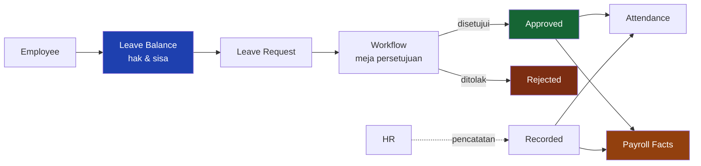
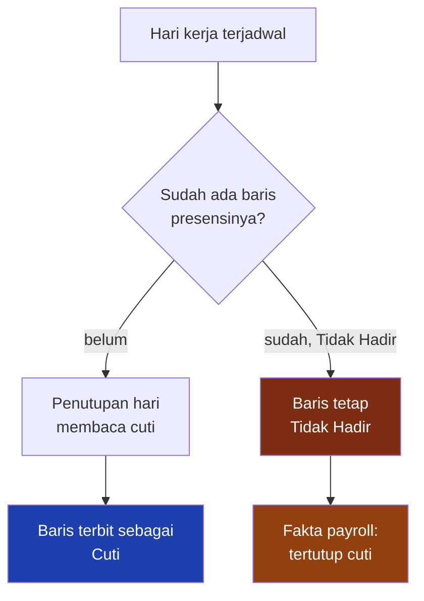

# Leave Management — Cuti

Cuti adalah satu-satunya dokumen di sistem ini yang memotong **hak**. Karena itu jalurnya panjang, jejaknya lengkap, dan tidak ada satu pun titik di mana saldo berkurang tanpa keputusan yang tercatat.

---

## Business purpose

| Pertanyaan | Jawaban |
|---|---|
| **Apa yang dilakukan modul ini?** | Mengatur hari tidak masuk yang **punya dasar** — diajukan, disetujui, dan diperhitungkan terhadap hak pegawai. |
| **Siapa yang memakainya?** | Pegawai (mengajukan untuk dirinya), atasan langsung dan meja-meja penyetuju, HR (mencatat cuti yang terjadi di luar sistem). |
| **Apa yang harus dikonfigurasi lebih dulu?** | Jenis Cuti, Kebijakan Cuti, saldo pembuka, garis pelaporan, dan alur persetujuan. |
| **Apa yang butuh persetujuan?** | Setiap pengajuan. Yang **tidak** lewat persetujuan hanya jalur pencatatan HR. |
| **Data apa yang mengalir ke modul berikutnya?** | Hari cuti, hari cuti tanpa upah, dan tanggal yang tertutup dokumen cuti — dibaca Payroll sebagai fakta periode. |

---

## Business flow



---

## Eligibility

Kebijakan Cuti menentukan siapa yang berhak dan sejak kapan. Yang paling menentukan di tenant ini: **cuti tahunan baru berlaku setelah 12 bulan masa kerja.**

Akibatnya nyata dan sering ditanyakan: pegawai yang bergabung pertengahan tahun berjalan **tidak bisa** mengambil cuti tahunan, dan satu-satunya jalur yang tersedia baginya adalah **cuti tanpa upah**. Itu bukan penolakan administratif — itu aturannya, dan sistem menahannya sejak layar pengajuan, bukan di meja approver.

---

## Leave Type & Leave Policy

**Jenis Cuti** adalah namanya. **Kebijakan Cuti** adalah aturannya. Keduanya terpisah supaya satu jenis cuti bisa punya aturan berbeda antar perusahaan tanpa menggandakan namanya.

Yang diatur kebijakan: memakai saldo atau tidak, berapa hari haknya setahun, sejak kapan berlaku, boleh dibawa ke tahun berikutnya atau tidak, batas hari per kejadian, dan apakah dokumen pendukung wajib.

Di tenant peragaan: **15 jenis cuti, 14 kebijakan, dan hanya satu yang memakai saldo** — Cuti Tahunan, 12 hari setahun, diberikan di muka, tidak bisa dibawa ke tahun berikutnya.

| Jenis | Memakai saldo | Batas | Dokumen wajib |
|---|---|---|---|
| **Cuti Tahunan** | **ya — 12 hari/tahun** | — | tidak |
| Cuti Sakit | tidak | — | tidak |
| Cuti Tanpa Upah | tidak | — | tidak |
| Cuti Melahirkan, Menikah, Kedukaan, dll. | tidak | per kejadian | sebagian ya |

Cuti yang **tidak** memakai saldo tetap tercatat, tetap butuh persetujuan, dan tetap dibaca payroll. Yang tidak ada hanyalah kartu haknya.

---

## Leave Balance

Kartu cuti seseorang bukan angka yang ditambah dan dikurangi. Ia **dijumlahkan ulang dari dokumen** setiap kali ada dokumen yang berpindah status.

```
sisa = hak tahun ini + bawaan tahun lalu + saldo pembuka + koreksi
       − yang sudah dipakai − yang sudah hangus
```

Konsekuensi yang membuatnya bisa dipercaya:

| Status dokumen | Memotong saldo? |
|---|---|
| **Recorded** | **ya** |
| **Approved** | **ya** |
| Submitted | **tidak** — yang belum disetujui belum mengurangi hak siapa pun |
| Draft | tidak |
| Rejected | tidak |
| Cancelled | tidak — potongannya **kembali dengan sendirinya** |

Pembatalan tidak "mengembalikan" apa pun; dokumennya berhenti dihitung, dan penjumlahan berikutnya sudah benar. Tidak ada kolom yang bisa hanyut.

---

## Employee Request

Pegawai membuat sendiri lewat Self Service, mengisi jenis, tanggal, dan alasannya, lalu menekan Submit. Sampai ditekan, dokumennya **Draft** dan belum sampai ke meja siapa pun.

Pada saat Submit — bukan sebelumnya — sistem menghitung ulang jumlah harinya dan menegakkan seluruh aturan kebijakannya, termasuk dokumen pendukung. Alasannya praktis: surat dokter lazim baru ada setelah orangnya pulang berobat, dan mewajibkannya sejak draft membuat isian yang sudah diketik tidak bisa disimpan.

---

## Workflow Approval

Rantai persetujuan **ditentukan lokasi kerja pengaju**, bukan jenis cutinya.

| Lokasi | Meja |
|---|---|
| **Jakarta Head Office** | atasan langsung → HR Manager |
| **Sagea Mine** | Admin Section → HR Admin Site → atasan langsung → HR Manager Site → KTT Site → HRGA |

Setiap meja diisi orang yang sungguhan: "atasan langsung" dibaca dari garis pelaporan pada penempatan organisasi, meja lainnya dari pemegang peran pada cakupan yang disebut.

Dua perilaku yang perlu diketahui sebelum melihatnya di layar:

**Satu orang, dua meja, satu tanda tangan.** Kalau orang yang sama mengisi dua meja pada satu dokumen, meja kedua ditandai *terwakili* — bukan ditandatangani dua kali.

**Tidak ada yang menyetujui dokumennya sendiri.** Pengaju dikecualikan dari mejanya sendiri, termasuk ketika ia kebetulan pemegang peran meja itu.

---

## Reject

Penolakan wajib beralasan, dan alasannya sampai ke pengaju. Dokumen yang ditolak **tidak** memotong saldo dan tanggalnya kembali terbuka untuk pengajuan ulang.

Meja yang menolak juga menutup meja-meja sesudahnya: sisa rantainya dibatalkan, tidak dibiarkan menggantung.

---

## Cancel

| Yang dibatalkan | Caranya |
|---|---|
| Pengajuan yang masih berjalan | **ditarik** pengaju, dokumennya kembali ke Draft |
| Catatan HR (Recorded) | **dibatalkan** meja yang berhak mencatat |
| Cuti yang sudah **disetujui lewat alur** | **belum ada aturannya** — lihat Known Limitations |

---

## Recorded Leave

Jalur kedua yang sengaja ada: cuti yang **sudah terjadi** atau sudah disetujui di luar sistem, diketik HR langsung sebagai *Recorded* tanpa melewati satu meja pun.

Bukan jalan pintas — HR yang mengetiknya sudah tahu cuti itu terjadi, dan menolaknya di titik itu berarti fakta yang sudah terjadi tidak punya tempat tersimpan. Yang boleh memakainya hanya meja yang memang diberi kewenangan mencatat, dan catatannya memotong saldo persis seperti cuti yang disetujui.

---

## Attendance Relationship

**Ini bagian yang paling sering disalahpahami, dan dokumen ini menyatakannya apa adanya.**

Cuti yang disetujui **tidak menulis ulang** baris presensi yang sudah ada. Hari yang sudah terbit sebagai *Tidak Hadir* tetap *Tidak Hadir*.

Yang benar-benar terjadi ada dua, dan keduanya berlaku:



**Kalau harinya belum punya baris** — penutupan hari menemukan cutinya dan menuliskan hari itu sebagai *Cuti*, bukan *Tidak Hadir*.

**Kalau harinya sudah punya baris Tidak Hadir** — barisnya tidak disentuh. Pembacaannya yang berubah: di lapisan fakta payroll hari itu tercatat **tertutup cuti** dan tidak ikut jadi ketidakhadiran yang dipotong.

Kedua perilaku ini dibuktikan pada data peragaan dengan **satu dokumen cuti yang sama**, pada dua tanggal yang berbeda. Lihat [Contoh untuk Manajemen](Attendance-Examples.md).

Alasan pembedaan ini disengaja: baris presensi adalah **catatan operasional** tentang apa yang terjadi di lapangan hari itu. Keputusan administratif yang datang kemudian dicatat sebagai keputusan, bukan dengan menimpa catatan lapangannya.

---

## Payroll Relationship

| Fakta yang dibaca payroll | Dari mana |
|---|---|
| Hari cuti | jumlah hari dokumen berstatus Recorded/Approved |
| Hari cuti tanpa upah | jenis cuti yang ditandai tidak dibayar pada aturan payroll |
| Ketidakhadiran yang tertutup cuti | baris Tidak Hadir yang tanggalnya punya dokumen cuti sah |

Cuti yang melintasi batas periode dihitung **proporsional** per hari yang benar-benar jatuh di dalam periodenya — cuti sepuluh hari yang dimulai tanggal 28 tidak memotong sepuluh hari dari dua bulan sekaligus.

Yang menentukan sebuah jenis cuti dibayar atau tidak adalah **aturan payroll**, bukan modul cuti. Jenis yang tidak disebut aturan mana pun diperlakukan dibayar.

---

## Employee Self Service

| Kemampuan | Ada? |
|---|---|
| Mengajukan cuti untuk diri sendiri | ✅ |
| Melihat cuti dan sisa saldo sendiri | ✅ |
| Menarik pengajuan yang belum diputuskan | ✅ |
| Menyetujui bawahan dari kotak masuk | ✅ (atasan) |
| Mencatat / membatalkan catatan | ✅ (HR) |

---

## Examples

Sembilan dokumen di tenant peragaan, semuanya menjelaskan hari tidak hadir yang benar-benar ada:

| Cerita | Jenis | Hasil | Saldo |
|---|---|---|---|
| Dua hari kerja berurutan, akhir pekan di tengahnya tidak dihitung | Tanpa Upah | **Disetujui** lewat alur | — |
| Sakit satu hari | Sakit | Disetujui | — |
| Cuti tahunan satu hari | Tahunan | Disetujui | **7,0 → 6,0** |
| Setengah hari | Tahunan | Disetujui | **8,0 → 7,5** |
| Ditolak atasan langsung di rantai enam meja site | Tahunan | **Ditolak** | 10,0 → **10,0** |
| Dicatat HR lalu dibatalkan | Tahunan | **Dibatalkan** | 2,0 → 1,0 → **2,0** |
| Masih berjalan di rantai site | Tahunan | **Diajukan** | 10,0 → **10,0** |
| Belum diajukan | Tahunan | **Draf** | 4,0 → **4,0** |
| Dicatat HR tanpa alur | Tahunan | **Tercatat** | **5,0 → 4,0** |

Sesudahnya **28 dari 35** hari tidak hadir tetap tanpa keterangan. Itu disengaja: data peragaan yang semua orangnya tertib tidak bisa dipakai memperagakan apa pun.

---

## Known Limitations

| # | Keterbatasan | Dampaknya |
|---|---|---|
| 1 | Cuti yang disetujui tidak menulis ulang baris presensi yang sudah ada | Layar presensi tetap menampilkan *Tidak Hadir*; penjelasannya muncul di lapisan fakta payroll |
| 2 | Cuti yang **sudah disetujui** belum punya jalur pembatalan | Satu-satunya jalan keluar hari ini adalah koreksi administratif |
| 3 | Pembatalan alur mengembalikan dokumen ke **Draf**, bukan ke *Dibatalkan* | Dua semantik yang berbeda; yang dipakai untuk membatalkan adalah aksi dokumennya |
| 4 | **Puncak garis pelaporan tidak bisa mengajukan cuti** | Orang yang tidak punya atasan tidak punya meja pertama — pengajuannya ditolak konfigurasi |
| 5 | **Peran berpemegang tunggal memblokir pemegangnya sendiri** | Pemegang peran KTT site tidak bisa mengajukan cuti: ia dikecualikan dari mejanya sendiri dan tidak ada pengganti |
| 5b | **Peran cadangan yang juga kosong tidak menolong** | Satu seksi site tidak punya pemegang peran pada meja pertama, dan peran cadangannya pun tidak ada pemegangnya di departemen itu |
| 6 | Cuti yang melintasi pergantian tahun dihitung penuh pada tahun tanggal mulainya | Kartu cuti dua tahun tidak terbagi |

Nomor 4, 5, dan 5b adalah **kekurangan konfigurasi**, bukan cacat mesin. Buktinya ada di modul sebelah: setiap meja pada alur **Izin Kehadiran** sudah membawa peran cadangan, dan orang yang sama — yang cutinya tertahan karena tidak punya atasan — bisa mengajukan izin tanpa hambatan apa pun. Mesinnya menyediakan tiga jalan keluar (peran cadangan, rantai cadangan berlapis, dan meja yang boleh dilewati); alur cuti belum memakai satu pun. Rinciannya di [Technical Reference](Technical-Reference.md).

Pengajuan yang tertahan **ditolak seluruhnya di muka**, bukan mengendap setengah jalan: meja yang tidak bisa diisi membatalkan seluruh pengajuan beserta alasannya. Dokumen yang berjalan dengan satu kotak kosong akan menunggu tanda tangan yang tidak pernah ada tagihannya.
