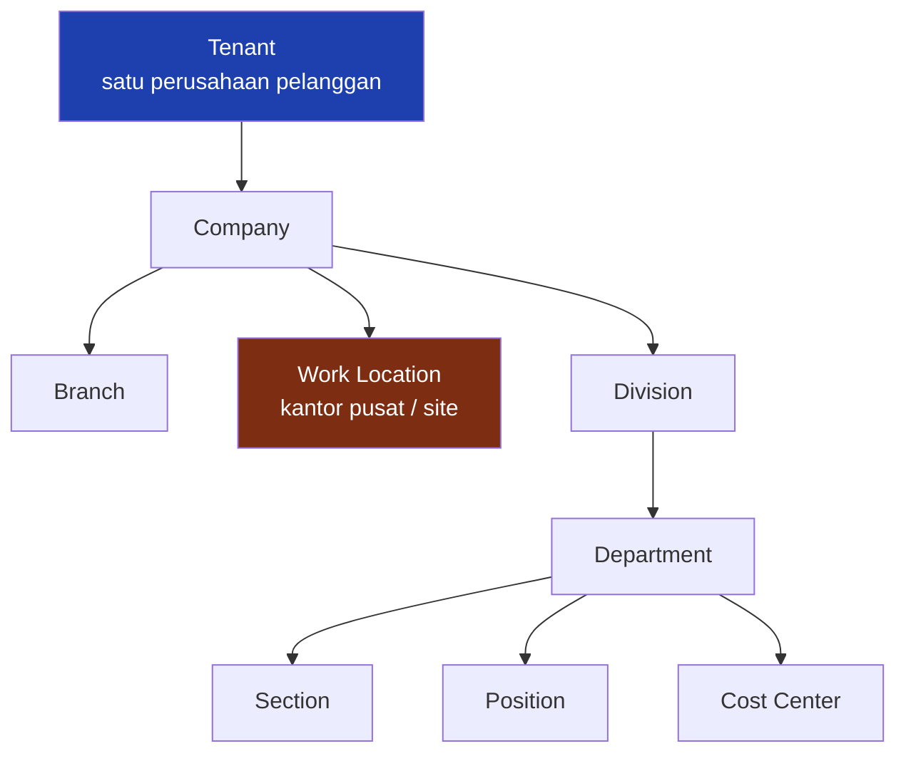

# Organization Management

**Status: IMPLEMENTED**

Struktur organisasi adalah fondasi dari semua yang lain. Ia menentukan siapa melapor ke siapa, laporan siapa yang boleh dilihat siapa, aturan kehadiran mana yang berlaku, dan biaya gaji masuk ke pusat biaya mana.

---

## Susunan yang dilihat manajemen

| Tingkat | Apa yang diwakili | Contoh |
|---|---|---|
| **Company** | badan usaha | Meinova Mineral Resources |
| **Branch** | cabang administratif | Default |
| **Work Location** | tempat orang bekerja | Jakarta Head Office · Sagea Mine |
| **Division** | kelompok fungsi besar | Operations · Corporate |
| **Department** | unit kerja | Plant & Maintenance · HRD · Finance |
| **Section** | sub-unit | Mechanical · HRD General |
| **Position** | jabatan | Electrician · Plant Supervisor |
| **Cost Center** | pusat biaya | MMR-PLANT |

---

## Yang penting dipahami: ini bukan pohon kaku

!!! warning "Constrained organizational lattice, bukan tree"
    Division, Department, Section, Position, dan Cost Center **masing-masing boleh menyebut Work Location-nya sendiri**, dan boleh juga tidak menyebutnya. Artinya struktur ini bukan satu pohon tunggal dari atas ke bawah — ia jaringan berbatas.

    Konsekuensinya nyata:

    - satu Department bisa dipakai lintas lokasi (misalnya Departemen HRD yang melayani kantor pusat dan site);
    - satu Department juga bisa dikunci ke satu lokasi saja;
    - kekosongan berarti **berlaku umum**, bukan "belum diisi".

**Yang menjaga agar tidak kacau adalah penempatan pegawai.** Saat seseorang ditempatkan, sistem memeriksa seluruh rantainya: Section yang dipilih harus benar-benar berada di bawah Department yang dipilih, Department di bawah Division, dan seterusnya sampai Company. Penempatan yang setengah pindah ditolak.

!!! example "Contoh penolakan yang sebenarnya terjadi"
    Seorang teknisi listrik hendak dipindahkan dari kantor pusat ke site. Yang diubah hanya lokasi, departemen, dan seksinya. Sistem **menolak** dengan alasan yang menyebut satu per satu: divisi, jabatan, dan pusat biayanya masih milik pohon kantor pusat.

    Penolakan itu benar. Pemindahan yang setengah jalan menghasilkan pegawai site yang biayanya tetap dibebankan ke kantor pusat, dan tidak ada satu pun layar yang akan menampilkannya sebagai kesalahan.

---

## Penempatan pegawai

Setiap pegawai punya **satu** penempatan organisasi yang berlaku sekarang. Isinya:

| Kolom | Peran dalam sistem |
|---|---|
| Company | menentukan buku, mata uang, dan periode akuntansi |
| Branch, Work Location | menentukan kalender, aturan kehadiran, dan alur persetujuan |
| Division, Department, Section | menentukan cakupan laporan dan cakupan data admin |
| Position | menentukan jenjang dan garis jabatan |
| Cost Center | menentukan pembebanan biaya |
| **Reports To** | atasan langsung — **inilah** yang dipakai alur persetujuan, bukan kolom supervisor terpisah |

!!! danger "KNOWN LIMITATION — penempatan tidak menyimpan sejarah"
    Penempatan organisasi menyimpan **keadaan sekarang**, satu baris per pegawai. Ia tidak menyimpan riwayat berlapis dengan tanggal berlaku.

    Riwayat perubahannya ada — tersimpan di dokumen Employee Action beserta nilai sebelum dan sesudah — tetapi laporan yang membaca departemen seseorang akan membaca departemennya **hari ini**, termasuk untuk transaksi bulan lalu.

    Akibatnya: **pelaporan historis di bawah tingkat Work Location belum bisa diandalkan setelah seorang pegawai dipindahkan.** Transaksi (presensi, cuti, lembur, gaji) menyimpan sendiri Company, Branch, dan Work Location pada saat kejadian, jadi ketiga tingkat itu aman. Division, Department, dan Section tidak.

    Ini batas arsitektur yang diketahui, bukan bug. Sampai ia ditangani, dataset peragaan sengaja **tidak memindahkan pegawai** di tengah periode.
