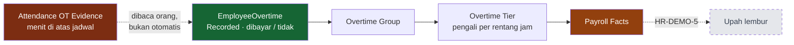

# Overtime Management — Lembur

Lembur adalah modul yang paling mudah salah dibaca, karena tiga hal yang berbeda memakai kata yang sama. Halaman ini memisahkannya lebih dulu, sebelum menjelaskan apa pun yang lain.

---

## Tiga hal berbeda yang sering tertukar

| Istilah | Artinya | Asalnya | Status |
|---|---|---|---|
| **Bukti lembur** | pegawai tercatat pulang lewat jadwal, di atas ambang | dihitung presensi dari jam tap | **IMPLEMENTED** |
| **Catatan lembur** | dokumen yang menyatakan jam itu diakui sebagai lembur | diketik orang | **IMPLEMENTED** |
| **Lembur dibayar** | baris upah pada slip gaji | dihitung payroll | **HR-DEMO-5** |

**Tidak ada satu pun jalur yang mengubah salah satunya menjadi yang berikutnya secara otomatis.** Pada data peragaan: **272** baris presensi membawa bukti lembur, dan hanya **7** catatan lembur yang dibuat. Selisihnya disengaja.

---

## Business purpose

| Pertanyaan | Jawaban |
|---|---|
| **Apa yang dilakukan modul ini?** | Mencatat jam kerja di luar jadwal yang **diakui** perusahaan, beserta apakah jam itu dibayar. |
| **Siapa yang memakainya?** | HR / admin yang mencatat, dan pengawas yang mengusulkan. |
| **Apa yang harus dikonfigurasi lebih dulu?** | Pegawai dinyatakan berhak lembur, dan Kelompok Lembur beserta tingkat pengalinya. |
| **Apa yang butuh persetujuan?** | **Tidak ada alur persetujuan.** Lihat di bawah. |
| **Data apa yang mengalir ke modul berikutnya?** | Jam lembur per tanggal dan totalnya. |

---

## Business flow

!!! danger "Tidak ada kotak persetujuan di diagram ini, dan itu bukan kelalaian gambar"
    **Alur persetujuan lembur = FUTURE / NOT IMPLEMENTED.**

    Sistem tidak punya definisi alur untuk lembur, tidak punya kotak masuk persetujuan untuknya, dan tidak punya tombol Ajukan/Setujui/Tolak. Daftar status internalnya memang memuat kata "Disetujui", tapi **tidak ada satu pun proses yang menuliskannya** — daftar yang memuat sebuah nama tidak membuktikan prosesnya ada.

    Keadaan terkuat yang benar-benar ada: **Tercatat**, dengan penanda dibayar atau tidak. Itu yang dipakai, dan itu yang didokumentasikan.

---

## Attendance OT Evidence

Presensi menghitung berapa menit seseorang tinggal lewat jadwal pulangnya. Kalau melewati ambang kebijakan (30 menit di tenant ini), menitnya tercatat sebagai **bukti lembur**.

Bukti, bukan pengakuan. Ia menjawab "orang ini masih di tempat kerja sampai jam berapa", bukan "perusahaan mengakui jam ini sebagai lembur". Orang yang menunggu hujan reda menghasilkan bukti yang sama dengan orang yang menyelesaikan perbaikan.

Yang mengubahnya jadi pengakuan adalah seseorang yang membuat catatannya.

---

## Overtime Record

Satu catatan menyebut pegawai, tanggal kerja, jam mulai, jam selesai, dan apakah dibayar. Durasinya diturunkan dari jam mulai–selesai; lembur yang melewati tengah malam dihitung ke tanggal berikutnya, bukan jadi angka negatif.

**Tanggal kerja bukan tanggal jam dindingnya.** Lembur sesudah shift malam terjadi pada jam 07:00–09:27 keesokan paginya, tapi hari kerjanya tetap tanggal shift itu dimulai — sama seperti presensinya.

**Beberapa catatan pada satu tanggal diperbolehkan**, dan itu disengaja: pekerjaan bisa terpotong lalu dilanjutkan. Payroll menjumlahkannya jadi **satu hari lembur** sebelum menyusun tingkat.

---

## Paid vs Unpaid

| Penanda | Artinya | Dibaca payroll? |
|---|---|---|
| **Dibayar** + Tercatat | jam yang diakui dan diupahkan | **ya** |
| **Tidak dibayar** + Tercatat | diganti libur pengganti; tetap masuk rekap jam kerja | **tidak** |
| Dibatalkan | catatannya dianulir | **tidak**, walau ditandai dibayar |

Lembur yang tidak dibayar tetap perlu tercatat: rekap jam kerja dan batas jam lembur bulanan menghitungnya, yang tidak menghitungnya cuma upahnya.

---

## Overtime Group

Aturan upah lembur satu kelompok pegawai, bukan satu tarif. Pegawai memilih kelompoknya lewat Payroll Assignment — **tidak ada konfigurasi lembur per orang**.

Yang disimpan kelompok: pengali tunggal (cadangan, dipakai kalau belum ada tingkat), pembagi gaji jadi upah sejam (173 — angka statuter Indonesia, bisa diubah dari layar), batas jam per hari dan per bulan, dan **dasar penyusunan tingkat**.

!!! info "Berhak lembur ≠ berlokasi di site"
    Kelompok lembur hanya dipasang ke pegawai yang **sudah dinyatakan berhak lembur** di Payroll Assignment. Manajer dan pejabat site pun berkantor di site, dan mereka memang tidak berhak — menyimpulkan kelayakan dari lokasi akan memasukkan mereka.

    Di tenant peragaan: **15 pegawai site** berkelompok lembur. Enam manajer dan pejabat di lokasi yang sama tidak.

---

## Overtime Tier

Kebijakan "jam pertama 1,5× dan jam berikutnya 2×" bukan satu angka — ia daftar rentang, dan jumlah rentangnya berbeda antar perusahaan.

**Rentangnya jam lembur kumulatif, bukan jam dinding.** "0 sampai 2" berarti dua jam lembur pertama, pukul berapa pun itu terjadi.

### Konfigurasi site di tenant peragaan

| Tingkat | Rentang jam lembur | Pengali |
|---|---|---:|
| 1 | 0 – 2 | **1,5×** |
| 2 | di atas 2 | **2,0×** |
| | **Disusun per** | **hari lembur** |

### Dasar penyusunan — pertanyaan yang wajib dijawab

Tingkat bisa disusun **per hari lembur** atau **dari total jam sebulan**, dan keduanya menghasilkan angka yang jauh berbeda untuk orang yang sama:

> Lembur 1 jam setiap hari selama empat hari seluruhnya masuk tarif jam pertama kalau disusun **per hari**. Kalau disusun **dari total sebulan**, tiga dari empat jamnya masuk tarif jam berikutnya.

Karena itu **tidak ada bawaan**. Kelompok yang memakai tingkat tapi belum menyatakan dasarnya ditolak validasi payroll — bukan diam-diam dihitung dengan salah satunya.

### Yang akan dihitung payroll

| Jam lembur satu hari | Susunan | Jam berbobot |
|---:|---|---:|
| 0,50 | 0,50 × 1,5 | **0,75** |
| 2,00 | 2,00 × 1,5 | **3,00** |
| 2,05 | 2,00 × 1,5 + 0,05 × 2,0 | **3,10** |
| 2,45 | 2,00 × 1,5 + 0,45 × 2,0 | **3,90** |

Perhitungan ini milik **Payroll**, dan berjalan di HR-DEMO-5. Modul lembur hanya menyediakan jamnya.

---

## Daily Aggregation

Payroll menjumlahkan jam per **tanggal** lebih dulu, baru menyusun tingkat.

Terbukti: seorang juru las mencatat dua kali pada satu tanggal — 60 menit lalu 86 menit. Payroll membacanya sebagai **satu hari lembur 2,43 jam**, bukan dua hari masing-masing di bawah dua jam. Tanpa penjumlahan itu, tarif jam pertama diberikan dua kali.

---

## Payroll Boundary

| Yang dibaca payroll | Syaratnya |
|---|---|
| Jam lembur per tanggal | catatan **Tercatat** dan **dibayar** |
| Total jam lembur periode | idem |

Yang **tidak** dibaca: catatan yang dibatalkan, catatan yang ditandai tidak dibayar, dan bukti lembur yang tidak pernah dijadikan catatan.

Payroll tidak menghitung sendiri jam mana yang lembur dari jam masuk–keluar, dan tidak membuat alur persetujuan kedua: **jam yang sah ditentukan HR, harga per jamnya ditentukan Payroll.**

---

## Examples

Tujuh catatan di tenant peragaan, semuanya dari bukti presensi yang benar-benar ada:

| Cerita | Jam | Keadaan | Dibaca payroll |
|---|---:|---|---|
| Serah terima shift molor | 0,50 | Tercatat, dibayar | ✅ seluruhnya tingkat 1 |
| Perbaikan conveyor sebelum shift berikutnya | **2,05** | Tercatat, dibayar | ✅ **melewati batas dua jam** |
| Menunggu pengganti shift malam | 2,45 | Tercatat, dibayar | ✅ jam dindingnya di tanggal berikutnya |
| Diganti libur pengganti | 2,45 | Tercatat, **tidak dibayar** | ❌ |
| Jamnya sudah tercakup penyesuaian roster | 2,43 | **Dibatalkan** | ❌ walau ditandai dibayar |
| Pengelasan, dua catatan satu tanggal | 1,00 + 1,43 | Tercatat, dibayar | ✅ **dijumlahkan jadi 2,43** |

**266 dari 272** baris berbukti lembur tetap tanpa catatan. Itu bukan data yang belum selesai — itu gambaran yang benar tentang bedanya bukti operasional dan pengakuan perusahaan.

---

## Known Limitations

| # | Keterbatasan | Tingkat |
|---|---|---|
| 1 | **Tidak ada alur persetujuan lembur** | **FUTURE / NOT IMPLEMENTED** |
| 2 | Tidak ada jalur dari bukti lembur ke usulan catatan lembur | NOT IMPLEMENTED — setiap catatan diketik orang |
| 3 | Catatan lembur tidak bertaut ke baris presensinya | KNOWN LIMITATION — kaitannya lewat pegawai + tanggal |
| 4 | Self Service bisa membuat catatan lembur tanpa meja persetujuan mana pun | KNOWN LIMITATION — dikendalikan lewat kewenangan, bukan lewat alur |
| 5 | **Pegawai kantor pusat belum punya kelompok lembur** | KNOWN LIMITATION — bukti lemburnya ada, konfigurasi upahnya belum; ditinjau di HR-DEMO-5 |
| 6 | Kelompok bertingkat tanpa dasar penyusunan ditolak saat payroll dihitung | perilaku yang disengaja, bukan cacat |

**Nomor 5 perlu dipahami manajemen sebagai celah konfigurasi, bukan sebagai kebijakan.** Kantor pusat menghasilkan 73 baris berbukti lembur di jendela peragaan. Tidak satu pun bisa diupahkan hari ini karena belum ada kelompok lembur yang berlaku untuk mereka — dan menambalnya asal-asalan berarti mengambil keputusan upah atas nama perusahaan.
