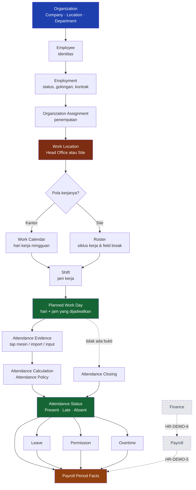

# HR Management — Overview

Dokumen ini menjelaskan **bagaimana seorang pegawai bergerak melalui sistem**, dari struktur organisasi sampai buku besar. Ditulis untuk manajemen, HR, payroll, finance, dan atasan langsung — bukan untuk membaca kode.

!!! abstract "Status dokumen"
    Halaman-halaman di bagian ini tumbuh bertahap. Yang sudah berisi fakta terverifikasi ditandai **IMPLEMENTED**; yang baru berlaku untuk data peragaan ditandai **CONFIGURED FOR DEMO**; batas yang diketahui ditandai **KNOWN LIMITATION**; yang belum ada ditandai **FUTURE / NOT IMPLEMENTED**. Tidak ada capability yang dijelaskan di sini tanpa bukti dari sistem yang berjalan.

---

## Perjalanan satu pegawai

Sampai **Planned Work Day**, sistem belum tahu apa pun tentang kehadiran. Ia baru tahu **kapan orang ini seharusnya bekerja dan jam berapa**. Semua yang datang sesudahnya — presensi, cuti, izin, lembur, payroll, jurnal — mengukur dirinya terhadap jadwal itu.

Tiga cabang sesudah presensi adalah **penjelasan atas pengecualian**, bukan bagian dari perhitungan kehadirannya: Cuti menerangkan hari yang tidak dijalani, Izin Kehadiran menerangkan menit yang menyimpang, Lembur mengakui jam di luar jadwal. Ketiganya bermuara di fakta yang sama yang dibaca Payroll.

Yang digambar putus-putus **belum tersambung**: Payroll dan Finance menyusul di fasenya masing-masing.

Itu sebabnya bagian ini dibangun lebih dulu: angka kehadiran yang benar mustahil ada di atas jadwal yang salah.

---

## Peta keseluruhan

Rantai penuh yang akan dijelaskan bertahap di bagian ini:

| Tahap | Halaman | Status |
|---|---|---|
| Organisasi & penempatan | [Organization Management](Organization.md), [Head Office vs Site](HO-vs-Site.md) | **IMPLEMENTED** |
| Kalender, shift, roster | [Work Calendar](Work-Calendar.md), [Shift](Shift.md), [Roster](Roster.md) | **IMPLEMENTED** |
| Aturan yang mengatur semuanya | [Policy Resolution](Policy-Resolution.md) | **IMPLEMENTED** |
| Siapa boleh apa | [Roles & Data Scope](Roles-And-Data-Scope.md) | **IMPLEMENTED** |
| Presensi | [Attendance](Attendance.md), [Aturan & Perhitungan](Attendance-Rules.md), [Penutupan & Batas Modul](Attendance-Closing.md), [Contoh Manajemen](Attendance-Examples.md) | **IMPLEMENTED** |
| Cuti, izin, lembur | [Leave](Leave.md), [Permission](Permission.md), [Overtime](Overtime.md) | **IMPLEMENTED** — persetujuan lembur **FUTURE** |
| Visitor | — | menyusul |
| Payroll | — | menyusul |
| Payroll → Finance | — | menyusul |

---

## Prinsip yang berlaku di seluruh modul

**Aturan bisnis tidak ditanam di kode.** Jam masuk, toleransi keterlambatan, pola roster, jatah cuti, ambang lembur, hari libur — semuanya master data yang bisa diubah HR tanpa menunggu rilis. Kalau sebuah angka tidak bisa diubah dari layar, itu dicatat sebagai keterbatasan, bukan disembunyikan.

**Ketidakhadiran bukan sebuah baris — ia baris yang tidak ada.** Mesin presensi hanya mengirim tap. Orang yang tidak masuk tidak menghasilkan apa pun. Sistem yang menyimpulkan "tidak hadir" dari jadwal yang kosong, bukan seed yang menuliskannya.

**Jam tap adalah fakta dan tidak pernah diubah aturan.** Toleransi memengaruhi status dan menit keterlambatan; jam masuk yang tersimpan tetap jam masuk yang sebenarnya.

**Dokumen yang sudah diposting tidak disunting.** Koreksi berjalan lewat dokumen baru atau pembalikan, tidak pernah dengan mengubah yang lama.
