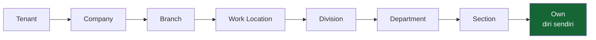

# Roles & Data Scope

**Status: IMPLEMENTED**

Dua pertanyaan yang sering dicampur, padahal jawabannya datang dari tempat yang berbeda:

| Pertanyaan | Dijawab oleh |
|---|---|
| **Boleh melakukan apa?** | Permission yang melekat pada peran |
| **Atas baris siapa?** | Cakupan data pada penugasan peran |

Seorang HR Admin site dan HR Admin kantor pusat memegang **peran yang sama** dengan **permission yang sama**. Yang membedakan hanya cakupan datanya.

---

## Peran yang tersedia

| Peran | Tanggung jawab bisnis |
|---|---|
| Board of Directors | melihat seluruh grup |
| Executive | memimpin satu perusahaan atau satu lokasi |
| HR Manager | menyetujui dan memfinalisasi dokumen HR & payroll |
| HR Admin | menyusun dan mengajukan dokumen HR |
| HR & General Affairs | urusan umum, termasuk kunjungan tamu |
| Admin Department / Admin Section | administrasi unit kerjanya sendiri |
| KTT (Kepala Teknik Tambang) | persetujuan operasional site |
| Employee | ruang pribadi — profil, jadwal, presensi, pengajuan sendiri |
| Security / Gate | pendaftaran, check-in, dan check-out tamu |
| Finance Manager / Finance Administrator | jurnal, periode akuntansi, posting |
| Workflow Administrator | definisi alur persetujuan |
| System Administrator | seluruh tenant |

---

## Cakupan data

Cakupan dinyatakan **saat penugasan peran dibuat**, bukan menempel pada perannya. Tingkatnya mengikuti struktur organisasi:

!!! warning "Akun tanpa penugasan tidak melihat apa-apa"
    Memberi seseorang peran tanpa menyatakan cakupannya **tidak** memberi akses data. Ia akan bisa membuka menu dan tidak melihat satu baris pun.

    Ini disengaja: kesalahan yang aman adalah tidak melihat apa pun, bukan melihat semuanya.

---

## Atasan sebagai penyetuju

Alur persetujuan tidak memakai kolom "supervisor" tersendiri. Yang dipakai adalah **garis Reports To** pada penempatan organisasi pegawainya.

Konsekuensinya: memperbaiki garis pelaporan di penempatan langsung memperbaiki siapa yang menerima dokumen di kotak masuknya. Tidak ada tabel kedua yang harus ikut disesuaikan.

!!! tip "Satu dokumen, satu meja"
    Dokumen penjadwalan massal yang memuat pegawai dari banyak atasan **tidak bisa diajukan sebagai satu dokumen**. Sistem menolak dan menyebutkan siapa saja atasannya.

    Alasannya bisnis, bukan teknis: memilih salah satu atasan berarti satu orang menandatangani jadwal bawahan orang lain, dan atasan yang tidak menandatangani tidak pernah tahu jadwal timnya berubah.

---

## Menu bukan pengaman

Menyembunyikan menu **tidak** mengamankan data. Pembatasan sesungguhnya ditegakkan di sisi server pada setiap permintaan. Menu hanya merapikan tampilan.
