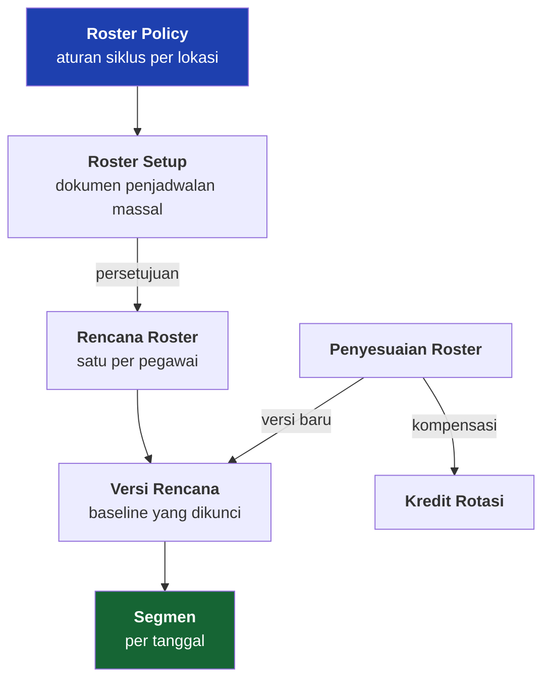

# Roster Site

**Status: IMPLEMENTED**

Pegawai site bekerja dalam siklus: sekian minggu di lokasi, sekian minggu field break, dengan hari perjalanan di antaranya. Roster adalah jadwal yang menyatakan siklus itu untuk setiap orang, per tanggal.

---

## Empat lapis, dan masing-masing punya pemiliknya

| Lapis | Siapa yang memutuskan | Berubah seberapa sering |
|---|---|---|
| Roster Policy | HR / manajemen site | jarang — ini kebijakan |
| Roster Setup | admin site / HR | tiap ada gelombang penjadwalan |
| Rencana & versi | sistem, dari dokumen setup | mengikuti dokumen |
| Penyesuaian | supervisor lapangan | sesuai kejadian |

---

## Roster Policy — pola yang bisa diubah tanpa rilis

Isi sebuah policy:

| Yang diatur | Contoh |
|---|---|
| Panjang blok kerja dan field break | 42 hari kerja / 14 hari off |
| Titik awal siklus dihitung dari mana | tanggal jangkar per pegawai |
| Hari perjalanan | berapa hari berangkat, berapa hari pulang, apakah dihitung hari kerja |
| Jeda istirahat minimum antar shift | dipakai menyisipkan hari pemulihan |
| Rotasi shift | urutan shift per blok — inilah yang menghasilkan pola siang/malam |
| Kredit rotasi | apakah kelebihan hari kerja dikonversi jadi hak libur, dengan rasio berapa |
| Horizon | jadwal dibangkitkan sampai berapa bulan ke depan |

!!! info "Satu lokasi boleh punya beberapa policy"
    Dataset peragaan memuat tiga policy untuk satu site: 42/14 dua shift, 42/14 siang saja, dan 56/14. Yang ditandai **baku** yang dipakai kalau tidak ada yang memilih.

    Angka 42/14 adalah **contoh konfigurasi**, bukan aturan aplikasi. Site lain boleh 14/7, 28/14, atau apa pun.

---

## Segmen: keadaan sebuah tanggal

Setelah rencana terbit, setiap tanggal punya satu keadaan:

| Keadaan | Arti | Menghasilkan jadwal kerja? |
|---|---|---|
| **Work** | di lokasi, blok kerja | ya |
| **Field Break** | jatah istirahat di rumah | tidak |
| **Travel Out** | perjalanan berangkat | tergantung policy |
| **Travel In** | perjalanan pulang | tergantung policy |
| **Recovery** | hari kerja yang sengaja dikosongkan karena jeda istirahat minimum tidak terpenuhi | tidak |
| **Off** | bukan hari kerja menurut kalender (pegawai kantor) | tidak |
| **Holiday** | hari libur yang berlaku di lokasinya | tidak |
| **Unplanned** | belum dijadwalkan siapa pun | tidak |

!!! tip "Unplanned dan Off sengaja dibedakan"
    *Off* adalah jadwal yang memang begitu. *Unplanned* adalah pekerjaan penjadwalan yang belum dilakukan HR. Menyatukan keduanya membuat lubang jadwal terlihat seperti hari libur.

---

## Cara admin membuat roster

1. **Buat dokumen Roster Setup** untuk sebuah lokasi, dengan **tanggal jangkar** — keadaan direkam per tanggal itu, dan jadwal berangkat dari blok yang sedang dijalani, bukan dari awal riwayat.
2. **Tambahkan baris pegawai**, masing-masing dengan Roster Policy dan titik awal siklusnya. Titik awal boleh berbeda antar orang — di site yang gelombangnya bergantian, itu justru keadaan normal.
3. **Ajukan** — dokumen masuk alur persetujuan.
4. **Setelah disetujui, dokumen diterbitkan**: satu rencana per pegawai, satu versi baseline yang dikunci, dan segmen per tanggal sampai batas horizon.
5. **Perubahan di kemudian hari** lewat dokumen Penyesuaian, yang menerbitkan versi baru — bukan dengan menyunting jadwal yang sudah berjalan.

!!! warning "Jadwal yang sudah dijalani tidak dihitung ulang"
    Penyesuaian dengan tanggal berlaku yang jatuh di segmen terkunci **ditolak**, dan penolakannya menyebutkan tanggal paling awal yang masih boleh dipakai.

    Ini melindungi hal yang benar: hari kerja yang sudah lewat sudah punya presensi, sudah mungkin masuk perhitungan gaji, dan mengubah jadwalnya sesudah itu mengubah masa lalu.

!!! danger "KNOWN LIMITATION — roster tidak bisa direkonstruksi mundur"
    Dokumen Roster Setup adalah alat **menjadwalkan ke depan**. Ia tidak menerima pegawai yang sudah tercatat berhenti, dan ia tidak menyusun ulang blok yang sudah dikunci.

    Artinya jadwal historis seorang pegawai yang sudah keluar tidak bisa diterbitkan belakangan. Urutan yang benar di lapangan — dan yang dipakai sistem ini — adalah: orang dijadwalkan selagi bekerja, tanggal berhentinya dicatat kemudian.

---

## Kredit rotasi

Kalau pegawai bekerja lebih lama dari blok yang dijadwalkan — kapal pengganti terlambat, pergantian regu mundur — kelebihannya tidak hilang. Policy menentukan apakah kelebihan itu dikonversi jadi hak libur, dengan rasio berapa, dan berapa maksimum saldo yang boleh menumpuk.

Ledger kreditnya **hanya bertambah** — koreksi dilakukan dengan transaksi pembalik, bukan dengan menghapus baris.
