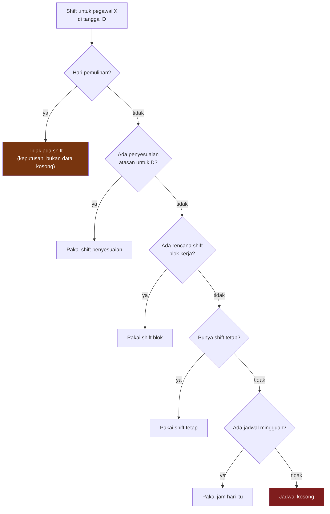

# Shift & Jam Kerja

**Status: IMPLEMENTED**

Shift menjawab pertanyaan kedua: **kalau hari ini hari kerja, jam berapa?**

---

## Master shift

Sebuah shift menyimpan jam mulai, jam selesai, jam istirahat, dan satu penanda penting: **apakah ia melewati tengah malam**.

Contoh dari dataset peragaan (**CONFIGURED FOR DEMO**):

| Kode | Jam | Lewat tengah malam | Dipakai |
|---|---|---|---|
| Office | 10:00 – 18:00 | tidak | shift tetap pegawai kantor |
| Shift 1 — Morning | 07:00 – 15:00 | tidak | blok kerja site, putaran ke-1 |
| **Shift 3 — Night** | **23:00 – 07:00** | **ya** | blok kerja site, putaran ke-2 |
| Shift 2 — Day | 15:00 – 23:00 | tidak | blok kerja site, putaran ke-3 |
| Day Shift | 07:00 – 19:00 | tidak | shift tetap pegawai site, cadangan di luar blok |
| Night Shift | 19:00 – 07:00 | ya | tersedia di master, belum dipakai rotasi |

Mengubah jam sebuah shift di layar master mengubah jadwal seluruh pegawai yang memakainya. Tidak ada jam kerja yang ditulis di kode.

---

## Shift lintas tengah malam

Ini bagian yang paling sering salah di sistem presensi.

!!! abstract "Aturannya"
    Pegawai masuk **23:00 tanggal 5**, pulang **07:00 tanggal 6**.

    Baris presensinya adalah **satu baris milik tanggal 5**, dengan jadwal masuk 5 Sep 23:00 dan jadwal pulang 6 Sep 07:00.

    Tap jam 07:00 tanggal 6 **bukan** kedatangan terlambat di tanggal 6. Ia kepulangan dari shift tanggal 5.

Tanpa penanda lewat-tengah-malam, sistem akan membaca orang yang pulang pukul tujuh pagi sebagai orang yang datang pukul tujuh pagi lalu tidak pernah pulang — dan seluruh jam kerjanya salah.

---

## Bagaimana shift seseorang ditentukan

Pertanyaannya bukan "shift apa yang dia punya" tapi **"shift apa yang berlaku untuknya di tanggal ini"**. Urutannya berjenjang, dan yang di atas menang:

Dua hal yang perlu dibaca manajemen dari bagan ini:

**Hari pemulihan menjawab "tidak ada shift", dan itu jawaban.** Kalau pergantian dari shift malam ke shift pagi tidak menyisakan jeda istirahat minimum, sistem menyisipkan hari pemulihan di tengah blok kerja. Rosternya tidak berubah; harinya sengaja dikosongkan.

**Jadwal kosong bukan tebakan.** Kalau tidak ada satu pun sumber yang bisa menjawab, sistem membiarkan jadwalnya kosong alih-alih menebak jam kerja. Angka yang ditebak terbaca persis seperti angka yang benar — dan itu jauh lebih berbahaya daripada kolom kosong.

---

## Penyesuaian shift oleh atasan

Rencana shift menempel pada **rentang tanggal**, dalam dua lapis:

| Lapis | Untuk apa |
|---|---|
| **Baseline** | rencana shift satu blok kerja — inilah yang membuat satu regu bisa masuk pagi minggu ini dan malam minggu depan tanpa menyentuh pola rosternya |
| **Override** | penyesuaian atasan untuk beberapa hari tertentu; selalu menang atas baseline |

---

## Rotasi shift pada roster site

Roster Policy site membawa **urutan shift per blok**, bukan satu shift tetap. Inilah yang menghasilkan pola bergantian yang dikenal pekerja lapangan:

| Putaran | Shift | Jam | Panjang blok |
|---|---|---|---|
| 1 | Shift 1 — Morning | 07:00 – 15:00 | 7 hari |
| 2 | **Shift 3 — Night** | **23:00 – 07:00** | 7 hari |
| 3 | Shift 2 — Day | 15:00 – 23:00 | 7 hari |

!!! example "Seperti yang terbaca di layar Shift Calendar"
    Seorang operator site pada pertengahan Agustus 2026:

    | Tanggal | Shift |
    |---|---|
    | 10 – 12 Agustus | Shift 1 — Morning |
    | 13 – 19 Agustus | **Shift 3 — Night** (lewat tengah malam) |
    | **20 Agustus** | **tidak ada shift — hari pemulihan** |
    | 21 – 24 Agustus | Shift 2 — Day |

    Tanggal 20 sengaja kosong: pergantian dari shift malam yang berakhir 07:00 ke shift sore yang mulai 15:00 tidak memenuhi jeda istirahat minimum, jadi generator menyisipkan hari pemulihan. Rosternya tidak berubah — harinya yang dikosongkan.

Rotasi ini **konfigurasi**, bukan aturan aplikasi. Site yang hanya bekerja siang cukup memakai policy dengan satu putaran.
