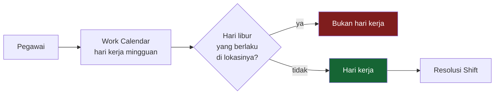

# Work Calendar & Holiday

**Status: IMPLEMENTED**

Kalender kerja menjawab satu pertanyaan: **hari ini hari kerja atau bukan?** Untuk pegawai kantor, ia yang menentukan. Untuk pegawai roster, yang menentukan rosternya — kalender site tetap ada tapi berjalan tujuh hari.

---

## Kalender kerja

Sebuah kalender menyatakan hari apa saja dalam seminggu yang dihitung hari kerja, lalu ditempelkan ke pegawai lewat data kepegawaiannya.

| Cakupan | Berlaku untuk |
|---|---|
| **Global** | semua pegawai yang tidak punya kalender lebih khusus |
| **Company** | semua pegawai perusahaan itu |
| **Location** | pegawai di lokasi itu saja |

Yang paling khusus menang.

!!! example "Dua kalender di satu tenant"
    | Kalender | Cakupan | Sabtu | Minggu |
    |---|---|---|---|
    | Office Calendar 2026 | global | libur | libur |
    | Sagea Mine Operational Calendar 2026 | lokasi Sagea Mine | **kerja** | **kerja** |

    Kalender site berjalan tujuh hari, dan itu benar: tambang tidak berhenti di akhir pekan. Yang memberi libur pada orang site adalah **blok field break** di rosternya, bukan hari Minggu.

---

## Hari libur

Hari libur berdiri terpisah dari kalender, karena tanggalnya berubah tiap tahun dan cakupannya tidak selalu sama dengan cakupan kalender.

| Cakupan | Arti |
|---|---|
| **Global** | seluruh tenant — libur nasional |
| **Company** | satu perusahaan |
| **Location** | satu lokasi kerja saja |

!!! success "Inilah cara menunjukkan bahwa kantor dan site boleh berbeda"
    Dataset peragaan memuat dua hari libur di dalam periode (**CONFIGURED FOR DEMO**):

    | Tanggal | Nama | Cakupan | Berlaku di |
    |---|---|---|---|
    | 17 Agustus 2026 | Hari Kemerdekaan | global | seluruh tenant |
    | 4 September 2026 | Sagea Mine Safety Stand-Down | lokasi | **hanya Sagea Mine** |

    Yang kedua adalah **hari libur operasional yang dinyatakan perusahaan sendiri** — bukan hari libur nasional Indonesia, dan tidak boleh dibaca begitu. Ia ada untuk membuktikan bahwa satu lokasi bisa berhenti beroperasi tanpa menghentikan lokasi lain.

!!! warning "FUTURE / NOT IMPLEMENTED — tidak ada feed kalender nasional"
    Hari libur dimasukkan manual. Strukturnya sudah menyiapkan tempat untuk sinkronisasi dari sumber luar (penanda sumber, id eksternal, status sinkronisasi), tetapi **tidak ada importer yang dibangun**. Daftar libur nasional tahun berjalan harus diisi HR.

---

## Urutannya

